# Дипломная работа

> ## Цели:
> 1. Подготовить облачную инфраструктуру на базе облачного провайдера Яндекс.Облако.
> 2. Запустить и сконфигурировать Kubernetes кластер.
> 3. Установить и настроить систему мониторинга.
> 4. Настроить и автоматизировать сборку тестового приложения с использованием Docker-контейнеров.
> 5. Настроить CI для автоматической сборки и тестирования.
> 6. Настроить CD для автоматического развёртывания приложения.

---
## Этапы выполнения:

### Создание облачной инфраструктуры

>**Ожидаемые результаты:**
> 1. Terraform сконфигурирован и создание инфраструктуры посредством Terraform возможно без дополнительных ручных действий.
> 3. Полученная конфигурация инфраструктуры является предварительной, поэтому в ходе дальнейшего выполнения задания возможны изменения.

Предварительная настройка включает в себя несколько шагов, необходимых для последующей работы с yandex.cloud через terraform.    
* Установить утилиту **yc** и подключится к облаку.   
* Создание сервисного аккаунта с ролью editor на дефолтной директории облака   
* Создание s3-bucket для хранения состояния terraform   
        Далее необходимо инициализировать terraform   

<details><summary>Пример</summary>

**Установка** [yc](https://cloud.yandex.ru/ru/docs/cli/quickstart) 

* Ответы на вопросы и порядок работы довольно не плохо описан в статье: [Начало работы с Terraform](https://cloud.yandex.ru/ru/docs/tutorials/infrastructure-management/terraform-quickstart)

```bash
curl -sSL https://storage.yandexcloud.net/yandexcloud-yc/install.sh | bash
```

**Создание сервисного аккаунта с ролью editor на дефолтной директории облака**

```bash
yc iam service-account create --name terraform-acc
yc resource-manager folder add-access-binding --name default --role editor --subject "serviceAccount:<accId>"
```
* accId - это уникальный идентификатор нового сервисного аккаунта

**Получаем ключ доступа для данного сервисного аккаунта**

```bash
yc iam access-key create --service-account-name terraform-acc --format=json
```

**Создание s3-bucket для хранения состояния terraform**

```bash
yc storage bucket create --name=netology-state
```

**Инициализация terraform**

```bash
terraform init \
  -backend-config="bucket=netology-state" \
  -backend-config="access_key=<service_account_key_id>" \
  -backend-config="secret_key=<service_account_secret_key>"

```
* где **service_account_key_id** и **service_account_secret_key** данные полученные на шаге получения ключа доступа для сервисного аккаунта

**Создание и переключение на новый workspace**

```bash
terraform workspace new diplom
```

Данные шаги мной выполнялись в ручную. 
</details>
    
**Решение: Создание VPC и подсетей через terraform**

<details><summary>network.tf</summary>

```bash
resource "yandex_vpc_network" "diplom-network" {
  name = "diplom-network"
}

resource "yandex_vpc_subnet" "diplom-network-subnet-a" {
  name           = "diplom-network-subnet-a"
  zone           = "ru-central1-a"
  network_id     = yandex_vpc_network.diplom-network.id
  v4_cidr_blocks = ["192.168.10.0/24"]
}

resource "yandex_vpc_subnet" "diplom-network-subnet-b" {
  name           = "diplom-network-subnet-b"
  zone           = "ru-central1-b"
  network_id     = yandex_vpc_network.diplom-network.id
  v4_cidr_blocks = ["192.168.11.0/24"]
}
```

</details>

<details><summary>terraform plan</summary>

```bash
denis@denis-lin(0):~/netology/diplom$ terraform plan

Terraform used the selected providers to generate the following execution plan. Resource actions are indicated with the following symbols:
  + create

Terraform will perform the following actions:

  # yandex_vpc_network.diplom-network will be created
  + resource "yandex_vpc_network" "diplom-network" {
      + created_at                = (known after apply)
      + default_security_group_id = (known after apply)
      + folder_id                 = (known after apply)
      + id                        = (known after apply)
      + labels                    = (known after apply)
      + name                      = "diplom-network"
      + subnet_ids                = (known after apply)
    }

  # yandex_vpc_subnet.diplom-network-subnet-a will be created
  + resource "yandex_vpc_subnet" "diplom-network-subnet-a" {
      + created_at     = (known after apply)
      + folder_id      = (known after apply)
      + id             = (known after apply)
      + labels         = (known after apply)
      + name           = "diplom-network-subnet-a"
      + network_id     = (known after apply)
      + v4_cidr_blocks = [
          + "192.168.10.0/24",
        ]
      + v6_cidr_blocks = (known after apply)
      + zone           = "ru-central1-a"
    }

  # yandex_vpc_subnet.diplom-network-subnet-b will be created
  + resource "yandex_vpc_subnet" "diplom-network-subnet-b" {
      + created_at     = (known after apply)
      + folder_id      = (known after apply)
      + id             = (known after apply)
      + labels         = (known after apply)
      + name           = "diplom-network-subnet-b"
      + network_id     = (known after apply)
      + v4_cidr_blocks = [
          + "192.168.11.0/24",
        ]
      + v6_cidr_blocks = (known after apply)
      + zone           = "ru-central1-b"
    }

Plan: 3 to add, 0 to change, 0 to destroy.

────────────────────────────────────────────────────────────────────

Note: You didn't use the -out option to save this plan, so Terraform can't guarantee to take exactly these actions if you run "terraform apply" now.

```

</details>

<details><summary>terraform apply</summary>

```bash
denis@denis-lin(0):~/netology/diplom$ terraform apply

Terraform used the selected providers to generate the following execution plan. Resource actions are indicated with the following symbols:
  + create

Terraform will perform the following actions:

  # yandex_vpc_network.diplom-network will be created
  + resource "yandex_vpc_network" "diplom-network" {
      + created_at                = (known after apply)
      + default_security_group_id = (known after apply)
      + folder_id                 = (known after apply)
      + id                        = (known after apply)
      + labels                    = (known after apply)
      + name                      = "diplom-network"
      + subnet_ids                = (known after apply)
    }

  # yandex_vpc_subnet.diplom-network-subnet-a will be created
  + resource "yandex_vpc_subnet" "diplom-network-subnet-a" {
      + created_at     = (known after apply)
      + folder_id      = (known after apply)
      + id             = (known after apply)
      + labels         = (known after apply)
      + name           = "diplom-network-subnet-a"
      + network_id     = (known after apply)
      + v4_cidr_blocks = [
          + "192.168.10.0/24",
        ]
      + v6_cidr_blocks = (known after apply)
      + zone           = "ru-central1-a"
    }

  # yandex_vpc_subnet.diplom-network-subnet-b will be created
  + resource "yandex_vpc_subnet" "diplom-network-subnet-b" {
      + created_at     = (known after apply)
      + folder_id      = (known after apply)
      + id             = (known after apply)
      + labels         = (known after apply)
      + name           = "diplom-network-subnet-b"
      + network_id     = (known after apply)
      + v4_cidr_blocks = [
          + "192.168.11.0/24",
        ]
      + v6_cidr_blocks = (known after apply)
      + zone           = "ru-central1-b"
    }

Plan: 3 to add, 0 to change, 0 to destroy.

Do you want to perform these actions?
  Terraform will perform the actions described above.
  Only 'yes' will be accepted to approve.

  Enter a value: yes

yandex_vpc_network.diplom-network: Creating...
yandex_vpc_network.diplom-network: Creation complete after 2s [id=enpvbm2m8t8b8bp5omk6]
yandex_vpc_subnet.diplom-network-subnet-a: Creating...
yandex_vpc_subnet.diplom-network-subnet-b: Creating...
yandex_vpc_subnet.diplom-network-subnet-a: Creation complete after 1s [id=e9bnvfvdpli6jqlsgopc]
yandex_vpc_subnet.diplom-network-subnet-b: Creation complete after 2s [id=e2lsblaev3lcj8hcotmd]

Apply complete! Resources: 3 added, 0 changed, 0 destroyed.

```


</details>

<details><summary>terraform destroy</summary>

```bash
denis@denis-lin(0):~/netology/diplom$ terraform destroy
yandex_vpc_network.diplom-network: Refreshing state... [id=enpvbm2m8t8b8bp5omk6]
yandex_vpc_subnet.diplom-network-subnet-b: Refreshing state... [id=e2lsblaev3lcj8hcotmd]
yandex_vpc_subnet.diplom-network-subnet-a: Refreshing state... [id=e9bnvfvdpli6jqlsgopc]

Terraform used the selected providers to generate the following execution plan. Resource actions are indicated with the following symbols:
  - destroy

Terraform will perform the following actions:

  # yandex_vpc_network.diplom-network will be destroyed
  - resource "yandex_vpc_network" "diplom-network" {
      - created_at                = "2024-02-03T06:34:41Z" -> null
      - default_security_group_id = "enp94bj339ltkrvgsjnv" -> null
      - folder_id                 = "b1gfkh66dgk5tpn7ajko" -> null
      - id                        = "enpvbm2m8t8b8bp5omk6" -> null
      - labels                    = {} -> null
      - name                      = "diplom-network" -> null
      - subnet_ids                = [
          - "e2lsblaev3lcj8hcotmd",
          - "e9bnvfvdpli6jqlsgopc",
        ] -> null
    }

  # yandex_vpc_subnet.diplom-network-subnet-a will be destroyed
  - resource "yandex_vpc_subnet" "diplom-network-subnet-a" {
      - created_at     = "2024-02-03T06:34:43Z" -> null
      - folder_id      = "b1gfkh66dgk5tpn7ajko" -> null
      - id             = "e9bnvfvdpli6jqlsgopc" -> null
      - labels         = {} -> null
      - name           = "diplom-network-subnet-a" -> null
      - network_id     = "enpvbm2m8t8b8bp5omk6" -> null
      - v4_cidr_blocks = [
          - "192.168.10.0/24",
        ] -> null
      - v6_cidr_blocks = [] -> null
      - zone           = "ru-central1-a" -> null
    }

  # yandex_vpc_subnet.diplom-network-subnet-b will be destroyed
  - resource "yandex_vpc_subnet" "diplom-network-subnet-b" {
      - created_at     = "2024-02-03T06:34:44Z" -> null
      - folder_id      = "b1gfkh66dgk5tpn7ajko" -> null
      - id             = "e2lsblaev3lcj8hcotmd" -> null
      - labels         = {} -> null
      - name           = "diplom-network-subnet-b" -> null
      - network_id     = "enpvbm2m8t8b8bp5omk6" -> null
      - v4_cidr_blocks = [
          - "192.168.11.0/24",
        ] -> null
      - v6_cidr_blocks = [] -> null
      - zone           = "ru-central1-b" -> null
    }

Plan: 0 to add, 0 to change, 3 to destroy.

Do you really want to destroy all resources?
  Terraform will destroy all your managed infrastructure, as shown above.
  There is no undo. Only 'yes' will be accepted to confirm.

  Enter a value: yes

yandex_vpc_subnet.diplom-network-subnet-b: Destroying... [id=e2lsblaev3lcj8hcotmd]
yandex_vpc_subnet.diplom-network-subnet-a: Destroying... [id=e9bnvfvdpli6jqlsgopc]
yandex_vpc_subnet.diplom-network-subnet-b: Destruction complete after 1s
yandex_vpc_subnet.diplom-network-subnet-a: Destruction complete after 1s
yandex_vpc_network.diplom-network: Destroying... [id=enpvbm2m8t8b8bp5omk6]
yandex_vpc_network.diplom-network: Destruction complete after 1s

Destroy complete! Resources: 3 destroyed.

```

</details>

---

## Создание Kubernetes кластера

> **Ожидаемый результат:**
> 1. Работоспособный Kubernetes кластер.
> 2. В файле ~/.kube/config находятся данные для доступа к кластеру.
> 3. Команда kubectl get pods --all-namespaces отрабатывает без ошибок.


За основу возьмем минимальную конфигурацию.

<details><summary>instances.tf</summary>

```bash
resource "random_shuffle" "diplom-network-subnet-random" {
  input        = [yandex_vpc_subnet.diplom-network-subnet-a.id, yandex_vpc_subnet.diplom-network-subnet-b.id]
  result_count = 1
}

resource "yandex_compute_instance" "k8s-cluster" {
  for_each = toset(["k8s-node1", "k8s-node2", "k8s-node3"])

  name = each.key
  hostname = "${each.key}.diplom.local"

  resources {
    cores  = 2
    memory = 2
  }

  boot_disk {
    initialize_params {
      image_id = "fd8kdq6d0p8sij7h5qe3" # ubuntu-20-04-lts-v20220822
      size = "20"
    }
  }

  network_interface {
    subnet_id = random_shuffle.diplom-network-subnet-random.result[0]
    nat       = true
  }

  metadata = {
    serial-port-enable = 1
    ssh-keys = "ubuntu:${file("~/.ssh/id_rsa.pub")}"
  }
}

output "cluster_ips" {
  value = {
    internal = values(yandex_compute_instance.k8s-cluster)[*].network_interface.0.ip_address
    external = values(yandex_compute_instance.k8s-cluster)[*].network_interface.0.nat_ip_address
  }
}
```

</details>

Для распределения по зонам доступности использован ***random_shuffle***   

<details><summary>terraform plan</summary>

```bash
denis@denis-lin(0):~/netology/diplom$ terraform plan

Terraform used the selected providers to generate the following execution plan. Resource actions are indicated with the following symbols:
  + create

Terraform will perform the following actions:

  # random_shuffle.diplom-network-subnet-random will be created
  + resource "random_shuffle" "diplom-network-subnet-random" {
      + id           = (known after apply)
      + input        = [
          + (known after apply),
          + (known after apply),
        ]
      + result       = (known after apply)
      + result_count = 1
    }

  # yandex_compute_instance.k8s-cluster["k8s-node1"] will be created
  + resource "yandex_compute_instance" "k8s-cluster" {
      + created_at                = (known after apply)
      + folder_id                 = (known after apply)
      + fqdn                      = (known after apply)
      + gpu_cluster_id            = (known after apply)
      + hostname                  = "k8s-node1.diplom.local"
      + id                        = (known after apply)
      + maintenance_grace_period  = (known after apply)
      + maintenance_policy        = (known after apply)
      + metadata                  = {
          + "serial-port-enable" = "1"
          + "ssh-keys"           = <<-EOT
                ubuntu:ssh-rsa AAAAB3NzaC1yc2EAAAADAQABAAABgQC7KoRsmTb6EC67YSxCrvoqTLhZcBgEd7lM4LebHU5p7qBtvyxA+oUxkH1Z4HjR2zbKEzDqtFfgREN5gaMFzHG/pa7RgMPR1c5lBynlsCzHDQqKt9417IoXfT71bFo2Mh+wXHo9gcJw9tU+4pab93zMBN7a40XtKWYQFsSQ0TffpprCcBkkqBeuBS9BFh3oaL7hRIOWPmUwpXmhY+Te7oaluj8fPxq/2ahPF1kthLY1NTLQvRGbrxENxsysi0jZwfDkYzWdWqhI5BA8fyG8e1wcpTM+9U8F4sAGMBxI5vEcC1J/Eb940tnEfp+oeZzcrSH9IRVCOgyGnEBh/qloxP7HVlErpX7KGf8h6s18h4d4mi5ylgBBgYfn/Wszej+Yotdgc+TJYihe/dDRulsxEcU/UQjIheqIoIIZApnajk0GdEyOtZpU/cY+CrtBH2czMLlNpn4lEOkcaCQu2XeqKn2yQNiOqz8jsDrVrTRrJHTEZ7+kkUROqmuNtcJdWl+4YH0= denis@denis-lin
            EOT
        }
      + name                      = "k8s-node1"
      + network_acceleration_type = "standard"
      + platform_id               = "standard-v1"
      + service_account_id        = (known after apply)
      + status                    = (known after apply)
      + zone                      = (known after apply)

      + boot_disk {
          + auto_delete = true
          + device_name = (known after apply)
          + disk_id     = (known after apply)
          + mode        = (known after apply)

          + initialize_params {
              + block_size  = (known after apply)
              + description = (known after apply)
              + image_id    = "fd8kdq6d0p8sij7h5qe3"
              + name        = (known after apply)
              + size        = 20
              + snapshot_id = (known after apply)
              + type        = "network-hdd"
            }
        }

      + network_interface {
          + index              = (known after apply)
          + ip_address         = (known after apply)
          + ipv4               = true
          + ipv6               = (known after apply)
          + ipv6_address       = (known after apply)
          + mac_address        = (known after apply)
          + nat                = true
          + nat_ip_address     = (known after apply)
          + nat_ip_version     = (known after apply)
          + security_group_ids = (known after apply)
          + subnet_id          = (known after apply)
        }

      + resources {
          + core_fraction = 100
          + cores         = 2
          + memory        = 2
        }
    }

  # yandex_compute_instance.k8s-cluster["k8s-node2"] will be created
  + resource "yandex_compute_instance" "k8s-cluster" {
      + created_at                = (known after apply)
      + folder_id                 = (known after apply)
      + fqdn                      = (known after apply)
      + gpu_cluster_id            = (known after apply)
      + hostname                  = "k8s-node2.diplom.local"
      + id                        = (known after apply)
      + maintenance_grace_period  = (known after apply)
      + maintenance_policy        = (known after apply)
      + metadata                  = {
          + "serial-port-enable" = "1"
          + "ssh-keys"           = <<-EOT
                ubuntu:ssh-rsa AAAAB3NzaC1yc2EAAAADAQABAAABgQC7KoRsmTb6EC67YSxCrvoqTLhZcBgEd7lM4LebHU5p7qBtvyxA+oUxkH1Z4HjR2zbKEzDqtFfgREN5gaMFzHG/pa7RgMPR1c5lBynlsCzHDQqKt9417IoXfT71bFo2Mh+wXHo9gcJw9tU+4pab93zMBN7a40XtKWYQFsSQ0TffpprCcBkkqBeuBS9BFh3oaL7hRIOWPmUwpXmhY+Te7oaluj8fPxq/2ahPF1kthLY1NTLQvRGbrxENxsysi0jZwfDkYzWdWqhI5BA8fyG8e1wcpTM+9U8F4sAGMBxI5vEcC1J/Eb940tnEfp+oeZzcrSH9IRVCOgyGnEBh/qloxP7HVlErpX7KGf8h6s18h4d4mi5ylgBBgYfn/Wszej+Yotdgc+TJYihe/dDRulsxEcU/UQjIheqIoIIZApnajk0GdEyOtZpU/cY+CrtBH2czMLlNpn4lEOkcaCQu2XeqKn2yQNiOqz8jsDrVrTRrJHTEZ7+kkUROqmuNtcJdWl+4YH0= denis@denis-lin
            EOT
        }
      + name                      = "k8s-node2"
      + network_acceleration_type = "standard"
      + platform_id               = "standard-v1"
      + service_account_id        = (known after apply)
      + status                    = (known after apply)
      + zone                      = (known after apply)

      + boot_disk {
          + auto_delete = true
          + device_name = (known after apply)
          + disk_id     = (known after apply)
          + mode        = (known after apply)

          + initialize_params {
              + block_size  = (known after apply)
              + description = (known after apply)
              + image_id    = "fd8kdq6d0p8sij7h5qe3"
              + name        = (known after apply)
              + size        = 20
              + snapshot_id = (known after apply)
              + type        = "network-hdd"
            }
        }

      + network_interface {
          + index              = (known after apply)
          + ip_address         = (known after apply)
          + ipv4               = true
          + ipv6               = (known after apply)
          + ipv6_address       = (known after apply)
          + mac_address        = (known after apply)
          + nat                = true
          + nat_ip_address     = (known after apply)
          + nat_ip_version     = (known after apply)
          + security_group_ids = (known after apply)
          + subnet_id          = (known after apply)
        }

      + resources {
          + core_fraction = 100
          + cores         = 2
          + memory        = 2
        }
    }

  # yandex_compute_instance.k8s-cluster["k8s-node3"] will be created
  + resource "yandex_compute_instance" "k8s-cluster" {
      + created_at                = (known after apply)
      + folder_id                 = (known after apply)
      + fqdn                      = (known after apply)
      + gpu_cluster_id            = (known after apply)
      + hostname                  = "k8s-node3.diplom.local"
      + id                        = (known after apply)
      + maintenance_grace_period  = (known after apply)
      + maintenance_policy        = (known after apply)
      + metadata                  = {
          + "serial-port-enable" = "1"
          + "ssh-keys"           = <<-EOT
                ubuntu:ssh-rsa AAAAB3NzaC1yc2EAAAADAQABAAABgQC7KoRsmTb6EC67YSxCrvoqTLhZcBgEd7lM4LebHU5p7qBtvyxA+oUxkH1Z4HjR2zbKEzDqtFfgREN5gaMFzHG/pa7RgMPR1c5lBynlsCzHDQqKt9417IoXfT71bFo2Mh+wXHo9gcJw9tU+4pab93zMBN7a40XtKWYQFsSQ0TffpprCcBkkqBeuBS9BFh3oaL7hRIOWPmUwpXmhY+Te7oaluj8fPxq/2ahPF1kthLY1NTLQvRGbrxENxsysi0jZwfDkYzWdWqhI5BA8fyG8e1wcpTM+9U8F4sAGMBxI5vEcC1J/Eb940tnEfp+oeZzcrSH9IRVCOgyGnEBh/qloxP7HVlErpX7KGf8h6s18h4d4mi5ylgBBgYfn/Wszej+Yotdgc+TJYihe/dDRulsxEcU/UQjIheqIoIIZApnajk0GdEyOtZpU/cY+CrtBH2czMLlNpn4lEOkcaCQu2XeqKn2yQNiOqz8jsDrVrTRrJHTEZ7+kkUROqmuNtcJdWl+4YH0= denis@denis-lin
            EOT
        }
      + name                      = "k8s-node3"
      + network_acceleration_type = "standard"
      + platform_id               = "standard-v1"
      + service_account_id        = (known after apply)
      + status                    = (known after apply)
      + zone                      = (known after apply)

      + boot_disk {
          + auto_delete = true
          + device_name = (known after apply)
          + disk_id     = (known after apply)
          + mode        = (known after apply)

          + initialize_params {
              + block_size  = (known after apply)
              + description = (known after apply)
              + image_id    = "fd8kdq6d0p8sij7h5qe3"
              + name        = (known after apply)
              + size        = 20
              + snapshot_id = (known after apply)
              + type        = "network-hdd"
            }
        }

      + network_interface {
          + index              = (known after apply)
          + ip_address         = (known after apply)
          + ipv4               = true
          + ipv6               = (known after apply)
          + ipv6_address       = (known after apply)
          + mac_address        = (known after apply)
          + nat                = true
          + nat_ip_address     = (known after apply)
          + nat_ip_version     = (known after apply)
          + security_group_ids = (known after apply)
          + subnet_id          = (known after apply)
        }

      + resources {
          + core_fraction = 100
          + cores         = 2
          + memory        = 2
        }
    }

  # yandex_vpc_network.diplom-network will be created
  + resource "yandex_vpc_network" "diplom-network" {
      + created_at                = (known after apply)
      + default_security_group_id = (known after apply)
      + folder_id                 = (known after apply)
      + id                        = (known after apply)
      + labels                    = (known after apply)
      + name                      = "diplom-network"
      + subnet_ids                = (known after apply)
    }

  # yandex_vpc_subnet.diplom-network-subnet-a will be created
  + resource "yandex_vpc_subnet" "diplom-network-subnet-a" {
      + created_at     = (known after apply)
      + folder_id      = (known after apply)
      + id             = (known after apply)
      + labels         = (known after apply)
      + name           = "diplom-network-subnet-a"
      + network_id     = (known after apply)
      + v4_cidr_blocks = [
          + "192.168.10.0/24",
        ]
      + v6_cidr_blocks = (known after apply)
      + zone           = "ru-central1-a"
    }

  # yandex_vpc_subnet.diplom-network-subnet-b will be created
  + resource "yandex_vpc_subnet" "diplom-network-subnet-b" {
      + created_at     = (known after apply)
      + folder_id      = (known after apply)
      + id             = (known after apply)
      + labels         = (known after apply)
      + name           = "diplom-network-subnet-b"
      + network_id     = (known after apply)
      + v4_cidr_blocks = [
          + "192.168.11.0/24",
        ]
      + v6_cidr_blocks = (known after apply)
      + zone           = "ru-central1-b"
    }

Plan: 7 to add, 0 to change, 0 to destroy.

Changes to Outputs:
  + cluster_ips = {
      + external = [
          + (known after apply),
          + (known after apply),
          + (known after apply),
        ]
      + internal = [
          + (known after apply),
          + (known after apply),
          + (known after apply),
        ]
    }

────────────────────────────────────────────────────────────────

Note: You didn't use the -out option to save this plan, so Terraform can't guarantee to take exactly these actions if you run "terraform apply" now.

```

</details>

<details><summary>terraform apply</summary>

```bash
denis@denis-lin(0):~/netology/diplom$ terraform apply

Terraform used the selected providers to generate the following execution plan. Resource actions are indicated with the following symbols:
  + create

Terraform will perform the following actions:

  # random_shuffle.diplom-network-subnet-random will be created
  + resource "random_shuffle" "diplom-network-subnet-random" {
      + id           = (known after apply)
      + input        = [
          + (known after apply),
          + (known after apply),
        ]
      + result       = (known after apply)
      + result_count = 1
    }

  # yandex_compute_instance.k8s-cluster["k8s-node1"] will be created
  + resource "yandex_compute_instance" "k8s-cluster" {
      + created_at                = (known after apply)
      + folder_id                 = (known after apply)
      + fqdn                      = (known after apply)
      + gpu_cluster_id            = (known after apply)
      + hostname                  = "k8s-node1.diplom.local"
      + id                        = (known after apply)
      + maintenance_grace_period  = (known after apply)
      + maintenance_policy        = (known after apply)
      + metadata                  = {
          + "serial-port-enable" = "1"
          + "ssh-keys"           = <<-EOT
                ubuntu:ssh-rsa AAAAB3NzaC1yc2EAAAADAQABAAABgQC7KoRsmTb6EC67YSxCrvoqTLhZcBgEd7lM4LebHU5p7qBtvyxA+oUxkH1Z4HjR2zbKEzDqtFfgREN5gaMFzHG/pa7RgMPR1c5lBynlsCzHDQqKt9417IoXfT71bFo2Mh+wXHo9gcJw9tU+4pab93zMBN7a40XtKWYQFsSQ0TffpprCcBkkqBeuBS9BFh3oaL7hRIOWPmUwpXmhY+Te7oaluj8fPxq/2ahPF1kthLY1NTLQvRGbrxENxsysi0jZwfDkYzWdWqhI5BA8fyG8e1wcpTM+9U8F4sAGMBxI5vEcC1J/Eb940tnEfp+oeZzcrSH9IRVCOgyGnEBh/qloxP7HVlErpX7KGf8h6s18h4d4mi5ylgBBgYfn/Wszej+Yotdgc+TJYihe/dDRulsxEcU/UQjIheqIoIIZApnajk0GdEyOtZpU/cY+CrtBH2czMLlNpn4lEOkcaCQu2XeqKn2yQNiOqz8jsDrVrTRrJHTEZ7+kkUROqmuNtcJdWl+4YH0= denis@denis-lin
            EOT
        }
      + name                      = "k8s-node1"
      + network_acceleration_type = "standard"
      + platform_id               = "standard-v1"
      + service_account_id        = (known after apply)
      + status                    = (known after apply)
      + zone                      = (known after apply)

      + boot_disk {
          + auto_delete = true
          + device_name = (known after apply)
          + disk_id     = (known after apply)
          + mode        = (known after apply)

          + initialize_params {
              + block_size  = (known after apply)
              + description = (known after apply)
              + image_id    = "fd8kdq6d0p8sij7h5qe3"
              + name        = (known after apply)
              + size        = 20
              + snapshot_id = (known after apply)
              + type        = "network-hdd"
            }
        }

      + network_interface {
          + index              = (known after apply)
          + ip_address         = (known after apply)
          + ipv4               = true
          + ipv6               = (known after apply)
          + ipv6_address       = (known after apply)
          + mac_address        = (known after apply)
          + nat                = true
          + nat_ip_address     = (known after apply)
          + nat_ip_version     = (known after apply)
          + security_group_ids = (known after apply)
          + subnet_id          = (known after apply)
        }

      + resources {
          + core_fraction = 100
          + cores         = 2
          + memory        = 2
        }
    }

  # yandex_compute_instance.k8s-cluster["k8s-node2"] will be created
  + resource "yandex_compute_instance" "k8s-cluster" {
      + created_at                = (known after apply)
      + folder_id                 = (known after apply)
      + fqdn                      = (known after apply)
      + gpu_cluster_id            = (known after apply)
      + hostname                  = "k8s-node2.diplom.local"
      + id                        = (known after apply)
      + maintenance_grace_period  = (known after apply)
      + maintenance_policy        = (known after apply)
      + metadata                  = {
          + "serial-port-enable" = "1"
          + "ssh-keys"           = <<-EOT
                ubuntu:ssh-rsa AAAAB3NzaC1yc2EAAAADAQABAAABgQC7KoRsmTb6EC67YSxCrvoqTLhZcBgEd7lM4LebHU5p7qBtvyxA+oUxkH1Z4HjR2zbKEzDqtFfgREN5gaMFzHG/pa7RgMPR1c5lBynlsCzHDQqKt9417IoXfT71bFo2Mh+wXHo9gcJw9tU+4pab93zMBN7a40XtKWYQFsSQ0TffpprCcBkkqBeuBS9BFh3oaL7hRIOWPmUwpXmhY+Te7oaluj8fPxq/2ahPF1kthLY1NTLQvRGbrxENxsysi0jZwfDkYzWdWqhI5BA8fyG8e1wcpTM+9U8F4sAGMBxI5vEcC1J/Eb940tnEfp+oeZzcrSH9IRVCOgyGnEBh/qloxP7HVlErpX7KGf8h6s18h4d4mi5ylgBBgYfn/Wszej+Yotdgc+TJYihe/dDRulsxEcU/UQjIheqIoIIZApnajk0GdEyOtZpU/cY+CrtBH2czMLlNpn4lEOkcaCQu2XeqKn2yQNiOqz8jsDrVrTRrJHTEZ7+kkUROqmuNtcJdWl+4YH0= denis@denis-lin
            EOT
        }
      + name                      = "k8s-node2"
      + network_acceleration_type = "standard"
      + platform_id               = "standard-v1"
      + service_account_id        = (known after apply)
      + status                    = (known after apply)
      + zone                      = (known after apply)

      + boot_disk {
          + auto_delete = true
          + device_name = (known after apply)
          + disk_id     = (known after apply)
          + mode        = (known after apply)

          + initialize_params {
              + block_size  = (known after apply)
              + description = (known after apply)
              + image_id    = "fd8kdq6d0p8sij7h5qe3"
              + name        = (known after apply)
              + size        = 20
              + snapshot_id = (known after apply)
              + type        = "network-hdd"
            }
        }

      + network_interface {
          + index              = (known after apply)
          + ip_address         = (known after apply)
          + ipv4               = true
          + ipv6               = (known after apply)
          + ipv6_address       = (known after apply)
          + mac_address        = (known after apply)
          + nat                = true
          + nat_ip_address     = (known after apply)
          + nat_ip_version     = (known after apply)
          + security_group_ids = (known after apply)
          + subnet_id          = (known after apply)
        }

      + resources {
          + core_fraction = 100
          + cores         = 2
          + memory        = 2
        }
    }

  # yandex_compute_instance.k8s-cluster["k8s-node3"] will be created
  + resource "yandex_compute_instance" "k8s-cluster" {
      + created_at                = (known after apply)
      + folder_id                 = (known after apply)
      + fqdn                      = (known after apply)
      + gpu_cluster_id            = (known after apply)
      + hostname                  = "k8s-node3.diplom.local"
      + id                        = (known after apply)
      + maintenance_grace_period  = (known after apply)
      + maintenance_policy        = (known after apply)
      + metadata                  = {
          + "serial-port-enable" = "1"
          + "ssh-keys"           = <<-EOT
                ubuntu:ssh-rsa AAAAB3NzaC1yc2EAAAADAQABAAABgQC7KoRsmTb6EC67YSxCrvoqTLhZcBgEd7lM4LebHU5p7qBtvyxA+oUxkH1Z4HjR2zbKEzDqtFfgREN5gaMFzHG/pa7RgMPR1c5lBynlsCzHDQqKt9417IoXfT71bFo2Mh+wXHo9gcJw9tU+4pab93zMBN7a40XtKWYQFsSQ0TffpprCcBkkqBeuBS9BFh3oaL7hRIOWPmUwpXmhY+Te7oaluj8fPxq/2ahPF1kthLY1NTLQvRGbrxENxsysi0jZwfDkYzWdWqhI5BA8fyG8e1wcpTM+9U8F4sAGMBxI5vEcC1J/Eb940tnEfp+oeZzcrSH9IRVCOgyGnEBh/qloxP7HVlErpX7KGf8h6s18h4d4mi5ylgBBgYfn/Wszej+Yotdgc+TJYihe/dDRulsxEcU/UQjIheqIoIIZApnajk0GdEyOtZpU/cY+CrtBH2czMLlNpn4lEOkcaCQu2XeqKn2yQNiOqz8jsDrVrTRrJHTEZ7+kkUROqmuNtcJdWl+4YH0= denis@denis-lin
            EOT
        }
      + name                      = "k8s-node3"
      + network_acceleration_type = "standard"
      + platform_id               = "standard-v1"
      + service_account_id        = (known after apply)
      + status                    = (known after apply)
      + zone                      = (known after apply)

      + boot_disk {
          + auto_delete = true
          + device_name = (known after apply)
          + disk_id     = (known after apply)
          + mode        = (known after apply)

          + initialize_params {
              + block_size  = (known after apply)
              + description = (known after apply)
              + image_id    = "fd8kdq6d0p8sij7h5qe3"
              + name        = (known after apply)
              + size        = 20
              + snapshot_id = (known after apply)
              + type        = "network-hdd"
            }
        }

      + network_interface {
          + index              = (known after apply)
          + ip_address         = (known after apply)
          + ipv4               = true
          + ipv6               = (known after apply)
          + ipv6_address       = (known after apply)
          + mac_address        = (known after apply)
          + nat                = true
          + nat_ip_address     = (known after apply)
          + nat_ip_version     = (known after apply)
          + security_group_ids = (known after apply)
          + subnet_id          = (known after apply)
        }

      + resources {
          + core_fraction = 100
          + cores         = 2
          + memory        = 2
        }
    }

  # yandex_vpc_network.diplom-network will be created
  + resource "yandex_vpc_network" "diplom-network" {
      + created_at                = (known after apply)
      + default_security_group_id = (known after apply)
      + folder_id                 = (known after apply)
      + id                        = (known after apply)
      + labels                    = (known after apply)
      + name                      = "diplom-network"
      + subnet_ids                = (known after apply)
    }

  # yandex_vpc_subnet.diplom-network-subnet-a will be created
  + resource "yandex_vpc_subnet" "diplom-network-subnet-a" {
      + created_at     = (known after apply)
      + folder_id      = (known after apply)
      + id             = (known after apply)
      + labels         = (known after apply)
      + name           = "diplom-network-subnet-a"
      + network_id     = (known after apply)
      + v4_cidr_blocks = [
          + "192.168.10.0/24",
        ]
      + v6_cidr_blocks = (known after apply)
      + zone           = "ru-central1-a"
    }

  # yandex_vpc_subnet.diplom-network-subnet-b will be created
  + resource "yandex_vpc_subnet" "diplom-network-subnet-b" {
      + created_at     = (known after apply)
      + folder_id      = (known after apply)
      + id             = (known after apply)
      + labels         = (known after apply)
      + name           = "diplom-network-subnet-b"
      + network_id     = (known after apply)
      + v4_cidr_blocks = [
          + "192.168.11.0/24",
        ]
      + v6_cidr_blocks = (known after apply)
      + zone           = "ru-central1-b"
    }

Plan: 7 to add, 0 to change, 0 to destroy.

Changes to Outputs:
  + cluster_ips = {
      + external = [
          + (known after apply),
          + (known after apply),
          + (known after apply),
        ]
      + internal = [
          + (known after apply),
          + (known after apply),
          + (known after apply),
        ]
    }

Do you want to perform these actions?
  Terraform will perform the actions described above.
  Only 'yes' will be accepted to approve.

  Enter a value: yes

yandex_vpc_network.diplom-network: Creating...
yandex_vpc_network.diplom-network: Creation complete after 3s [id=enpvii24n7ibl5a0aeq7]
yandex_vpc_subnet.diplom-network-subnet-a: Creating...
yandex_vpc_subnet.diplom-network-subnet-b: Creating...
yandex_vpc_subnet.diplom-network-subnet-a: Creation complete after 1s [id=e9b402228ol6e0l6118p]
yandex_vpc_subnet.diplom-network-subnet-b: Creation complete after 2s [id=e2l26vuodeclji2ou2bg]
random_shuffle.diplom-network-subnet-random: Creating...
random_shuffle.diplom-network-subnet-random: Creation complete after 0s [id=-]
yandex_compute_instance.k8s-cluster["k8s-node2"]: Creating...
yandex_compute_instance.k8s-cluster["k8s-node3"]: Creating...
yandex_compute_instance.k8s-cluster["k8s-node1"]: Creating...
yandex_compute_instance.k8s-cluster["k8s-node3"]: Still creating... [10s elapsed]
yandex_compute_instance.k8s-cluster["k8s-node2"]: Still creating... [10s elapsed]
yandex_compute_instance.k8s-cluster["k8s-node1"]: Still creating... [10s elapsed]
yandex_compute_instance.k8s-cluster["k8s-node2"]: Still creating... [20s elapsed]
yandex_compute_instance.k8s-cluster["k8s-node1"]: Still creating... [20s elapsed]
yandex_compute_instance.k8s-cluster["k8s-node3"]: Still creating... [20s elapsed]
yandex_compute_instance.k8s-cluster["k8s-node3"]: Still creating... [30s elapsed]
yandex_compute_instance.k8s-cluster["k8s-node2"]: Still creating... [30s elapsed]
yandex_compute_instance.k8s-cluster["k8s-node1"]: Still creating... [30s elapsed]
yandex_compute_instance.k8s-cluster["k8s-node1"]: Creation complete after 32s [id=fhmjtckrhsjhgfg71f9s]
yandex_compute_instance.k8s-cluster["k8s-node2"]: Creation complete after 32s [id=fhmrgq4pqimt5laee4cm]
yandex_compute_instance.k8s-cluster["k8s-node3"]: Creation complete after 36s [id=fhmu6oc2vdk5hj4dmgg6]

Apply complete! Resources: 7 added, 0 changed, 0 destroyed.

Outputs:

cluster_ips = {
  "external" = [
    "130.193.48.211",
    "130.193.37.164",
    "130.193.49.28",
  ]
  "internal" = [
    "192.168.10.12",
    "192.168.10.30",
    "192.168.10.26",
  ]
}

```


</details>

<details><summary>Получим ini файл с IP адресами</summary>

Сохраняем вывод в json

```bash
terraform output -json > ips.json
```

Преобразуем с помощью скрипта на питоне ips.json в cluster_ips.ini

<details><summary>out_to_ini.py</summary>

```python
import json
from configparser import ConfigParser

# загружаем данные из ips.json
with open('ips.json', 'r') as json_file:
    data = json.load(json_file)

# извлекаем IPs
external_ips = data['cluster_ips']['value']['external']
internal_ips = data['cluster_ips']['value']['internal']

# парсим в разделы
config = ConfigParser()

config['external'] = {ip: '' for ip in external_ips}
config['internal'] = {ip: '' for ip in internal_ips}

# убираем лишнее
with open('cluster_ips.ini', 'w') as ini_file:
    for section in config.sections():
        ini_file.write(f'[{section}]\n')
        for key in config[section]:
            ini_file.write(f'{key}\n')

print("Файл сконвертирован!")

```

</details>

```bash
denis@denis-lin(0):~/netology/diplom$ python3 out_to_ini.py
Файл сконвертирован!
denis@denis-lin(0):~/netology/diplom$ cat cluster_ips.ini
[external]
130.193.48.211
130.193.37.164
130.193.49.28
[internal]
192.168.10.12
192.168.10.30
192.168.10.26
```

</details>


Далее будем использовать плейбук из прошлых ДЗ - который писал сам, плейбук подготавливает хосты, устанавливая все необходимое. 


<details><summary>ansible k8s</summary>

[Репозиторий](https://github.com/VodyakovDenis/diplom-ansible)

---

<details><summary>ansible/ansible.cfg</summary>

```bash
[defaults]
host_key_checking = False
deprecation_warnings=False
```

</details>

<details><summary>ansible/ping.yml</summary>

```bash
---
- hosts: external
  gather_facts: false
  tasks:
    - ping:
```

* Позволит проверить доступность

</details>

<details><summary>ansible/k8s-cluster2.yml</summary>

```bash
---
- name: Prepare to install Kubernetes
  become: true
  hosts: external
  tasks:

    - name: Ensure the keyrings directory exists
      file:
        path: /etc/apt/keyrings
        state: directory

    - name: Create the k8s.gpg keyring file
      file:
        path: /etc/apt/keyrings/k8s.gpg
        state: touch

    - name: Add gpg key for K8S
      apt_key:
        url: https://pkgs.k8s.io/core:/stable:/v1.28/deb/Release.key
        keyring: /etc/apt/keyrings/k8s.gpg


    - name: Add repository K8S
      apt_repository:
        repo: "deb [signed-by=/etc/apt/keyrings/k8s.gpg] https://pkgs.k8s.io/core:/stable:/v1.28/deb/ /"
        state: present
        filename: k8s
        mode: 0600

    - name: Load kernel modules
      modprobe:
        name: "{{ item }}"
        state: present
      loop:
        - br_netfilter

    - name: Set Sysctl on all nodes
      sysctl:
        name: "{{ item.name }}"
        value: "{{ item.value }}"
        state: present
      with_items:
        - name: net.ipv4.ip_forward
          value: 1
        - name: net.bridge.bridge-nf-call-iptables
          value: 1
        - name: net.bridge.bridge-nf-call-ip6tables
          value: 1

    - name: Prepare to install Kubernetes | Exec commands
      ansible.builtin.command: "{{ item }}"
      with_items:
        - modprobe overlay
        - modprobe br_netfilter
        - sysctl --system
        - swapoff -a
      register: result
      changed_when: result.rc != 0

    - name: Stop UFW service
      systemd:
        name: ufw
        state: stopped
        enabled: no

    - name: Mask firewalld service
      shell:
        cmd: systemctl mask firewalld

- name: Install Kubernetes
  become: true
  hosts: external
  tasks:
    - name: Install Kubernetes | Install packages
      ansible.builtin.apt:
        name:
          - kubectl
          - kubeadm
          - kubelet
          - containerd
        state: present
      notify: Start kubelet service

  handlers:
    - name: Start kubelet service
      ansible.builtin.service:
        name: kubelet
        enabled: true
        state: started
```

</details>

```bash
denis@denis-lin(0):~/netology/diplom$ mkdir ansible/
denis@denis-lin(0):~/netology/diplom$ mkdir ansible/inventory/
denis@denis-lin(0):~/netology/diplom$ ln -s ~/netology/diplom/cluster_ips.ini ~/netology/diplom/ansible/inventory/cluster_ips.ini
```

```bash
denis@denis-lin(0):~/netology/diplom$ ansible-playbook -i ansible/inventory/cluster_ips.ini ansible/k8s-cluster2.yml -u ubuntu
...
PLAY RECAP *****************************************************************************************************************************
130.193.37.164             : ok=16   changed=11   unreachable=0    failed=0    skipped=0    rescued=0    ignored=0
130.193.48.211             : ok=16   changed=11   unreachable=0    failed=0    skipped=0    rescued=0    ignored=0
130.193.49.28              : ok=16   changed=11   unreachable=0    failed=0    skipped=0    rescued=0    ignored=0

```

Далее для корректной работы k8s кластера необходимо поправить **/etc/hosts**

<details><summary>ansible/hosts.yml</summary>

```bash
---
- name: 'install k8s-cluster hostname'
  hosts: external
  become: true
  tasks:
    - name: "Add nodes /etc/hosts"
      lineinfile:
        name: /etc/hosts
        line: "{{ item }}"
        state: present
      with_items:
        - "192.168.10.12 k8s-node1"
        - "192.168.10.30 k8s-node2"
        - "192.168.10.26 k8s-node3"
```

</details>

```bash
denis@denis-lin(0):~/netology/diplom$ ansible-playbook -i ansible/inventory/cluster_ips.ini ansible/hosts.yml -u ubuntu
```

```bash
PLAY [install k8s-cluster hostname] ************************************************************************************************

TASK [Gathering Facts] *************************************************************************************************************
ok: [130.193.49.28]
ok: [130.193.48.211]

TASK [Add nodes /etc/hosts] ********************************************************************************************************
changed: [130.193.37.164] => (item=192.168.10.12 k8s-node1)
changed: [130.193.49.28] => (item=192.168.10.12 k8s-node1)
changed: [130.193.48.211] => (item=192.168.10.12 k8s-node1)
changed: [130.193.37.164] => (item=192.168.10.30 k8s-node2)
changed: [130.193.49.28] => (item=192.168.10.30 k8s-node2)
changed: [130.193.48.211] => (item=192.168.10.30 k8s-node2)
changed: [130.193.37.164] => (item=192.168.10.26 k8s-node3)
changed: [130.193.49.28] => (item=192.168.10.26 k8s-node3)
changed: [130.193.48.211] => (item=192.168.10.26 k8s-node3)

PLAY RECAP *************************************************************************************************************************
130.193.37.164             : ok=2    changed=1    unreachable=0    failed=0    skipped=0    rescued=0    ignored=0
130.193.48.211             : ok=2    changed=1    unreachable=0    failed=0    skipped=0    rescued=0    ignored=0
130.193.49.28              : ok=2    changed=1    unreachable=0    failed=0    skipped=0    rescued=0    ignored=0
```

</details>


Инициализирует кластер Kubernetes на k8s-node1 (Данный процесс может быть полностью автоматизирован ansible но пока не хватило времени)

<details><summary>Собираем кластер</summary>

```bash
kubeadm init --v=5 --upload-certs --pod-network-cidr=10.244.0.0/16 --service-cidr=10.245.0.0/16 --control-plane-endpoint k8s-node1
...

Your Kubernetes control-plane has initialized successfully!

To start using your cluster, you need to run the following as a regular user:

  mkdir -p $HOME/.kube
  sudo cp -i /etc/kubernetes/admin.conf $HOME/.kube/config
  sudo chown $(id -u):$(id -g) $HOME/.kube/config

Alternatively, if you are the root user, you can run:

  export KUBECONFIG=/etc/kubernetes/admin.conf

You should now deploy a pod network to the cluster.
Run "kubectl apply -f [podnetwork].yaml" with one of the options listed at:
  https://kubernetes.io/docs/concepts/cluster-administration/addons/

You can now join any number of the control-plane node running the following command on each as root:

  kubeadm join k8s-node1:6443 --token lo4zxy.s3yyostmigxsvu83 \
        --discovery-token-ca-cert-hash sha256:dbad7f19b5066a9b40b16650614f6d196ff4e9e6fd1774c7b4c30bf7967609d1 \
        --control-plane --certificate-key 9a3c32b82b797d25ea88aa42976012850b54f4f29912b513b805b7b47b555fc2

Please note that the certificate-key gives access to cluster sensitive data, keep it secret!
As a safeguard, uploaded-certs will be deleted in two hours; If necessary, you can use
"kubeadm init phase upload-certs --upload-certs" to reload certs afterward.

Then you can join any number of worker nodes by running the following on each as root:

kubeadm join k8s-node1:6443 --token lo4zxy.s3yyostmigxsvu83 \
        --discovery-token-ca-cert-hash sha256:dbad7f19b5066a9b40b16650614f6d196ff4e9e6fd1774c7b4c30bf7967609d1

```

```bash
root@k8s-node1:/home/ubuntu# mkdir -p $HOME/.kube
root@k8s-node1:/home/ubuntu# cp -i /etc/kubernetes/admin.conf $HOME/.kube/config
root@k8s-node1:/home/ubuntu# chown $(id -u):$(id -g) $HOME/.kube/config
root@k8s-node1:/home/ubuntu# export KUBECONFIG=/etc/kubernetes/admin.conf
root@k8s-node1:/home/ubuntu# kubectl apply -f https://github.com/flannel-io/flannel/releases/latest/download/kube-flannel.yml
namespace/kube-flannel created
serviceaccount/flannel created
clusterrole.rbac.authorization.k8s.io/flannel created
clusterrolebinding.rbac.authorization.k8s.io/flannel created
configmap/kube-flannel-cfg created
daemonset.apps/kube-flannel-ds created
```

Дальше мы можем добавить еще одну контрол ноду если необходимо, но в рамках данного задания нам будет достаточно одной контрол ноды, по этому оставшиеся ноды добавляем как воркеры.

```bash
denis@denis-lin(0):~/netology/diplom$ ssh ubuntu@130.193.37.164
...
ubuntu@k8s-node2:~$ sudo su
root@k8s-node2:/home/ubuntu# kubeadm join k8s-node1:6443 --token lo4zxy.s3yyostmigxsvu83 \
>         --discovery-token-ca-cert-hash sha256:dbad7f19b5066a9b40b16650614f6d196ff4e9e6fd1774c7b4c30bf7967609d1
...
This node has joined the cluster:
* Certificate signing request was sent to apiserver and a response was received.
* The Kubelet was informed of the new secure connection details.

Run 'kubectl get nodes' on the control-plane to see this node join the cluster.

```

```bash
denis@denis-lin(0):~/netology/diplom$ ssh ubuntu@130.193.49.28
...
root@k8s-node3:/home/ubuntu# kubeadm join k8s-node1:6443 --token lo4zxy.s3yyostmigxsvu83 \
>         --discovery-token-ca-cert-hash sha256:dbad7f19b5066a9b40b16650614f6d196ff4e9e6fd1774c7b4c30bf7967609d1
...
This node has joined the cluster:
* Certificate signing request was sent to apiserver and a response was received.
* The Kubelet was informed of the new secure connection details.

Run 'kubectl get nodes' on the control-plane to see this node join the cluster.

```

```bash
root@k8s-node1:/home/ubuntu# kubectl get nodes -owide
NAME        STATUS   ROLES           AGE     VERSION   INTERNAL-IP     EXTERNAL-IP   OS-IMAGE             KERNEL-VERSION      CONTAINER-RUNTIME
k8s-node1   Ready    control-plane   13m     v1.28.6   192.168.10.12   <none>        Ubuntu 20.04.4 LTS   5.4.0-124-generic   containerd://1.7.2
k8s-node2   Ready    <none>          9m16s   v1.28.6   192.168.10.30   <none>        Ubuntu 20.04.4 LTS   5.4.0-124-generic   containerd://1.7.2
k8s-node3   Ready    <none>          5m29s   v1.28.6   192.168.10.26   <none>        Ubuntu 20.04.4 LTS   5.4.0-124-generic   containerd://1.7.2
```

Задаем роль воркеров:

```bash
root@k8s-node1:/home/ubuntu# kubectl label node k8s-node2 node-role.kubernetes.io/worker=worker
node/k8s-node2 labeled
root@k8s-node1:/home/ubuntu# kubectl label node k8s-node3 node-role.kubernetes.io/worker=worker
node/k8s-node3 labeled
root@k8s-node1:/home/ubuntu# kubectl get nodes -owide
NAME        STATUS   ROLES           AGE    VERSION   INTERNAL-IP     EXTERNAL-IP   OS-IMAGE             KERNEL-VERSION      CONTAINER-RUNTIME
k8s-node1   Ready    control-plane   15m    v1.28.6   192.168.10.12   <none>        Ubuntu 20.04.4 LTS   5.4.0-124-generic   containerd://1.7.2
k8s-node2   Ready    worker          10m    v1.28.6   192.168.10.30   <none>        Ubuntu 20.04.4 LTS   5.4.0-124-generic   containerd://1.7.2
k8s-node3   Ready    worker          7m8s   v1.28.6   192.168.10.26   <none>        Ubuntu 20.04.4 LTS   5.4.0-124-generic   containerd://1.7.2

```


</details>

<details><summary>Итого</summary>

```bash
root@k8s-node1:/home/ubuntu# kubectl get pods --all-namespaces
NAMESPACE      NAME                                READY   STATUS    RESTARTS   AGE
kube-flannel   kube-flannel-ds-v59jh               1/1     Running   0          2m15s
kube-flannel   kube-flannel-ds-v7jnm               1/1     Running   0          82s
kube-flannel   kube-flannel-ds-v8jhz               1/1     Running   0          96s
kube-system    coredns-5dd5756b68-78xx5            1/1     Running   0          2m52s
kube-system    coredns-5dd5756b68-7nhcx            1/1     Running   0          2m52s
kube-system    etcd-k8s-node1                      1/1     Running   0          3m5s
kube-system    kube-apiserver-k8s-node1            1/1     Running   0          3m5s
kube-system    kube-controller-manager-k8s-node1   1/1     Running   0          3m5s
kube-system    kube-proxy-2l5c6                    1/1     Running   0          82s
kube-system    kube-proxy-nvh7g                    1/1     Running   0          2m52s
kube-system    kube-proxy-qklbt                    1/1     Running   0          96s
kube-system    kube-scheduler-k8s-node1            1/1     Running   0          3m5s

```

</details>

<details><summary>Переносим .kube/config на локальный пк для проверки</summary>

```bash
denis@denis-lin(0):~$ mkdir -p $HOME/.kube
denis@denis-lin(0):~$ nano $HOME/.kube/config
denis@denis-lin(0):~$ sudo nano /etc/hosts
[sudo] password for denis:
denis@denis-lin(0):~$ kubectl get pods --all-namespaces
NAMESPACE      NAME                                READY   STATUS    RESTARTS   AGE
kube-flannel   kube-flannel-ds-v59jh               1/1     Running   0          3m52s
kube-flannel   kube-flannel-ds-v7jnm               1/1     Running   0          2m59s
kube-flannel   kube-flannel-ds-v8jhz               1/1     Running   0          3m13s
kube-system    coredns-5dd5756b68-78xx5            1/1     Running   0          4m29s
kube-system    coredns-5dd5756b68-7nhcx            1/1     Running   0          4m29s
kube-system    etcd-k8s-node1                      1/1     Running   0          4m42s
kube-system    kube-apiserver-k8s-node1            1/1     Running   0          4m42s
kube-system    kube-controller-manager-k8s-node1   1/1     Running   0          4m42s
kube-system    kube-proxy-2l5c6                    1/1     Running   0          2m59s
kube-system    kube-proxy-nvh7g                    1/1     Running   0          4m29s
kube-system    kube-proxy-qklbt                    1/1     Running   0          3m13s
kube-system    kube-scheduler-k8s-node1            1/1     Running   0          4m42s


```

</details>


---
## Создание тестового приложения

> **Ожидаемый результат:**
> 1. Git репозиторий с тестовым приложением и Dockerfile.
> 2. Регистри с собранным docker image. В качестве регистри может быть DockerHub или Yandex Container Registry, созданный также с помощью terraform.


Репозиторий git [diplom-app](https://github.com/VodyakovDenis/diplom-app)   
Репозиторий docker hub [diplom-app](https://hub.docker.com/repository/docker/vodyakovdenis/diplom-app/general)   

<details><summary>docker build</summary>

```bash
denis@denis-lin(0):~/netology/diplom/diplom-app$ sudo docker build -t vodyakovdenis/diplom-app:v1.0 .
DEPRECATED: The legacy builder is deprecated and will be removed in a future release.
            Install the buildx component to build images with BuildKit:
            https://docs.docker.com/go/buildx/

Sending build context to Docker daemon  167.9kB
Step 1/2 : FROM nginx:1.22.0-alpine
1.22.0-alpine: Pulling from library/nginx
213ec9aee27d: Pull complete
1bfd2b69cf63: Pull complete
a19f4cc2e029: Pull complete
4ae981811a6d: Pull complete
7a662f439736: Pull complete
a317c3c2c906: Pull complete
Digest: sha256:addd3bf05ec3c69ef3e8f0021ce1ca98e0eb21117b97ab8b64127e3ff6e444ec
Status: Downloaded newer image for nginx:1.22.0-alpine
 ---> 5685937b6bc1
Step 2/2 : COPY site /usr/share/nginx/html
 ---> 19039b1859c8
Successfully built 19039b1859c8
Successfully tagged vodyakovdenis/diplom-app:v1.0
denis@denis-lin(0):~/netology/diplom/diplom-app$ sudo docker images | grep diplom
vodyakovdenis/diplom-app                        v1.0            19039b1859c8   46 seconds ago   23.6MB
denis@denis-lin(0):~/netology/diplom/diplom-app$ sudo docker push vodyakovdenis/diplom-app:v1.0
The push refers to repository [docker.io/vodyakovdenis/diplom-app]
16692ab9e5c6: Pushed
2215c66bbd37: Mounted from library/nginx
2fced351995b: Mounted from library/nginx
f5e6d03415cf: Mounted from library/nginx
3427d79f4b93: Mounted from library/nginx
e14491c4bad5: Mounted from library/nginx
994393dc58e7: Mounted from library/nginx
v1.0: digest: sha256:55a6cbdc2135301671ee74e089fb84c7714eaf1e87d9504d0594def30c26cce5 size: 1778
```

</details>

<details><summary>Результат</summary>

```bash
denis@denis-lin(0):~/netology/diplom/diplom-app$ sudo docker run -d -m 512m --name diplom-app -p 80:80 vodyakovdenis/diplom-app:v1.0
c6c9a973eaf4b7d93e1a168dad0124de90677eb905b0fdfdb948103259057045
denis@denis-lin(0):~/netology/diplom/diplom-app$ sudo docker ps -a
CONTAINER ID   IMAGE                           COMMAND                  CREATED         STATUS         PORTS     NAMES
c6c9a973eaf4   vodyakovdenis/diplom-app:v1.0   "/docker-entrypoint.…"   9 seconds ago   Up 7 seconds   80/tcp    diplomm-app
```

</details>


---
## Подготовка cистемы мониторинга и деплой приложения

> **Цель:**
> 1. Задеплоить в кластер prometheus, grafana, alertmanager, экспортер основных метрик Kubernetes.   
> 2. Задеплоить тестовое приложение, например, nginx сервер отдающий статическую страницу.   
>  
> **Ожидаемый результат:**
> 1. Git репозиторий с конфигурационными файлами для настройки Kubernetes.
> 2. Http доступ к web интерфейсу grafana.
> 3. Дашборды в grafana отображающие состояние Kubernetes кластера.
> 4. Http доступ к тестовому приложению.

<details><summary>install helm</summary>

* [оф дока](https://helm.sh/docs/intro/install/)

```bash
curl -fsSL -o get_helm.sh https://raw.githubusercontent.com/helm/helm/main/scripts/get-helm-3 && \
chmod 700 get_helm.sh && \
./get_helm.sh
```

</details>

<details><summary>install ingress-controller</summary>

```bash
helm upgrade --install ingress-nginx ingress-nginx \
--repo https://kubernetes.github.io/ingress-nginx \
--namespace ingress-nginx --create-namespace
```

Иногда необходимо "[пропатчить](https://docs.nginx.com/nginx-ingress-controller/installation/installing-nic/installation-with-helm/)" 

```bash
helm pull oci://ghcr.io/nginxinc/charts/nginx-ingress --untar --version 1.1.2 && \
cd nginx-ingress && \
kubectl apply -f crds/
```

</details>

<details><summary>EXTERNAL-IP (на яндексе)</summary>

Арендуем IP у Яндекса


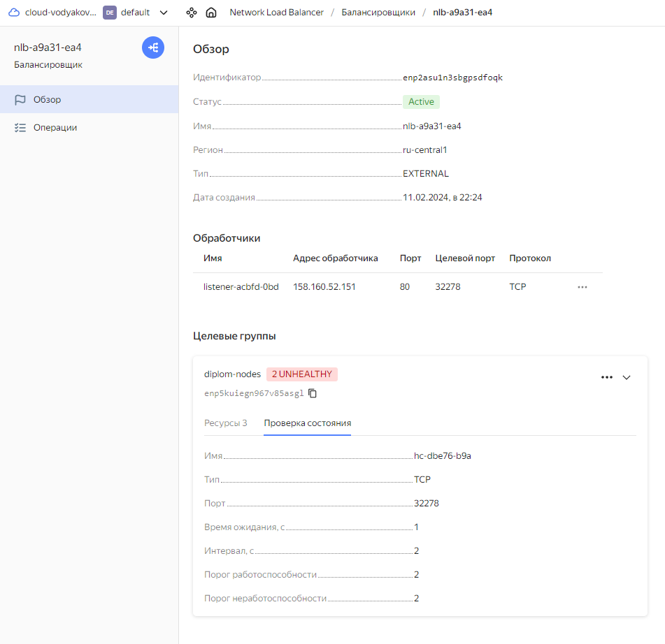

```bash
KUBE_EDITOR="nano" kubectl edit configmap -n kube-system kube-proxy
```

Установить значения:

```bash
apiVersion: kubeproxy.config.k8s.io/v1alpha1
kind: KubeProxyConfiguration
mode: "ipvs"
ipvs:
  strictARP: true
```

```bash
kubectl apply -f externalIP.yaml
```
[externalIP.yaml](file/ingress-control/externalIP.yaml)

```bash
root@k8s-node1:/home/ubuntu# kubectl -n ingress-nginx get svc
NAME                                 TYPE           CLUSTER-IP       EXTERNAL-IP      PORT(S)                      AGE
ingress-nginx-controller             LoadBalancer   10.245.246.172   158.160.52.151   80:32278/TCP,443:31163/TCP   83m
ingress-nginx-controller-admission   ClusterIP      10.245.212.160   <none>           443/TCP                      83m

```


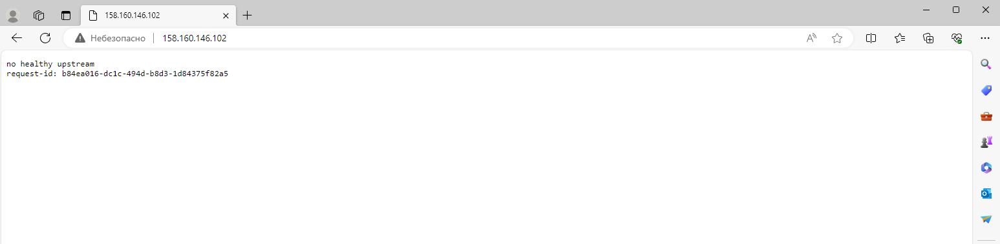

</details>

<details><summary>install prometheus + grafana</summary>

```bash
helm repo add prometheus-community https://prometheus-community.github.io/helm-charts
helm repo update
kubectl create namespace monitoring
helm install monitoring prometheus-community/kube-prometheus-stack -n monitoring -f values.yaml
```

[values.yaml](file/monitoring/values.yaml)


```bash
root@k8s-node1:/home/ubuntu/monitoring# kubectl -n monitoring get ingress
NAME                 CLASS   HOSTS                ADDRESS   PORTS   AGE
kube-state-ingress   nginx   grafana.diplom.com             80      10s
```

```
login: admin
password: prom-operator
```

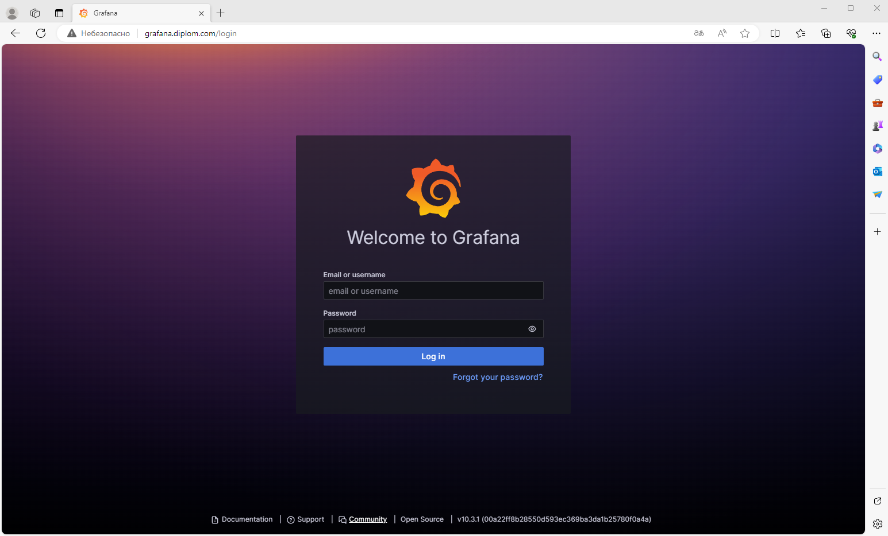


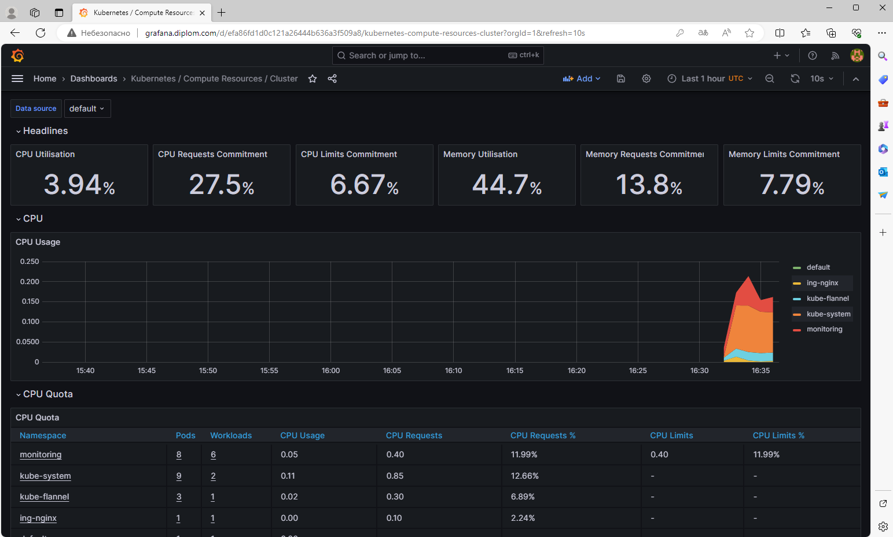


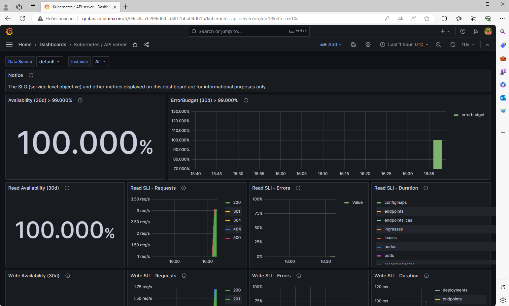

<details><summary>* При ошибке : failed calling webhook</summary>

```bash
Error from server (InternalError): error when creating "ingress.yaml": Internal error occurred: failed calling webhook "validate.nginx.ingress.kubernetes.io": failed to call webhook: Post "https://ingress-nginx-controller-admission.ingress-nginx.svc:443/networking/v1/ingresses?timeout=10s": dial tcp 10.245.55.76:443: i/o timeout
```

Выполнить:

```bash
kubectl delete -A ValidatingWebhookConfiguration ingress-nginx-admission
```

</details>

</details>

<details><summary>* Если вдруг проблема с DNS</summary>

накаждой ноде нужно:
```bash
systemctl mask firewald
```

затем самое просто грохнуть кор-днс
```bash
kubectl delete pods -n kube-system -l k8s-app=kube-dns
```

проверяем что новые поднялись:
```bash
kubectl get pods -n kube-system -l k8s-app=kube-dns
```

для тестов можем поднять dnsutils под
```bash
kubectl apply -f https://k8s.io/examples/admin/dns/dnsutils.yaml
```

и увидем:
```bash
root@dnsutils:/# ping ya.ru
PING ya.ru (5.255.255.242) 56(84) bytes of data.
64 bytes from ya.ru (5.255.255.242): icmp_seq=1 ttl=248 time=1.17 ms
64 bytes from ya.ru (5.255.255.242): icmp_seq=2 ttl=248 time=0.451 ms
```

</details>


<details><summary>* Используем metallb (если установка в локальной сети)</summary>

Для начала необходимо проверить что включен режим IPVS

```bash
KUBE_EDITOR="nano" kubectl edit configmap -n kube-system kube-proxy
```

Установить значения:

```bash
apiVersion: kubeproxy.config.k8s.io/v1alpha1
kind: KubeProxyConfiguration
mode: "ipvs"
ipvs:
  strictARP: true
```

Устанавливаем metallb

```bash
kubectl create namespace metallb-system
helm repo add metallb https://metallb.github.io/metallb
helm install metallb metallb/metallb -n metallb-system
kubectl apply -f metallb-ip.yaml
```

<details><summary>metallb-ip.yaml</summary>

```bash
apiVersion: metallb.io/v1beta1
kind: IPAddressPool
metadata:
  name: default
  namespace: metallb-system
spec:
  addresses:
  - 10.10.3.100-10.10.3.105

kind: L2Advertisement
metadata:
  name: default
  namespace: metallb-system
spec:
  ipAddressPools:
  - default
  interfaces:
  - eth0
  - eth1
```

</details>

**Вывод на локальном кластере:**

```bash
root@k8s-node1:/home/admlocal# kubectl -n ingress-nginx get svc
NAME                                 TYPE           CLUSTER-IP       EXTERNAL-IP   PORT(S)                      AGE
ingress-nginx-controller             LoadBalancer   10.245.227.235   10.10.3.100   80:32360/TCP,443:32144/TCP   51m
ingress-nginx-controller-admission   ClusterIP      10.245.253.213   <none>        443/TCP                      51m
```


</details>


---
## Установка и настройка CI/CD

> **Цель:**
> 1. Автоматическая сборка docker образа при коммите в репозиторий с тестовым приложением.   
> 2. Автоматический деплой нового docker образа.   
> Можно использовать teamcity, jenkins, GitLab CI или GitHub Actions.   
>
> **Ожидаемый результат:**
> 1. Интерфейс ci/cd сервиса доступен по http.
> 2. При любом коммите в репозиторие с тестовым приложением происходит сборка и отправка в регистр Docker образа.
> 3. При создании тега (например, v1.0.0) происходит сборка и отправка с соответствующим label в регистри, а также деплой соответствующего Docker образа в кластер Kubernetes.

В качестве CI/CD будет использоваться гитлаб развернутый в одной из домашних работ (доступ может быть ограничен):

Репозиторий с ci/cd для gitlab (расположен на github) - [diplom-terraform](https://github.com/VodyakovDenis/diplom-terraform)

Ссылка на проект на внутреннет [gitlab](https://gitlab.it-git.ru/test/diplom-terraform)

<details><summary>Применение CI-CD-terraform pipeline</summary>

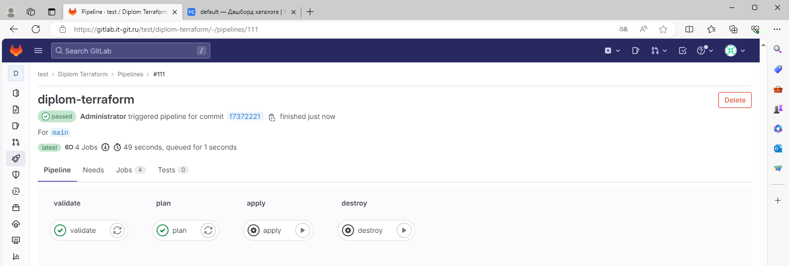

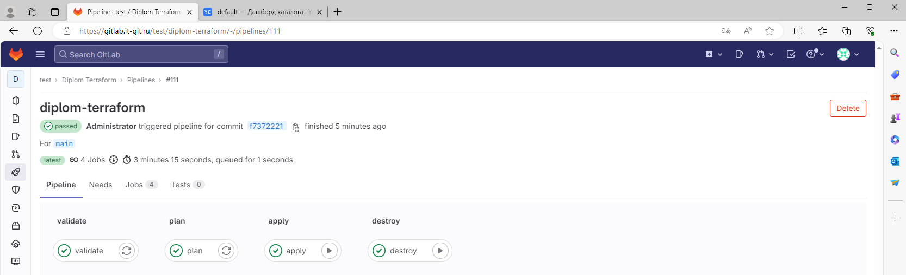

<details><summary>validate</summary>

[raw](https://gitlab.it-git.ru/test/diplom-terraform/-/jobs/328/raw)

```txt
Running with gitlab-runner 16.2.1 (674e0e29)
  on gitlab-runner-1 GvwJgJtvC, system ID: s_3b0069d0acea
section_start:1708003106:prepare_executor
Preparing the "docker" executor
Using Docker executor with image hashicorp/terraform:light ...
Pulling docker image hashicorp/terraform:light ...
Using docker image sha256:22ae929e925c6bdb60846c05fbee4f15ef15bd02d101e23f34dd6be69cace0f3 for hashicorp/terraform:light with digest hashicorp/terraform@sha256:2734886211a482abaff7efbbfd8bdb32295c9c35dda124092d46f39b69f47c42 ...
section_end:1708003113:prepare_executor
section_start:1708003113:prepare_script
Preparing environment
Running on runner-gvwjgjtvc-project-3-concurrent-0 via gitlab-runner-1...
section_end:1708003114:prepare_script
section_start:1708003114:get_sources
Getting source from Git repository
Fetching changes with git depth set to 20...
Reinitialized existing Git repository in /builds/test/diplom-terraform/.git/
Checking out f7372221 as detached HEAD (ref is main)...
Removing .terraform.lock.hcl
Removing .terraform/

Skipping Git submodules setup
section_end:1708003117:get_sources
section_start:1708003117:step_script
Executing "step_script" stage of the job script
Using docker image sha256:22ae929e925c6bdb60846c05fbee4f15ef15bd02d101e23f34dd6be69cace0f3 for hashicorp/terraform:light with digest hashicorp/terraform@sha256:2734886211a482abaff7efbbfd8bdb32295c9c35dda124092d46f39b69f47c42 ...
$ cp .terraformrc /root/.terraformrc
$ rm -rf .terraform
$ terraform --version
Terraform v1.4.2
on linux_amd64

Your version of Terraform is out of date! The latest version
is 1.7.3. You can update by downloading from https://www.terraform.io/downloads.html
$ export GITLAB_ACCESS_TOKEN=$GITLAB_TOCKEN
$ sed -i "s/__TOKEN__/$TOKEN/" variables.tf
$ terraform init

Initializing the backend...

Successfully configured the backend "http"! Terraform will automatically
use this backend unless the backend configuration changes.

Initializing provider plugins...
- Finding latest version of yandex-cloud/yandex...
- Finding latest version of hashicorp/random...
- Installing yandex-cloud/yandex v0.108.0...
- Installed yandex-cloud/yandex v0.108.0 (unauthenticated)
- Installing hashicorp/random v3.6.0...
- Installed hashicorp/random v3.6.0 (unauthenticated)

Terraform has created a lock file .terraform.lock.hcl to record the provider
selections it made above. Include this file in your version control repository
so that Terraform can guarantee to make the same selections by default when
you run "terraform init" in the future.

╷
│ Warning: Incomplete lock file information for providers
│ 
│ Due to your customized provider installation methods, Terraform was forced
│ to calculate lock file checksums locally for the following providers:
│   - hashicorp/random
│   - yandex-cloud/yandex
│ 
│ The current .terraform.lock.hcl file only includes checksums for
│ linux_amd64, so Terraform running on another platform will fail to install
│ these providers.
│ 
│ To calculate additional checksums for another platform, run:
│   terraform providers lock -platform=linux_amd64
│ (where linux_amd64 is the platform to generate)
╵

Terraform has been successfully initialized!

You may now begin working with Terraform. Try running "terraform plan" to see
any changes that are required for your infrastructure. All Terraform commands
should now work.

If you ever set or change modules or backend configuration for Terraform,
rerun this command to reinitialize your working directory. If you forget, other
commands will detect it and remind you to do so if necessary.
$ terraform validate
Success! The configuration is valid.

section_end:1708003130:step_script
section_start:1708003130:cleanup_file_variables
Cleaning up project directory and file based variables
section_end:1708003131:cleanup_file_variables
Job succeeded

```

</details>

<details><summary>plan</summary>

[raw](https://gitlab.it-git.ru/test/diplom-terraform/-/jobs/329/raw)

```txt
Running with gitlab-runner 16.2.1 (674e0e29)
  on gitlab-runner-1 GvwJgJtvC, system ID: s_3b0069d0acea
section_start:1708003135:prepare_executor
Preparing the "docker" executor
Using Docker executor with image hashicorp/terraform:light ...
Pulling docker image hashicorp/terraform:light ...
Using docker image sha256:22ae929e925c6bdb60846c05fbee4f15ef15bd02d101e23f34dd6be69cace0f3 for hashicorp/terraform:light with digest hashicorp/terraform@sha256:2734886211a482abaff7efbbfd8bdb32295c9c35dda124092d46f39b69f47c42 ...
section_end:1708003141:prepare_executor
section_start:1708003141:prepare_script
Preparing environment
Running on runner-gvwjgjtvc-project-3-concurrent-0 via gitlab-runner-1...
section_end:1708003142:prepare_script
section_start:1708003142:get_sources
Getting source from Git repository
Fetching changes with git depth set to 20...
Reinitialized existing Git repository in /builds/test/diplom-terraform/.git/
Checking out f7372221 as detached HEAD (ref is main)...
Removing .terraform.lock.hcl
Removing .terraform/

Skipping Git submodules setup
section_end:1708003143:get_sources
section_start:1708003143:step_script
Executing "step_script" stage of the job script
Using docker image sha256:22ae929e925c6bdb60846c05fbee4f15ef15bd02d101e23f34dd6be69cace0f3 for hashicorp/terraform:light with digest hashicorp/terraform@sha256:2734886211a482abaff7efbbfd8bdb32295c9c35dda124092d46f39b69f47c42 ...
$ cp .terraformrc /root/.terraformrc
$ rm -rf .terraform
$ terraform --version
Terraform v1.4.2
on linux_amd64

Your version of Terraform is out of date! The latest version
is 1.7.3. You can update by downloading from https://www.terraform.io/downloads.html
$ export GITLAB_ACCESS_TOKEN=$GITLAB_TOCKEN
$ sed -i "s/__TOKEN__/$TOKEN/" variables.tf
$ terraform init

Initializing the backend...

Successfully configured the backend "http"! Terraform will automatically
use this backend unless the backend configuration changes.

Initializing provider plugins...
- Finding latest version of yandex-cloud/yandex...
- Finding latest version of hashicorp/random...
- Installing yandex-cloud/yandex v0.108.0...
- Installed yandex-cloud/yandex v0.108.0 (unauthenticated)
- Installing hashicorp/random v3.6.0...
- Installed hashicorp/random v3.6.0 (unauthenticated)

Terraform has created a lock file .terraform.lock.hcl to record the provider
selections it made above. Include this file in your version control repository
so that Terraform can guarantee to make the same selections by default when
you run "terraform init" in the future.

╷
│ Warning: Incomplete lock file information for providers
│ 
│ Due to your customized provider installation methods, Terraform was forced
│ to calculate lock file checksums locally for the following providers:
│   - hashicorp/random
│   - yandex-cloud/yandex
│ 
│ The current .terraform.lock.hcl file only includes checksums for
│ linux_amd64, so Terraform running on another platform will fail to install
│ these providers.
│ 
│ To calculate additional checksums for another platform, run:
│   terraform providers lock -platform=linux_amd64
│ (where linux_amd64 is the platform to generate)
╵

Terraform has been successfully initialized!

You may now begin working with Terraform. Try running "terraform plan" to see
any changes that are required for your infrastructure. All Terraform commands
should now work.

If you ever set or change modules or backend configuration for Terraform,
rerun this command to reinitialize your working directory. If you forget, other
commands will detect it and remind you to do so if necessary.
$ terraform plan -out "planfile"
Acquiring state lock. This may take a few moments...

Terraform used the selected providers to generate the following execution
plan. Resource actions are indicated with the following symbols:
  + create

Terraform will perform the following actions:

  # random_shuffle.diplom-network-subnet-random will be created
  + resource "random_shuffle" "diplom-network-subnet-random" {
      + id           = (known after apply)
      + input        = [
          + (known after apply),
          + (known after apply),
        ]
      + result       = (known after apply)
      + result_count = 1
    }

  # yandex_compute_instance.k8s-cluster["k8s-node1"] will be created
  + resource "yandex_compute_instance" "k8s-cluster" {
      + created_at                = (known after apply)
      + folder_id                 = (known after apply)
      + fqdn                      = (known after apply)
      + gpu_cluster_id            = (known after apply)
      + hostname                  = "k8s-node1.diplom.local"
      + id                        = (known after apply)
      + maintenance_grace_period  = (known after apply)
      + maintenance_policy        = (known after apply)
      + metadata                  = {
          + "serial-port-enable" = "1"
          + "ssh-keys"           = <<-EOT
                ubuntu:ssh-rsa AAAAB3NzaC1yc2EAAAADAQABAAABgQC7KoRsmTb6EC67YSxCrvoqTLhZcBgEd7lM4LebHU5p7qBtvyxA+oUxkH1Z4HjR2zbKEzDqtFfgREN5gaMFzHG/pa7RgMPR1c5lBynlsCzHDQqKt9417IoXfT71bFo2Mh+wXHo9gcJw9tU+4pab93zMBN7a40XtKWYQFsSQ0TffpprCcBkkqBeuBS9BFh3oaL7hRIOWPmUwpXmhY+Te7oaluj8fPxq/2ahPF1kthLY1NTLQvRGbrxENxsysi0jZwfDkYzWdWqhI5BA8fyG8e1wcpTM+9U8F4sAGMBxI5vEcC1J/Eb940tnEfp+oeZzcrSH9IRVCOgyGnEBh/qloxP7HVlErpX7KGf8h6s18h4d4mi5ylgBBgYfn/Wszej+Yotdgc+TJYihe/dDRulsxEcU/UQjIheqIoIIZApnajk0GdEyOtZpU/cY+CrtBH2czMLlNpn4lEOkcaCQu2XeqKn2yQNiOqz8jsDrVrTRrJHTEZ7+kkUROqmuNtcJdWl+4YH0= denis@denis-lin
            EOT
        }
      + name                      = "k8s-node1"
      + network_acceleration_type = "standard"
      + platform_id               = "standard-v1"
      + service_account_id        = (known after apply)
      + status                    = (known after apply)
      + zone                      = (known after apply)

      + boot_disk {
          + auto_delete = true
          + device_name = (known after apply)
          + disk_id     = (known after apply)
          + mode        = (known after apply)

          + initialize_params {
              + block_size  = (known after apply)
              + description = (known after apply)
              + image_id    = "fd8tckeqoshi403tks4l"
              + name        = (known after apply)
              + size        = 20
              + snapshot_id = (known after apply)
              + type        = "network-hdd"
            }
        }

      + network_interface {
          + index              = (known after apply)
          + ip_address         = (known after apply)
          + ipv4               = true
          + ipv6               = (known after apply)
          + ipv6_address       = (known after apply)
          + mac_address        = (known after apply)
          + nat                = true
          + nat_ip_address     = (known after apply)
          + nat_ip_version     = (known after apply)
          + security_group_ids = (known after apply)
          + subnet_id          = (known after apply)
        }

      + resources {
          + core_fraction = 100
          + cores         = 2
          + memory        = 2
        }
    }

  # yandex_compute_instance.k8s-cluster["k8s-node2"] will be created
  + resource "yandex_compute_instance" "k8s-cluster" {
      + created_at                = (known after apply)
      + folder_id                 = (known after apply)
      + fqdn                      = (known after apply)
      + gpu_cluster_id            = (known after apply)
      + hostname                  = "k8s-node2.diplom.local"
      + id                        = (known after apply)
      + maintenance_grace_period  = (known after apply)
      + maintenance_policy        = (known after apply)
      + metadata                  = {
          + "serial-port-enable" = "1"
          + "ssh-keys"           = <<-EOT
                ubuntu:ssh-rsa AAAAB3NzaC1yc2EAAAADAQABAAABgQC7KoRsmTb6EC67YSxCrvoqTLhZcBgEd7lM4LebHU5p7qBtvyxA+oUxkH1Z4HjR2zbKEzDqtFfgREN5gaMFzHG/pa7RgMPR1c5lBynlsCzHDQqKt9417IoXfT71bFo2Mh+wXHo9gcJw9tU+4pab93zMBN7a40XtKWYQFsSQ0TffpprCcBkkqBeuBS9BFh3oaL7hRIOWPmUwpXmhY+Te7oaluj8fPxq/2ahPF1kthLY1NTLQvRGbrxENxsysi0jZwfDkYzWdWqhI5BA8fyG8e1wcpTM+9U8F4sAGMBxI5vEcC1J/Eb940tnEfp+oeZzcrSH9IRVCOgyGnEBh/qloxP7HVlErpX7KGf8h6s18h4d4mi5ylgBBgYfn/Wszej+Yotdgc+TJYihe/dDRulsxEcU/UQjIheqIoIIZApnajk0GdEyOtZpU/cY+CrtBH2czMLlNpn4lEOkcaCQu2XeqKn2yQNiOqz8jsDrVrTRrJHTEZ7+kkUROqmuNtcJdWl+4YH0= denis@denis-lin
            EOT
        }
      + name                      = "k8s-node2"
      + network_acceleration_type = "standard"
      + platform_id               = "standard-v1"
      + service_account_id        = (known after apply)
      + status                    = (known after apply)
      + zone                      = (known after apply)

      + boot_disk {
          + auto_delete = true
          + device_name = (known after apply)
          + disk_id     = (known after apply)
          + mode        = (known after apply)

          + initialize_params {
              + block_size  = (known after apply)
              + description = (known after apply)
              + image_id    = "fd8tckeqoshi403tks4l"
              + name        = (known after apply)
              + size        = 20
              + snapshot_id = (known after apply)
              + type        = "network-hdd"
            }
        }

      + network_interface {
          + index              = (known after apply)
          + ip_address         = (known after apply)
          + ipv4               = true
          + ipv6               = (known after apply)
          + ipv6_address       = (known after apply)
          + mac_address        = (known after apply)
          + nat                = true
          + nat_ip_address     = (known after apply)
          + nat_ip_version     = (known after apply)
          + security_group_ids = (known after apply)
          + subnet_id          = (known after apply)
        }

      + resources {
          + core_fraction = 100
          + cores         = 2
          + memory        = 2
        }
    }

  # yandex_compute_instance.k8s-cluster["k8s-node3"] will be created
  + resource "yandex_compute_instance" "k8s-cluster" {
      + created_at                = (known after apply)
      + folder_id                 = (known after apply)
      + fqdn                      = (known after apply)
      + gpu_cluster_id            = (known after apply)
      + hostname                  = "k8s-node3.diplom.local"
      + id                        = (known after apply)
      + maintenance_grace_period  = (known after apply)
      + maintenance_policy        = (known after apply)
      + metadata                  = {
          + "serial-port-enable" = "1"
          + "ssh-keys"           = <<-EOT
                ubuntu:ssh-rsa AAAAB3NzaC1yc2EAAAADAQABAAABgQC7KoRsmTb6EC67YSxCrvoqTLhZcBgEd7lM4LebHU5p7qBtvyxA+oUxkH1Z4HjR2zbKEzDqtFfgREN5gaMFzHG/pa7RgMPR1c5lBynlsCzHDQqKt9417IoXfT71bFo2Mh+wXHo9gcJw9tU+4pab93zMBN7a40XtKWYQFsSQ0TffpprCcBkkqBeuBS9BFh3oaL7hRIOWPmUwpXmhY+Te7oaluj8fPxq/2ahPF1kthLY1NTLQvRGbrxENxsysi0jZwfDkYzWdWqhI5BA8fyG8e1wcpTM+9U8F4sAGMBxI5vEcC1J/Eb940tnEfp+oeZzcrSH9IRVCOgyGnEBh/qloxP7HVlErpX7KGf8h6s18h4d4mi5ylgBBgYfn/Wszej+Yotdgc+TJYihe/dDRulsxEcU/UQjIheqIoIIZApnajk0GdEyOtZpU/cY+CrtBH2czMLlNpn4lEOkcaCQu2XeqKn2yQNiOqz8jsDrVrTRrJHTEZ7+kkUROqmuNtcJdWl+4YH0= denis@denis-lin
            EOT
        }
      + name                      = "k8s-node3"
      + network_acceleration_type = "standard"
      + platform_id               = "standard-v1"
      + service_account_id        = (known after apply)
      + status                    = (known after apply)
      + zone                      = (known after apply)

      + boot_disk {
          + auto_delete = true
          + device_name = (known after apply)
          + disk_id     = (known after apply)
          + mode        = (known after apply)

          + initialize_params {
              + block_size  = (known after apply)
              + description = (known after apply)
              + image_id    = "fd8tckeqoshi403tks4l"
              + name        = (known after apply)
              + size        = 20
              + snapshot_id = (known after apply)
              + type        = "network-hdd"
            }
        }

      + network_interface {
          + index              = (known after apply)
          + ip_address         = (known after apply)
          + ipv4               = true
          + ipv6               = (known after apply)
          + ipv6_address       = (known after apply)
          + mac_address        = (known after apply)
          + nat                = true
          + nat_ip_address     = (known after apply)
          + nat_ip_version     = (known after apply)
          + security_group_ids = (known after apply)
          + subnet_id          = (known after apply)
        }

      + resources {
          + core_fraction = 100
          + cores         = 2
          + memory        = 2
        }
    }

  # yandex_vpc_network.diplom-network will be created
  + resource "yandex_vpc_network" "diplom-network" {
      + created_at                = (known after apply)
      + default_security_group_id = (known after apply)
      + folder_id                 = (known after apply)
      + id                        = (known after apply)
      + labels                    = (known after apply)
      + name                      = "diplom-network"
      + subnet_ids                = (known after apply)
    }

  # yandex_vpc_subnet.diplom-network-subnet-a will be created
  + resource "yandex_vpc_subnet" "diplom-network-subnet-a" {
      + created_at     = (known after apply)
      + folder_id      = (known after apply)
      + id             = (known after apply)
      + labels         = (known after apply)
      + name           = "diplom-network-subnet-a"
      + network_id     = (known after apply)
      + v4_cidr_blocks = [
          + "192.168.10.0/24",
        ]
      + v6_cidr_blocks = (known after apply)
      + zone           = "ru-central1-a"
    }

  # yandex_vpc_subnet.diplom-network-subnet-b will be created
  + resource "yandex_vpc_subnet" "diplom-network-subnet-b" {
      + created_at     = (known after apply)
      + folder_id      = (known after apply)
      + id             = (known after apply)
      + labels         = (known after apply)
      + name           = "diplom-network-subnet-b"
      + network_id     = (known after apply)
      + v4_cidr_blocks = [
          + "192.168.11.0/24",
        ]
      + v6_cidr_blocks = (known after apply)
      + zone           = "ru-central1-b"
    }

Plan: 7 to add, 0 to change, 0 to destroy.

Changes to Outputs:
  + cluster_ips = {
      + external = [
          + null,
          + null,
          + null,
        ]
      + internal = [
          + null,
          + null,
          + null,
        ]
    }

─────────────────────────────────────────────────────────────────────────────

Saved the plan to: planfile

To perform exactly these actions, run the following command to apply:
    terraform apply "planfile"
section_end:1708003154:step_script
section_start:1708003154:upload_artifacts_on_success
Uploading artifacts for successful job
Uploading artifacts...
planfile: found 1 matching artifact files and directories 
Uploading artifacts as "archive" to coordinator... 201 Created  id=329 responseStatus=201 Created token=64_zXbTZ
section_end:1708003158:upload_artifacts_on_success
section_start:1708003158:cleanup_file_variables
Cleaning up project directory and file based variables
section_end:1708003159:cleanup_file_variables
Job succeeded
```

</details>

<details><summary>apply</summary>

[raw](https://gitlab.it-git.ru/test/diplom-terraform/-/jobs/330/raw)

```txt
Running with gitlab-runner 16.2.1 (674e0e29)
  on gitlab-runner-1 GvwJgJtvC, system ID: s_3b0069d0acea
section_start:1708003675:prepare_executor
Preparing the "docker" executor
Using Docker executor with image hashicorp/terraform:light ...
Pulling docker image hashicorp/terraform:light ...
Using docker image sha256:22ae929e925c6bdb60846c05fbee4f15ef15bd02d101e23f34dd6be69cace0f3 for hashicorp/terraform:light with digest hashicorp/terraform@sha256:2734886211a482abaff7efbbfd8bdb32295c9c35dda124092d46f39b69f47c42 ...
section_end:1708003680:prepare_executor
section_start:1708003680:prepare_script
Preparing environment
Running on runner-gvwjgjtvc-project-3-concurrent-0 via gitlab-runner-1...
section_end:1708003681:prepare_script
section_start:1708003681:get_sources
Getting source from Git repository
Fetching changes with git depth set to 20...
Reinitialized existing Git repository in /builds/test/diplom-terraform/.git/
Checking out f7372221 as detached HEAD (ref is main)...
Removing .terraform.lock.hcl
Removing .terraform/
Removing planfile

Skipping Git submodules setup
section_end:1708003683:get_sources
section_start:1708003683:download_artifacts
Downloading artifacts
Downloading artifacts for plan (329)...
Downloading artifacts from coordinator... ok        host=gitlab.it-git.ru id=329 responseStatus=200 OK token=64_iQVx-
section_end:1708003684:download_artifacts
section_start:1708003684:step_script
Executing "step_script" stage of the job script
Using docker image sha256:22ae929e925c6bdb60846c05fbee4f15ef15bd02d101e23f34dd6be69cace0f3 for hashicorp/terraform:light with digest hashicorp/terraform@sha256:2734886211a482abaff7efbbfd8bdb32295c9c35dda124092d46f39b69f47c42 ...
$ cp .terraformrc /root/.terraformrc
$ rm -rf .terraform
$ terraform --version
Terraform v1.4.2
on linux_amd64

Your version of Terraform is out of date! The latest version
is 1.7.3. You can update by downloading from https://www.terraform.io/downloads.html
$ export GITLAB_ACCESS_TOKEN=$GITLAB_TOCKEN
$ sed -i "s/__TOKEN__/$TOKEN/" variables.tf
$ terraform init

Initializing the backend...

Successfully configured the backend "http"! Terraform will automatically
use this backend unless the backend configuration changes.

Initializing provider plugins...
- Finding latest version of yandex-cloud/yandex...
- Finding latest version of hashicorp/random...
- Installing yandex-cloud/yandex v0.108.0...
- Installed yandex-cloud/yandex v0.108.0 (unauthenticated)
- Installing hashicorp/random v3.6.0...
- Installed hashicorp/random v3.6.0 (unauthenticated)

Terraform has created a lock file .terraform.lock.hcl to record the provider
selections it made above. Include this file in your version control repository
so that Terraform can guarantee to make the same selections by default when
you run "terraform init" in the future.

╷
│ Warning: Incomplete lock file information for providers
│ 
│ Due to your customized provider installation methods, Terraform was forced
│ to calculate lock file checksums locally for the following providers:
│   - hashicorp/random
│   - yandex-cloud/yandex
│ 
│ The current .terraform.lock.hcl file only includes checksums for
│ linux_amd64, so Terraform running on another platform will fail to install
│ these providers.
│ 
│ To calculate additional checksums for another platform, run:
│   terraform providers lock -platform=linux_amd64
│ (where linux_amd64 is the platform to generate)
╵

Terraform has been successfully initialized!

You may now begin working with Terraform. Try running "terraform plan" to see
any changes that are required for your infrastructure. All Terraform commands
should now work.

If you ever set or change modules or backend configuration for Terraform,
rerun this command to reinitialize your working directory. If you forget, other
commands will detect it and remind you to do so if necessary.
$ terraform apply -auto-approve "planfile"
yandex_vpc_network.diplom-network: Creating...
yandex_vpc_network.diplom-network: Creation complete after 4s [id=enp48huj8ab5ubime77m]
yandex_vpc_subnet.diplom-network-subnet-a: Creating...
yandex_vpc_subnet.diplom-network-subnet-b: Creating...
yandex_vpc_subnet.diplom-network-subnet-b: Creation complete after 1s [id=e2lbtdq0id3k2avv45sm]
yandex_vpc_subnet.diplom-network-subnet-a: Creation complete after 1s [id=e9bp6i4phmsbasju46hb]
random_shuffle.diplom-network-subnet-random: Creating...
random_shuffle.diplom-network-subnet-random: Creation complete after 0s [id=-]
yandex_compute_instance.k8s-cluster["k8s-node2"]: Creating...
yandex_compute_instance.k8s-cluster["k8s-node1"]: Creating...
yandex_compute_instance.k8s-cluster["k8s-node3"]: Creating...
yandex_compute_instance.k8s-cluster["k8s-node1"]: Still creating... [10s elapsed]
yandex_compute_instance.k8s-cluster["k8s-node2"]: Still creating... [10s elapsed]
yandex_compute_instance.k8s-cluster["k8s-node3"]: Still creating... [10s elapsed]
yandex_compute_instance.k8s-cluster["k8s-node2"]: Still creating... [20s elapsed]
yandex_compute_instance.k8s-cluster["k8s-node1"]: Still creating... [20s elapsed]
yandex_compute_instance.k8s-cluster["k8s-node3"]: Still creating... [20s elapsed]
yandex_compute_instance.k8s-cluster["k8s-node2"]: Still creating... [30s elapsed]
yandex_compute_instance.k8s-cluster["k8s-node1"]: Still creating... [30s elapsed]
yandex_compute_instance.k8s-cluster["k8s-node3"]: Still creating... [30s elapsed]
yandex_compute_instance.k8s-cluster["k8s-node2"]: Creation complete after 36s [id=fhm10404qco16b0d3j77]
yandex_compute_instance.k8s-cluster["k8s-node3"]: Creation complete after 36s [id=fhmnne713httg57trv06]
yandex_compute_instance.k8s-cluster["k8s-node1"]: Still creating... [40s elapsed]
yandex_compute_instance.k8s-cluster["k8s-node1"]: Creation complete after 45s [id=fhm5htkn04et2l8khpok]

Apply complete! Resources: 7 added, 0 changed, 0 destroyed.

Outputs:

cluster_ips = {
  "external" = [
    "158.160.116.25",
    "158.160.40.26",
    "178.154.207.84",
  ]
  "internal" = [
    "192.168.10.4",
    "192.168.10.10",
    "192.168.10.13",
  ]
}
section_end:1708003744:step_script
section_start:1708003744:cleanup_file_variables
Cleaning up project directory and file based variables
section_end:1708003745:cleanup_file_variables
Job succeeded
```

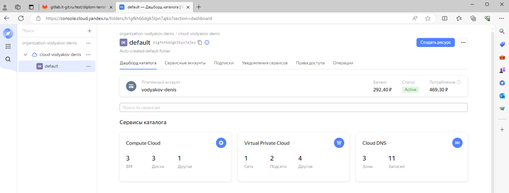

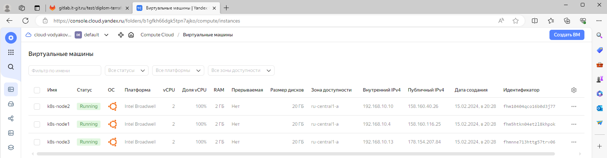

</details>

<details><summary>destroy</summary>

[raw](https://gitlab.it-git.ru/test/diplom-terraform/-/jobs/331/raw)

```txt
Running with gitlab-runner 16.2.1 (674e0e29)
  on gitlab-runner-1 GvwJgJtvC, system ID: s_3b0069d0acea
section_start:1708004058:prepare_executor
Preparing the "docker" executor
Using Docker executor with image hashicorp/terraform:light ...
Pulling docker image hashicorp/terraform:light ...
Using docker image sha256:22ae929e925c6bdb60846c05fbee4f15ef15bd02d101e23f34dd6be69cace0f3 for hashicorp/terraform:light with digest hashicorp/terraform@sha256:2734886211a482abaff7efbbfd8bdb32295c9c35dda124092d46f39b69f47c42 ...
section_end:1708004063:prepare_executor
section_start:1708004063:prepare_script
Preparing environment
Running on runner-gvwjgjtvc-project-3-concurrent-0 via gitlab-runner-1...
section_end:1708004063:prepare_script
section_start:1708004063:get_sources
Getting source from Git repository
Fetching changes with git depth set to 20...
Reinitialized existing Git repository in /builds/test/diplom-terraform/.git/
Checking out f7372221 as detached HEAD (ref is main)...
Removing .terraform.lock.hcl
Removing .terraform/
Removing planfile

Skipping Git submodules setup
section_end:1708004064:get_sources
section_start:1708004064:step_script
Executing "step_script" stage of the job script
Using docker image sha256:22ae929e925c6bdb60846c05fbee4f15ef15bd02d101e23f34dd6be69cace0f3 for hashicorp/terraform:light with digest hashicorp/terraform@sha256:2734886211a482abaff7efbbfd8bdb32295c9c35dda124092d46f39b69f47c42 ...
$ cp .terraformrc /root/.terraformrc
$ rm -rf .terraform
$ terraform --version
Terraform v1.4.2
on linux_amd64

Your version of Terraform is out of date! The latest version
is 1.7.3. You can update by downloading from https://www.terraform.io/downloads.html
$ export GITLAB_ACCESS_TOKEN=$GITLAB_TOCKEN
$ sed -i "s/__TOKEN__/$TOKEN/" variables.tf
$ terraform init

Initializing the backend...

Successfully configured the backend "http"! Terraform will automatically
use this backend unless the backend configuration changes.

Initializing provider plugins...
- Finding latest version of yandex-cloud/yandex...
- Finding latest version of hashicorp/random...
- Installing yandex-cloud/yandex v0.108.0...
- Installed yandex-cloud/yandex v0.108.0 (unauthenticated)
- Installing hashicorp/random v3.6.0...
- Installed hashicorp/random v3.6.0 (unauthenticated)

Terraform has created a lock file .terraform.lock.hcl to record the provider
selections it made above. Include this file in your version control repository
so that Terraform can guarantee to make the same selections by default when
you run "terraform init" in the future.

╷
│ Warning: Incomplete lock file information for providers
│ 
│ Due to your customized provider installation methods, Terraform was forced
│ to calculate lock file checksums locally for the following providers:
│   - hashicorp/random
│   - yandex-cloud/yandex
│ 
│ The current .terraform.lock.hcl file only includes checksums for
│ linux_amd64, so Terraform running on another platform will fail to install
│ these providers.
│ 
│ To calculate additional checksums for another platform, run:
│   terraform providers lock -platform=linux_amd64
│ (where linux_amd64 is the platform to generate)
╵

Terraform has been successfully initialized!

You may now begin working with Terraform. Try running "terraform plan" to see
any changes that are required for your infrastructure. All Terraform commands
should now work.

If you ever set or change modules or backend configuration for Terraform,
rerun this command to reinitialize your working directory. If you forget, other
commands will detect it and remind you to do so if necessary.
$ terraform init

Initializing the backend...

Initializing provider plugins...
- Reusing previous version of yandex-cloud/yandex from the dependency lock file
- Reusing previous version of hashicorp/random from the dependency lock file
- Using previously-installed hashicorp/random v3.6.0
- Using previously-installed yandex-cloud/yandex v0.108.0

Terraform has been successfully initialized!

You may now begin working with Terraform. Try running "terraform plan" to see
any changes that are required for your infrastructure. All Terraform commands
should now work.

If you ever set or change modules or backend configuration for Terraform,
rerun this command to reinitialize your working directory. If you forget, other
commands will detect it and remind you to do so if necessary.
$ terraform destroy -auto-approve
yandex_vpc_network.diplom-network: Refreshing state... [id=enp48huj8ab5ubime77m]
yandex_vpc_subnet.diplom-network-subnet-a: Refreshing state... [id=e9bp6i4phmsbasju46hb]
yandex_vpc_subnet.diplom-network-subnet-b: Refreshing state... [id=e2lbtdq0id3k2avv45sm]
random_shuffle.diplom-network-subnet-random: Refreshing state... [id=-]
yandex_compute_instance.k8s-cluster["k8s-node1"]: Refreshing state... [id=fhm5htkn04et2l8khpok]
yandex_compute_instance.k8s-cluster["k8s-node2"]: Refreshing state... [id=fhm10404qco16b0d3j77]
yandex_compute_instance.k8s-cluster["k8s-node3"]: Refreshing state... [id=fhmnne713httg57trv06]

Terraform used the selected providers to generate the following execution
plan. Resource actions are indicated with the following symbols:
  - destroy

Terraform will perform the following actions:

  # random_shuffle.diplom-network-subnet-random will be destroyed
  - resource "random_shuffle" "diplom-network-subnet-random" {
      - id           = "-" -> null
      - input        = [
          - "e9bp6i4phmsbasju46hb",
          - "e9bp6i4phmsbasju46hb",
        ] -> null
      - result       = [
          - "e9bp6i4phmsbasju46hb",
        ] -> null
      - result_count = 1 -> null
    }

  # yandex_compute_instance.k8s-cluster["k8s-node1"] will be destroyed
  - resource "yandex_compute_instance" "k8s-cluster" {
      - created_at                = "2024-02-15T13:28:20Z" -> null
      - folder_id                 = "b1gfkh66dgk5tpn7ajko" -> null
      - fqdn                      = "k8s-node1.diplom.local" -> null
      - hostname                  = "k8s-node1.diplom.local" -> null
      - id                        = "fhm5htkn04et2l8khpok" -> null
      - labels                    = {} -> null
      - metadata                  = {
          - "serial-port-enable" = "1"
          - "ssh-keys"           = <<-EOT
                ubuntu:ssh-rsa AAAAB3NzaC1yc2EAAAADAQABAAABgQC7KoRsmTb6EC67YSxCrvoqTLhZcBgEd7lM4LebHU5p7qBtvyxA+oUxkH1Z4HjR2zbKEzDqtFfgREN5gaMFzHG/pa7RgMPR1c5lBynlsCzHDQqKt9417IoXfT71bFo2Mh+wXHo9gcJw9tU+4pab93zMBN7a40XtKWYQFsSQ0TffpprCcBkkqBeuBS9BFh3oaL7hRIOWPmUwpXmhY+Te7oaluj8fPxq/2ahPF1kthLY1NTLQvRGbrxENxsysi0jZwfDkYzWdWqhI5BA8fyG8e1wcpTM+9U8F4sAGMBxI5vEcC1J/Eb940tnEfp+oeZzcrSH9IRVCOgyGnEBh/qloxP7HVlErpX7KGf8h6s18h4d4mi5ylgBBgYfn/Wszej+Yotdgc+TJYihe/dDRulsxEcU/UQjIheqIoIIZApnajk0GdEyOtZpU/cY+CrtBH2czMLlNpn4lEOkcaCQu2XeqKn2yQNiOqz8jsDrVrTRrJHTEZ7+kkUROqmuNtcJdWl+4YH0= denis@denis-lin
            EOT
        } -> null
      - name                      = "k8s-node1" -> null
      - network_acceleration_type = "standard" -> null
      - platform_id               = "standard-v1" -> null
      - status                    = "running" -> null
      - zone                      = "ru-central1-a" -> null

      - boot_disk {
          - auto_delete = true -> null
          - device_name = "fhm7d55ina368mmjs97c" -> null
          - disk_id     = "fhm7d55ina368mmjs97c" -> null
          - mode        = "READ_WRITE" -> null

          - initialize_params {
              - block_size = 4096 -> null
              - image_id   = "fd8tckeqoshi403tks4l" -> null
              - size       = 20 -> null
              - type       = "network-hdd" -> null
            }
        }

      - metadata_options {
          - aws_v1_http_endpoint = 1 -> null
          - aws_v1_http_token    = 2 -> null
          - gce_http_endpoint    = 1 -> null
          - gce_http_token       = 1 -> null
        }

      - network_interface {
          - index              = 0 -> null
          - ip_address         = "192.168.10.4" -> null
          - ipv4               = true -> null
          - ipv6               = false -> null
          - mac_address        = "d0:0d:58:f6:97:01" -> null
          - nat                = true -> null
          - nat_ip_address     = "158.160.116.25" -> null
          - nat_ip_version     = "IPV4" -> null
          - security_group_ids = [] -> null
          - subnet_id          = "e9bp6i4phmsbasju46hb" -> null
        }

      - placement_policy {
          - host_affinity_rules       = [] -> null
          - placement_group_partition = 0 -> null
        }

      - resources {
          - core_fraction = 100 -> null
          - cores         = 2 -> null
          - gpus          = 0 -> null
          - memory        = 2 -> null
        }

      - scheduling_policy {
          - preemptible = false -> null
        }
    }

  # yandex_compute_instance.k8s-cluster["k8s-node2"] will be destroyed
  - resource "yandex_compute_instance" "k8s-cluster" {
      - created_at                = "2024-02-15T13:28:20Z" -> null
      - folder_id                 = "b1gfkh66dgk5tpn7ajko" -> null
      - fqdn                      = "k8s-node2.diplom.local" -> null
      - hostname                  = "k8s-node2.diplom.local" -> null
      - id                        = "fhm10404qco16b0d3j77" -> null
      - labels                    = {} -> null
      - metadata                  = {
          - "serial-port-enable" = "1"
          - "ssh-keys"           = <<-EOT
                ubuntu:ssh-rsa AAAAB3NzaC1yc2EAAAADAQABAAABgQC7KoRsmTb6EC67YSxCrvoqTLhZcBgEd7lM4LebHU5p7qBtvyxA+oUxkH1Z4HjR2zbKEzDqtFfgREN5gaMFzHG/pa7RgMPR1c5lBynlsCzHDQqKt9417IoXfT71bFo2Mh+wXHo9gcJw9tU+4pab93zMBN7a40XtKWYQFsSQ0TffpprCcBkkqBeuBS9BFh3oaL7hRIOWPmUwpXmhY+Te7oaluj8fPxq/2ahPF1kthLY1NTLQvRGbrxENxsysi0jZwfDkYzWdWqhI5BA8fyG8e1wcpTM+9U8F4sAGMBxI5vEcC1J/Eb940tnEfp+oeZzcrSH9IRVCOgyGnEBh/qloxP7HVlErpX7KGf8h6s18h4d4mi5ylgBBgYfn/Wszej+Yotdgc+TJYihe/dDRulsxEcU/UQjIheqIoIIZApnajk0GdEyOtZpU/cY+CrtBH2czMLlNpn4lEOkcaCQu2XeqKn2yQNiOqz8jsDrVrTRrJHTEZ7+kkUROqmuNtcJdWl+4YH0= denis@denis-lin
            EOT
        } -> null
      - name                      = "k8s-node2" -> null
      - network_acceleration_type = "standard" -> null
      - platform_id               = "standard-v1" -> null
      - status                    = "running" -> null
      - zone                      = "ru-central1-a" -> null

      - boot_disk {
          - auto_delete = true -> null
          - device_name = "fhmadov7jg2403jng5d1" -> null
          - disk_id     = "fhmadov7jg2403jng5d1" -> null
          - mode        = "READ_WRITE" -> null

          - initialize_params {
              - block_size = 4096 -> null
              - image_id   = "fd8tckeqoshi403tks4l" -> null
              - size       = 20 -> null
              - type       = "network-hdd" -> null
            }
        }

      - metadata_options {
          - aws_v1_http_endpoint = 1 -> null
          - aws_v1_http_token    = 2 -> null
          - gce_http_endpoint    = 1 -> null
          - gce_http_token       = 1 -> null
        }

      - network_interface {
          - index              = 0 -> null
          - ip_address         = "192.168.10.10" -> null
          - ipv4               = true -> null
          - ipv6               = false -> null
          - mac_address        = "d0:0d:10:10:04:d3" -> null
          - nat                = true -> null
          - nat_ip_address     = "158.160.40.26" -> null
          - nat_ip_version     = "IPV4" -> null
          - security_group_ids = [] -> null
          - subnet_id          = "e9bp6i4phmsbasju46hb" -> null
        }

      - placement_policy {
          - host_affinity_rules       = [] -> null
          - placement_group_partition = 0 -> null
        }

      - resources {
          - core_fraction = 100 -> null
          - cores         = 2 -> null
          - gpus          = 0 -> null
          - memory        = 2 -> null
        }

      - scheduling_policy {
          - preemptible = false -> null
        }
    }

  # yandex_compute_instance.k8s-cluster["k8s-node3"] will be destroyed
  - resource "yandex_compute_instance" "k8s-cluster" {
      - created_at                = "2024-02-15T13:28:20Z" -> null
      - folder_id                 = "b1gfkh66dgk5tpn7ajko" -> null
      - fqdn                      = "k8s-node3.diplom.local" -> null
      - hostname                  = "k8s-node3.diplom.local" -> null
      - id                        = "fhmnne713httg57trv06" -> null
      - labels                    = {} -> null
      - metadata                  = {
          - "serial-port-enable" = "1"
          - "ssh-keys"           = <<-EOT
                ubuntu:ssh-rsa AAAAB3NzaC1yc2EAAAADAQABAAABgQC7KoRsmTb6EC67YSxCrvoqTLhZcBgEd7lM4LebHU5p7qBtvyxA+oUxkH1Z4HjR2zbKEzDqtFfgREN5gaMFzHG/pa7RgMPR1c5lBynlsCzHDQqKt9417IoXfT71bFo2Mh+wXHo9gcJw9tU+4pab93zMBN7a40XtKWYQFsSQ0TffpprCcBkkqBeuBS9BFh3oaL7hRIOWPmUwpXmhY+Te7oaluj8fPxq/2ahPF1kthLY1NTLQvRGbrxENxsysi0jZwfDkYzWdWqhI5BA8fyG8e1wcpTM+9U8F4sAGMBxI5vEcC1J/Eb940tnEfp+oeZzcrSH9IRVCOgyGnEBh/qloxP7HVlErpX7KGf8h6s18h4d4mi5ylgBBgYfn/Wszej+Yotdgc+TJYihe/dDRulsxEcU/UQjIheqIoIIZApnajk0GdEyOtZpU/cY+CrtBH2czMLlNpn4lEOkcaCQu2XeqKn2yQNiOqz8jsDrVrTRrJHTEZ7+kkUROqmuNtcJdWl+4YH0= denis@denis-lin
            EOT
        } -> null
      - name                      = "k8s-node3" -> null
      - network_acceleration_type = "standard" -> null
      - platform_id               = "standard-v1" -> null
      - status                    = "running" -> null
      - zone                      = "ru-central1-a" -> null

      - boot_disk {
          - auto_delete = true -> null
          - device_name = "fhmfk50ke0spq15rv2va" -> null
          - disk_id     = "fhmfk50ke0spq15rv2va" -> null
          - mode        = "READ_WRITE" -> null

          - initialize_params {
              - block_size = 4096 -> null
              - image_id   = "fd8tckeqoshi403tks4l" -> null
              - size       = 20 -> null
              - type       = "network-hdd" -> null
            }
        }

      - metadata_options {
          - aws_v1_http_endpoint = 1 -> null
          - aws_v1_http_token    = 2 -> null
          - gce_http_endpoint    = 1 -> null
          - gce_http_token       = 1 -> null
        }

      - network_interface {
          - index              = 0 -> null
          - ip_address         = "192.168.10.13" -> null
          - ipv4               = true -> null
          - ipv6               = false -> null
          - mac_address        = "d0:0d:17:bb:8e:11" -> null
          - nat                = true -> null
          - nat_ip_address     = "178.154.207.84" -> null
          - nat_ip_version     = "IPV4" -> null
          - security_group_ids = [] -> null
          - subnet_id          = "e9bp6i4phmsbasju46hb" -> null
        }

      - placement_policy {
          - host_affinity_rules       = [] -> null
          - placement_group_partition = 0 -> null
        }

      - resources {
          - core_fraction = 100 -> null
          - cores         = 2 -> null
          - gpus          = 0 -> null
          - memory        = 2 -> null
        }

      - scheduling_policy {
          - preemptible = false -> null
        }
    }

  # yandex_vpc_network.diplom-network will be destroyed
  - resource "yandex_vpc_network" "diplom-network" {
      - created_at                = "2024-02-15T13:28:15Z" -> null
      - default_security_group_id = "enpjtipc1cccj22qrnne" -> null
      - folder_id                 = "b1gfkh66dgk5tpn7ajko" -> null
      - id                        = "enp48huj8ab5ubime77m" -> null
      - labels                    = {} -> null
      - name                      = "diplom-network" -> null
      - subnet_ids                = [
          - "e2lbtdq0id3k2avv45sm",
          - "e9bp6i4phmsbasju46hb",
        ] -> null
    }

  # yandex_vpc_subnet.diplom-network-subnet-a will be destroyed
  - resource "yandex_vpc_subnet" "diplom-network-subnet-a" {
      - created_at     = "2024-02-15T13:28:18Z" -> null
      - folder_id      = "b1gfkh66dgk5tpn7ajko" -> null
      - id             = "e9bp6i4phmsbasju46hb" -> null
      - labels         = {} -> null
      - name           = "diplom-network-subnet-a" -> null
      - network_id     = "enp48huj8ab5ubime77m" -> null
      - v4_cidr_blocks = [
          - "192.168.10.0/24",
        ] -> null
      - v6_cidr_blocks = [] -> null
      - zone           = "ru-central1-a" -> null
    }

  # yandex_vpc_subnet.diplom-network-subnet-b will be destroyed
  - resource "yandex_vpc_subnet" "diplom-network-subnet-b" {
      - created_at     = "2024-02-15T13:28:18Z" -> null
      - folder_id      = "b1gfkh66dgk5tpn7ajko" -> null
      - id             = "e2lbtdq0id3k2avv45sm" -> null
      - labels         = {} -> null
      - name           = "diplom-network-subnet-b" -> null
      - network_id     = "enp48huj8ab5ubime77m" -> null
      - v4_cidr_blocks = [
          - "192.168.11.0/24",
        ] -> null
      - v6_cidr_blocks = [] -> null
      - zone           = "ru-central1-b" -> null
    }

Plan: 0 to add, 0 to change, 7 to destroy.

Changes to Outputs:
  - cluster_ips = {
      - external = [
          - "158.160.116.25",
          - "158.160.40.26",
          - "178.154.207.84",
        ]
      - internal = [
          - "192.168.10.4",
          - "192.168.10.10",
          - "192.168.10.13",
        ]
    } -> null
yandex_vpc_subnet.diplom-network-subnet-b: Destroying... [id=e2lbtdq0id3k2avv45sm]
yandex_compute_instance.k8s-cluster["k8s-node3"]: Destroying... [id=fhmnne713httg57trv06]
yandex_compute_instance.k8s-cluster["k8s-node2"]: Destroying... [id=fhm10404qco16b0d3j77]
yandex_compute_instance.k8s-cluster["k8s-node1"]: Destroying... [id=fhm5htkn04et2l8khpok]
yandex_vpc_subnet.diplom-network-subnet-b: Destruction complete after 1s
yandex_compute_instance.k8s-cluster["k8s-node1"]: Still destroying... [id=fhm5htkn04et2l8khpok, 10s elapsed]
yandex_compute_instance.k8s-cluster["k8s-node3"]: Still destroying... [id=fhmnne713httg57trv06, 10s elapsed]
yandex_compute_instance.k8s-cluster["k8s-node2"]: Still destroying... [id=fhm10404qco16b0d3j77, 10s elapsed]
yandex_compute_instance.k8s-cluster["k8s-node2"]: Still destroying... [id=fhm10404qco16b0d3j77, 20s elapsed]
yandex_compute_instance.k8s-cluster["k8s-node3"]: Still destroying... [id=fhmnne713httg57trv06, 20s elapsed]
yandex_compute_instance.k8s-cluster["k8s-node1"]: Still destroying... [id=fhm5htkn04et2l8khpok, 20s elapsed]
yandex_compute_instance.k8s-cluster["k8s-node2"]: Still destroying... [id=fhm10404qco16b0d3j77, 30s elapsed]
yandex_compute_instance.k8s-cluster["k8s-node3"]: Still destroying... [id=fhmnne713httg57trv06, 30s elapsed]
yandex_compute_instance.k8s-cluster["k8s-node1"]: Still destroying... [id=fhm5htkn04et2l8khpok, 30s elapsed]
yandex_compute_instance.k8s-cluster["k8s-node3"]: Still destroying... [id=fhmnne713httg57trv06, 40s elapsed]
yandex_compute_instance.k8s-cluster["k8s-node2"]: Still destroying... [id=fhm10404qco16b0d3j77, 40s elapsed]
yandex_compute_instance.k8s-cluster["k8s-node1"]: Still destroying... [id=fhm5htkn04et2l8khpok, 40s elapsed]
yandex_compute_instance.k8s-cluster["k8s-node3"]: Destruction complete after 40s
yandex_compute_instance.k8s-cluster["k8s-node1"]: Destruction complete after 44s
yandex_compute_instance.k8s-cluster["k8s-node2"]: Destruction complete after 48s
random_shuffle.diplom-network-subnet-random: Destroying... [id=-]
random_shuffle.diplom-network-subnet-random: Destruction complete after 0s
yandex_vpc_subnet.diplom-network-subnet-a: Destroying... [id=e9bp6i4phmsbasju46hb]
yandex_vpc_subnet.diplom-network-subnet-a: Destruction complete after 3s
yandex_vpc_network.diplom-network: Destroying... [id=enp48huj8ab5ubime77m]
yandex_vpc_network.diplom-network: Destruction complete after 1s

Destroy complete! Resources: 7 destroyed.
section_end:1708004133:step_script
section_start:1708004133:cleanup_file_variables
Cleaning up project directory and file based variables
section_end:1708004133:cleanup_file_variables
Job succeeded
```
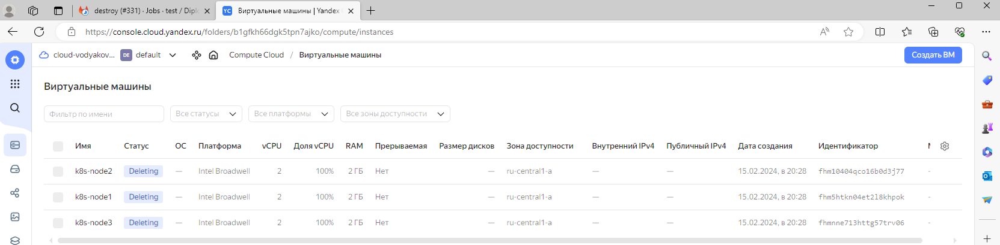

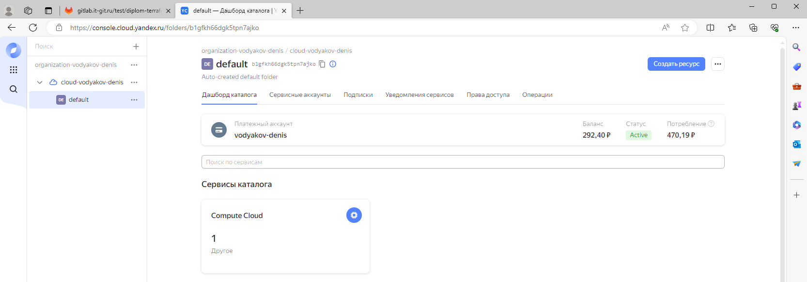

</details>

</details>

<details><summary>Установка GitlabRunner в K8S</summary>

```bash
kubectl create namespace gitlab
```

Дальше создаем обычный раннер в гилабе (можно для конкретного проекта, можно групповой) нам необхомим runner-token который мы прописываем в secret.   
Создаем секрсет в кубуре:

```bash
kubectl apply -f secret.yaml
```

Устанавливаем раннер (values можно отредактировать сразу или в процессе при необходимости будет удобно вносить изменения в конфгурацию раннера):

```bash
helm repo add gitlab https://charts.gitlab.io
helm repo update
helm install gitlab-runner gitlab/gitlab-runner -f my-values.yaml -n gitlab
```

[secret.yaml](file/gitlab/secret.yaml)   
[my-values.yaml](file/gitlab/my-values.yaml)   

Предоставим права администратора сервисной учетной записи «defaul» в пространстве имен «gitlab»

```bash
kubectl create clusterrolebinding gitlab-is-now-admin   --clusterrole=admin   --serviceaccount=gitlab:default
```

* Данный способ создания раннера удобен тем что нам нет необходимости, каждый раз создавать новый раннер.
* В том числе при пересоздании окружения можем использовать тот же раннер


```bash
root@k8s-node1:/home/ubuntu# kubectl -n gitlab get po
NAME                           READY   STATUS    RESTARTS   AGE
gitlab-runner-cd899f6c-c59x5   1/1     Running   0          39s

```

</details>

<details><summary>Http доступ к тестовому приложению</summary>

Репозиторий с ci/cd для gitlab (расположен на github) [diplom-site](https://github.com/VodyakovDenis/diplom-site)

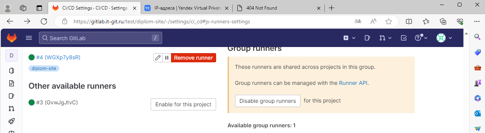

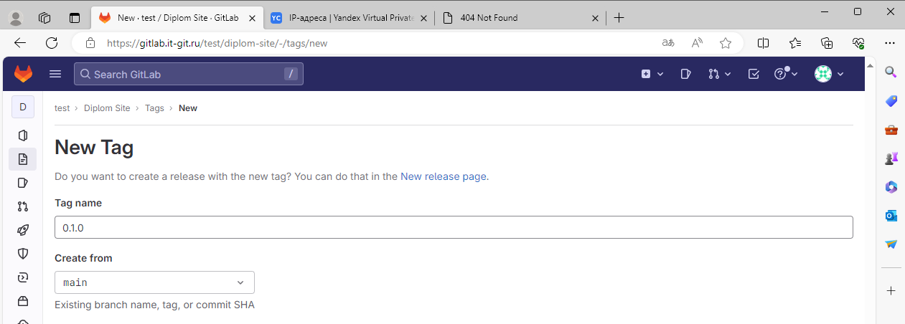

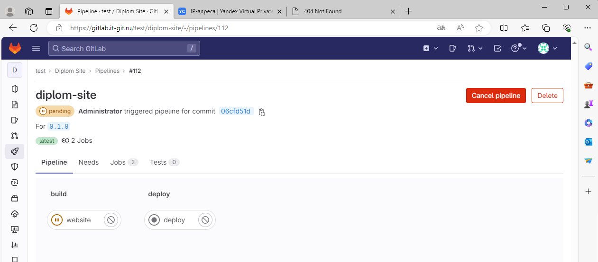

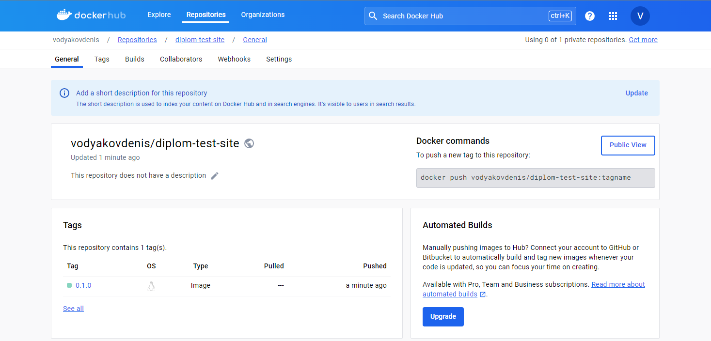

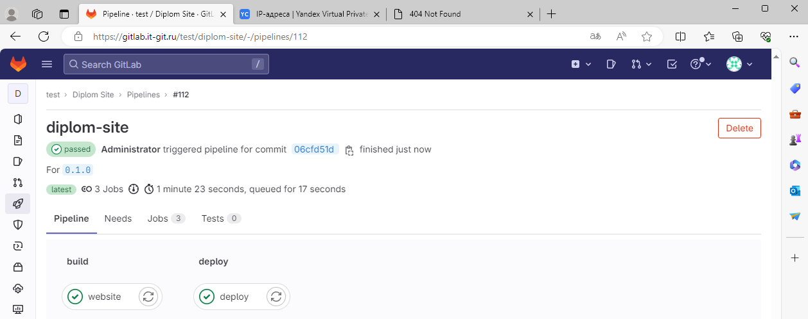

<details><summary>website</summary>

[raw](https://gitlab.it-git.ru/test/diplom-site/-/jobs/332/raw)

```txt
Running with gitlab-runner 16.8.0 (c72a09b6)
  on gitlab-runner-cd899f6c-c59x5 WGXp7y8sR, system ID: r_Tgu3xwZqfvt8
section_start:1708007992:prepare_executor
Preparing the "kubernetes" executor
Using Kubernetes namespace: gitlab
Using Kubernetes executor with image gcr.io/kaniko-project/executor:v1.11.0-debug ...
Using attach strategy to execute scripts...
section_end:1708007992:prepare_executor
section_start:1708007992:prepare_script
Preparing environment
Using FF_USE_POD_ACTIVE_DEADLINE_SECONDS, the Pod activeDeadlineSeconds will be set to the job timeout: 1h0m0s...
Waiting for pod gitlab/runner-wgxp7y8sr-project-2-concurrent-0-obj34nlc to be running, status is Pending
Waiting for pod gitlab/runner-wgxp7y8sr-project-2-concurrent-0-obj34nlc to be running, status is Pending
	ContainersNotInitialized: "containers with incomplete status: [init-permissions]"
	ContainersNotReady: "containers with unready status: [build helper]"
	ContainersNotReady: "containers with unready status: [build helper]"
Waiting for pod gitlab/runner-wgxp7y8sr-project-2-concurrent-0-obj34nlc to be running, status is Pending
	ContainersNotInitialized: "containers with incomplete status: [init-permissions]"
	ContainersNotReady: "containers with unready status: [build helper]"
	ContainersNotReady: "containers with unready status: [build helper]"
Waiting for pod gitlab/runner-wgxp7y8sr-project-2-concurrent-0-obj34nlc to be running, status is Pending
	ContainersNotReady: "containers with unready status: [build helper]"
	ContainersNotReady: "containers with unready status: [build helper]"
Waiting for pod gitlab/runner-wgxp7y8sr-project-2-concurrent-0-obj34nlc to be running, status is Pending
	ContainersNotReady: "containers with unready status: [build helper]"
	ContainersNotReady: "containers with unready status: [build helper]"
Waiting for pod gitlab/runner-wgxp7y8sr-project-2-concurrent-0-obj34nlc to be running, status is Pending
	ContainersNotReady: "containers with unready status: [build helper]"
	ContainersNotReady: "containers with unready status: [build helper]"
Running on runner-wgxp7y8sr-project-2-concurrent-0-obj34nlc via gitlab-runner-cd899f6c-c59x5...

section_end:1708008010:prepare_script
section_start:1708008010:get_sources
Getting source from Git repository
Fetching changes with git depth set to 20...
Initialized empty Git repository in /builds/test/diplom-site/.git/
Created fresh repository.
Checking out 06cfd51d as detached HEAD (ref is 0.1.0)...

Skipping Git submodules setup

section_end:1708008012:get_sources
section_start:1708008012:step_script
Executing "step_script" stage of the job script
$ echo "Authenticating with Docker registry..."
Authenticating with Docker registry...
$ echo "{\"auths\":{\"${REGISTRY}\":{\"auth\":\"$(printf "%s:%s" "${DOCKER_USER}" "${DOCKER_PASS}" | base64 | tr -d '\n')\"}}}" > /kaniko/.docker/config.json
$ echo "Building container..."
Building container...
$ /kaniko/executor --context "${CI_PROJECT_DIR}/website" --dockerfile "${CI_PROJECT_DIR}/website/Dockerfile" --destination "${CONTAINER_NAME}:${CI_COMMIT_TAG}"
INFO[0001] Retrieving image manifest nginx:1.22.0-alpine 
INFO[0001] Retrieving image nginx:1.22.0-alpine from registry index.docker.io 
INFO[0002] Built cross stage deps: map[]                
INFO[0002] Retrieving image manifest nginx:1.22.0-alpine 
INFO[0002] Returning cached image manifest              
INFO[0002] Executing 0 build triggers                   
INFO[0002] Building stage 'nginx:1.22.0-alpine' [idx: '0', base-idx: '-1'] 
INFO[0002] Unpacking rootfs as cmd COPY site /usr/share/nginx/html requires it. 
INFO[0004] COPY site /usr/share/nginx/html              
INFO[0004] Taking snapshot of files...                  
INFO[0004] Pushing image to vodyakovdenis/diplom-test-site:0.1.0 
INFO[0007] Pushed index.docker.io/vodyakovdenis/diplom-test-site@sha256:37c83059f9f18e6edfc67bc431e849d53d0bb50a537e2605e133b3a55484b7a9 

section_end:1708008021:step_script
section_start:1708008021:cleanup_file_variables
Cleaning up project directory and file based variables

section_end:1708008021:cleanup_file_variables
Job succeeded
```

</details>

<details><summary>deploy</summary>

[raw](https://gitlab.it-git.ru/test/diplom-site/-/jobs/334/raw)

```txt
Running with gitlab-runner 16.8.0 (c72a09b6)
  on gitlab-runner-cd899f6c-c59x5 WGXp7y8sR, system ID: r_Tgu3xwZqfvt8
section_start:1708008303:prepare_executor
Preparing the "kubernetes" executor
Using Kubernetes namespace: gitlab
Using Kubernetes executor with image gcr.io/cloud-builders/kubectl:latest ...
Using attach strategy to execute scripts...
section_end:1708008303:prepare_executor
section_start:1708008303:prepare_script
Preparing environment
Using FF_USE_POD_ACTIVE_DEADLINE_SECONDS, the Pod activeDeadlineSeconds will be set to the job timeout: 1h0m0s...
Waiting for pod gitlab/runner-wgxp7y8sr-project-2-concurrent-0-c5kki1hy to be running, status is Pending
Waiting for pod gitlab/runner-wgxp7y8sr-project-2-concurrent-0-c5kki1hy to be running, status is Pending
	ContainersNotReady: "containers with unready status: [build helper]"
	ContainersNotReady: "containers with unready status: [build helper]"
Running on runner-wgxp7y8sr-project-2-concurrent-0-c5kki1hy via gitlab-runner-cd899f6c-c59x5...

section_end:1708008316:prepare_script
section_start:1708008316:get_sources
Getting source from Git repository
Fetching changes with git depth set to 20...
Initialized empty Git repository in /builds/test/diplom-site/.git/
Created fresh repository.
Checking out 06cfd51d as detached HEAD (ref is 0.1.0)...

Skipping Git submodules setup

section_end:1708008327:get_sources
section_start:1708008327:step_script
Executing "step_script" stage of the job script
$ kubectl config set-cluster kubernetes --server="$KUBE_URL" --insecure-skip-tls-verify=true
Cluster "kubernetes" set.
$ kubectl config set-credentials admin --token="$KUBE_TOKEN"
User "admin" set.
$ kubectl config set-context default --cluster=kubernetes --user=admin
Context "default" created.
$ kubectl config use-context default
Switched to context "default".
$ sed -i "s/__VERSION__/$CI_COMMIT_TAG/" diplom-app.yml
$ kubectl apply -f diplom-app.yml
deployment.apps/diplom-app created
service/diplom-app created
ingress.networking.k8s.io/diplom-app created

section_end:1708008344:step_script
section_start:1708008344:cleanup_file_variables
Cleaning up project directory and file based variables

section_end:1708008345:cleanup_file_variables
Job succeeded
```

</details>

```bash
root@k8s-node1:/home/ubuntu# kubectl -n gitlab get svc
NAME         TYPE        CLUSTER-IP       EXTERNAL-IP   PORT(S)   AGE
diplom-app   ClusterIP   10.245.134.185   <none>        80/TCP    2m21s
root@k8s-node1:/home/ubuntu# kubectl -n gitlab get ingress
NAME         CLASS   HOSTS              ADDRESS          PORTS   AGE
diplom-app   nginx   denis.diplom.com   158.160.52.151   80      2m25s
```

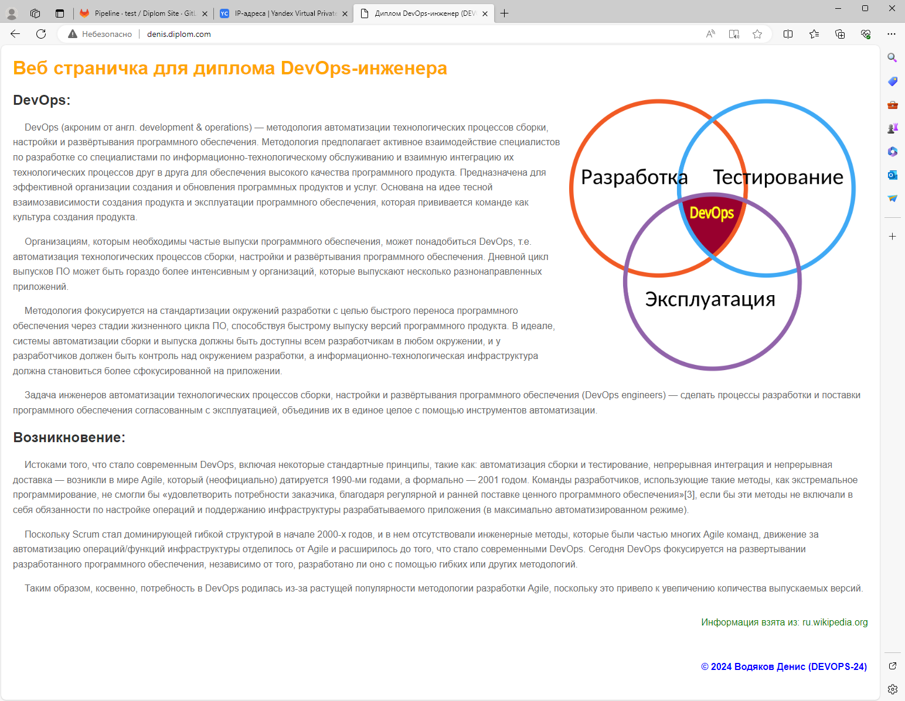

</details>

---

**Комментарии:**   

* Http доступ к тестовому приложению - выполнен через ci/cd в последнем разделе
* Для запуска ci/cd терраформ использовался раннер запущенный на VM (создан там-же в прошлых ДЗ)
* Для запуска ci/cd по публикации веб странички использовался раннер запущенный внутри K8S

**Список репозиториев собранные на github:**

- [diplom-app](https://github.com/VodyakovDenis/diplom-app)   
- [diplom-terraform](https://github.com/VodyakovDenis/diplom-terraform)
- [diplom-site](https://github.com/VodyakovDenis/diplom-site)
- [diplom-ansible](https://github.com/VodyakovDenis/diplom-ansible)


<details><summary>* Полезные ссылки которые пригодились</summary>

https://siebjee.nl/posts/ingress-nginx-context-deadline-exceeded/   
https://cloud.yandex.ru/ru/docs/managed-kubernetes/tutorials/prometheus-grafana-monitoring   
https://cloud.yandex.ru/ru/docs/application-load-balancer/quickstart   
https://docs.nginx.com/nginx-ingress-controller/installation/installing-nic/installation-with-helm/   
https://selectel.ru/blog/tutorials/monitoring-in-k8s-with-prometheus/   
https://ru.stackoverflow.com/questions/931025/%D0%9D%D0%B5-%D1%80%D0%B0%D0%B1%D0%BE%D1%82%D0%B0%D0%B5%D1%82-dns-kubernetes-%D0%B2%D0%BD%D1%83%D1%82%D1%80%D0%B8-%D0%BA%D0%BE%D0%BD%D1%82%D0%B5%D0%B9%D0%BD%D0%B5%D1%80%D0%BE%D0%B2
https://kubernetes.io/ru/docs/reference/kubectl/cheatsheet/
https://kubernetes.io/docs/reference/config-api/kube-proxy-config.v1alpha1/   
https://helm.sh/ru/docs/intro/using_helm/   
https://nixhub.ru/posts/k8s-cluster-access/   
https://docs.gitlab.com/ee/topics/autodevops/troubleshooting.html   
https://docs.gitlab.com/ee/user/clusters/agent/ci_cd_workflow.html 

</details>