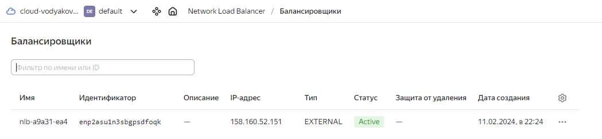

# Дипломная работа
---
## Этапы выполнения:

### Создание облачной инфраструктуры

Предварительная настройка включает в себя несколько шагов, необходимых для последующей работы с yandex.cloud через terraform.    
* Установить утилиту **yc** и подключится к облаку.   
* Создание сервисного аккаунта с ролью editor на дефолтной директории облака   
* Создание s3-bucket для хранения состояния terraform   
        Далее необходимо инициализировать terraform   

<details><summary>Пример</summary>

### Установка [yc](https://cloud.yandex.ru/ru/docs/cli/quickstart) 

* Ответы на вопросы и порядок работы довольно не плохо описан в статье: [Начало работы с Terraform](https://cloud.yandex.ru/ru/docs/tutorials/infrastructure-management/terraform-quickstart)

```bash
curl -sSL https://storage.yandexcloud.net/yandexcloud-yc/install.sh | bash
```

### Создание сервисного аккаунта с ролью editor на дефолтной директории облака

```bash
yc iam service-account create --name terraform-acc
yc resource-manager folder add-access-binding --name default --role editor --subject "serviceAccount:<accId>"
```
* accId - это уникальный идентификатор нового сервисного аккаунта

### Получаем ключ доступа для данного сервисного аккаунта

```bash
yc iam access-key create --service-account-name terraform-acc --format=json
```

### Создание s3-bucket для хранения состояния terraform

```bash
yc storage bucket create --name=netology-state
```

### Инициализация terraform

```bash
terraform init \
  -backend-config="bucket=netology-state" \
  -backend-config="access_key=<service_account_key_id>" \
  -backend-config="secret_key=<service_account_secret_key>"

```
* где **service_account_key_id** и **service_account_secret_key** данные полученные на шаге получения ключа доступа для сервисного аккаунта

### Создание и переключение на новый workspace

```bash
terraform workspace new diplom
```

Данные шаги мной выполнялись в ручную. 
</details>
    
---

## Создание VPC и подсетей через terraform

<details><summary>network.tf</summary>

```bash
resource "yandex_vpc_network" "diplom-network" {
  name = "diplom-network"
}

resource "yandex_vpc_subnet" "diplom-network-subnet-a" {
  name           = "diplom-network-subnet-a"
  zone           = "ru-central1-a"
  network_id     = yandex_vpc_network.diplom-network.id
  v4_cidr_blocks = ["192.168.10.0/24"]
}

resource "yandex_vpc_subnet" "diplom-network-subnet-b" {
  name           = "diplom-network-subnet-b"
  zone           = "ru-central1-b"
  network_id     = yandex_vpc_network.diplom-network.id
  v4_cidr_blocks = ["192.168.11.0/24"]
}
```

</details>

<details><summary>terraform plan</summary>

```bash
denis@denis-lin(0):~/netology/diplom$ terraform plan

Terraform used the selected providers to generate the following execution plan. Resource actions are indicated with the following symbols:
  + create

Terraform will perform the following actions:

  # yandex_vpc_network.diplom-network will be created
  + resource "yandex_vpc_network" "diplom-network" {
      + created_at                = (known after apply)
      + default_security_group_id = (known after apply)
      + folder_id                 = (known after apply)
      + id                        = (known after apply)
      + labels                    = (known after apply)
      + name                      = "diplom-network"
      + subnet_ids                = (known after apply)
    }

  # yandex_vpc_subnet.diplom-network-subnet-a will be created
  + resource "yandex_vpc_subnet" "diplom-network-subnet-a" {
      + created_at     = (known after apply)
      + folder_id      = (known after apply)
      + id             = (known after apply)
      + labels         = (known after apply)
      + name           = "diplom-network-subnet-a"
      + network_id     = (known after apply)
      + v4_cidr_blocks = [
          + "192.168.10.0/24",
        ]
      + v6_cidr_blocks = (known after apply)
      + zone           = "ru-central1-a"
    }

  # yandex_vpc_subnet.diplom-network-subnet-b will be created
  + resource "yandex_vpc_subnet" "diplom-network-subnet-b" {
      + created_at     = (known after apply)
      + folder_id      = (known after apply)
      + id             = (known after apply)
      + labels         = (known after apply)
      + name           = "diplom-network-subnet-b"
      + network_id     = (known after apply)
      + v4_cidr_blocks = [
          + "192.168.11.0/24",
        ]
      + v6_cidr_blocks = (known after apply)
      + zone           = "ru-central1-b"
    }

Plan: 3 to add, 0 to change, 0 to destroy.

────────────────────────────────────────────────────────────────────

Note: You didn't use the -out option to save this plan, so Terraform can't guarantee to take exactly these actions if you run "terraform apply" now.

```

</details>

<details><summary>terraform apply</summary>

```bash
denis@denis-lin(0):~/netology/diplom$ terraform apply

Terraform used the selected providers to generate the following execution plan. Resource actions are indicated with the following symbols:
  + create

Terraform will perform the following actions:

  # yandex_vpc_network.diplom-network will be created
  + resource "yandex_vpc_network" "diplom-network" {
      + created_at                = (known after apply)
      + default_security_group_id = (known after apply)
      + folder_id                 = (known after apply)
      + id                        = (known after apply)
      + labels                    = (known after apply)
      + name                      = "diplom-network"
      + subnet_ids                = (known after apply)
    }

  # yandex_vpc_subnet.diplom-network-subnet-a will be created
  + resource "yandex_vpc_subnet" "diplom-network-subnet-a" {
      + created_at     = (known after apply)
      + folder_id      = (known after apply)
      + id             = (known after apply)
      + labels         = (known after apply)
      + name           = "diplom-network-subnet-a"
      + network_id     = (known after apply)
      + v4_cidr_blocks = [
          + "192.168.10.0/24",
        ]
      + v6_cidr_blocks = (known after apply)
      + zone           = "ru-central1-a"
    }

  # yandex_vpc_subnet.diplom-network-subnet-b will be created
  + resource "yandex_vpc_subnet" "diplom-network-subnet-b" {
      + created_at     = (known after apply)
      + folder_id      = (known after apply)
      + id             = (known after apply)
      + labels         = (known after apply)
      + name           = "diplom-network-subnet-b"
      + network_id     = (known after apply)
      + v4_cidr_blocks = [
          + "192.168.11.0/24",
        ]
      + v6_cidr_blocks = (known after apply)
      + zone           = "ru-central1-b"
    }

Plan: 3 to add, 0 to change, 0 to destroy.

Do you want to perform these actions?
  Terraform will perform the actions described above.
  Only 'yes' will be accepted to approve.

  Enter a value: yes

yandex_vpc_network.diplom-network: Creating...
yandex_vpc_network.diplom-network: Creation complete after 2s [id=enpvbm2m8t8b8bp5omk6]
yandex_vpc_subnet.diplom-network-subnet-a: Creating...
yandex_vpc_subnet.diplom-network-subnet-b: Creating...
yandex_vpc_subnet.diplom-network-subnet-a: Creation complete after 1s [id=e9bnvfvdpli6jqlsgopc]
yandex_vpc_subnet.diplom-network-subnet-b: Creation complete after 2s [id=e2lsblaev3lcj8hcotmd]

Apply complete! Resources: 3 added, 0 changed, 0 destroyed.

```


</details>

<details><summary>terraform destroy</summary>

```bash
denis@denis-lin(0):~/netology/diplom$ terraform destroy
yandex_vpc_network.diplom-network: Refreshing state... [id=enpvbm2m8t8b8bp5omk6]
yandex_vpc_subnet.diplom-network-subnet-b: Refreshing state... [id=e2lsblaev3lcj8hcotmd]
yandex_vpc_subnet.diplom-network-subnet-a: Refreshing state... [id=e9bnvfvdpli6jqlsgopc]

Terraform used the selected providers to generate the following execution plan. Resource actions are indicated with the following symbols:
  - destroy

Terraform will perform the following actions:

  # yandex_vpc_network.diplom-network will be destroyed
  - resource "yandex_vpc_network" "diplom-network" {
      - created_at                = "2024-02-03T06:34:41Z" -> null
      - default_security_group_id = "enp94bj339ltkrvgsjnv" -> null
      - folder_id                 = "b1gfkh66dgk5tpn7ajko" -> null
      - id                        = "enpvbm2m8t8b8bp5omk6" -> null
      - labels                    = {} -> null
      - name                      = "diplom-network" -> null
      - subnet_ids                = [
          - "e2lsblaev3lcj8hcotmd",
          - "e9bnvfvdpli6jqlsgopc",
        ] -> null
    }

  # yandex_vpc_subnet.diplom-network-subnet-a will be destroyed
  - resource "yandex_vpc_subnet" "diplom-network-subnet-a" {
      - created_at     = "2024-02-03T06:34:43Z" -> null
      - folder_id      = "b1gfkh66dgk5tpn7ajko" -> null
      - id             = "e9bnvfvdpli6jqlsgopc" -> null
      - labels         = {} -> null
      - name           = "diplom-network-subnet-a" -> null
      - network_id     = "enpvbm2m8t8b8bp5omk6" -> null
      - v4_cidr_blocks = [
          - "192.168.10.0/24",
        ] -> null
      - v6_cidr_blocks = [] -> null
      - zone           = "ru-central1-a" -> null
    }

  # yandex_vpc_subnet.diplom-network-subnet-b will be destroyed
  - resource "yandex_vpc_subnet" "diplom-network-subnet-b" {
      - created_at     = "2024-02-03T06:34:44Z" -> null
      - folder_id      = "b1gfkh66dgk5tpn7ajko" -> null
      - id             = "e2lsblaev3lcj8hcotmd" -> null
      - labels         = {} -> null
      - name           = "diplom-network-subnet-b" -> null
      - network_id     = "enpvbm2m8t8b8bp5omk6" -> null
      - v4_cidr_blocks = [
          - "192.168.11.0/24",
        ] -> null
      - v6_cidr_blocks = [] -> null
      - zone           = "ru-central1-b" -> null
    }

Plan: 0 to add, 0 to change, 3 to destroy.

Do you really want to destroy all resources?
  Terraform will destroy all your managed infrastructure, as shown above.
  There is no undo. Only 'yes' will be accepted to confirm.

  Enter a value: yes

yandex_vpc_subnet.diplom-network-subnet-b: Destroying... [id=e2lsblaev3lcj8hcotmd]
yandex_vpc_subnet.diplom-network-subnet-a: Destroying... [id=e9bnvfvdpli6jqlsgopc]
yandex_vpc_subnet.diplom-network-subnet-b: Destruction complete after 1s
yandex_vpc_subnet.diplom-network-subnet-a: Destruction complete after 1s
yandex_vpc_network.diplom-network: Destroying... [id=enpvbm2m8t8b8bp5omk6]
yandex_vpc_network.diplom-network: Destruction complete after 1s

Destroy complete! Resources: 3 destroyed.

```

</details>

---
## Создание Kubernetes кластера

За основу возьмем минимальную конфигурацию.

<details><summary>instances.tf</summary>

```bash
resource "random_shuffle" "diplom-network-subnet-random" {
  input        = [yandex_vpc_subnet.diplom-network-subnet-a.id, yandex_vpc_subnet.diplom-network-subnet-b.id]
  result_count = 1
}

resource "yandex_compute_instance" "k8s-cluster" {
  for_each = toset(["k8s-node1", "k8s-node2", "k8s-node3"])

  name = each.key
  hostname = "${each.key}.diplom.local"

  resources {
    cores  = 2
    memory = 2
  }

  boot_disk {
    initialize_params {
      image_id = "fd8kdq6d0p8sij7h5qe3" # ubuntu-20-04-lts-v20220822
      size = "20"
    }
  }

  network_interface {
    subnet_id = random_shuffle.diplom-network-subnet-random.result[0]
    nat       = true
  }

  metadata = {
    serial-port-enable = 1
    ssh-keys = "ubuntu:${file("~/.ssh/id_rsa.pub")}"
  }
}

output "cluster_ips" {
  value = {
    internal = values(yandex_compute_instance.k8s-cluster)[*].network_interface.0.ip_address
    external = values(yandex_compute_instance.k8s-cluster)[*].network_interface.0.nat_ip_address
  }
}
```

</details>

Для распределения по зонам доступности использован ***random_shuffle***   

<details><summary>terraform plan</summary>

```bash
denis@denis-lin(0):~/netology/diplom$ terraform plan

Terraform used the selected providers to generate the following execution plan. Resource actions are indicated with the following symbols:
  + create

Terraform will perform the following actions:

  # random_shuffle.diplom-network-subnet-random will be created
  + resource "random_shuffle" "diplom-network-subnet-random" {
      + id           = (known after apply)
      + input        = [
          + (known after apply),
          + (known after apply),
        ]
      + result       = (known after apply)
      + result_count = 1
    }

  # yandex_compute_instance.k8s-cluster["k8s-node1"] will be created
  + resource "yandex_compute_instance" "k8s-cluster" {
      + created_at                = (known after apply)
      + folder_id                 = (known after apply)
      + fqdn                      = (known after apply)
      + gpu_cluster_id            = (known after apply)
      + hostname                  = "k8s-node1.diplom.local"
      + id                        = (known after apply)
      + maintenance_grace_period  = (known after apply)
      + maintenance_policy        = (known after apply)
      + metadata                  = {
          + "serial-port-enable" = "1"
          + "ssh-keys"           = <<-EOT
                ubuntu:ssh-rsa AAAAB3NzaC1yc2EAAAADAQABAAABgQC7KoRsmTb6EC67YSxCrvoqTLhZcBgEd7lM4LebHU5p7qBtvyxA+oUxkH1Z4HjR2zbKEzDqtFfgREN5gaMFzHG/pa7RgMPR1c5lBynlsCzHDQqKt9417IoXfT71bFo2Mh+wXHo9gcJw9tU+4pab93zMBN7a40XtKWYQFsSQ0TffpprCcBkkqBeuBS9BFh3oaL7hRIOWPmUwpXmhY+Te7oaluj8fPxq/2ahPF1kthLY1NTLQvRGbrxENxsysi0jZwfDkYzWdWqhI5BA8fyG8e1wcpTM+9U8F4sAGMBxI5vEcC1J/Eb940tnEfp+oeZzcrSH9IRVCOgyGnEBh/qloxP7HVlErpX7KGf8h6s18h4d4mi5ylgBBgYfn/Wszej+Yotdgc+TJYihe/dDRulsxEcU/UQjIheqIoIIZApnajk0GdEyOtZpU/cY+CrtBH2czMLlNpn4lEOkcaCQu2XeqKn2yQNiOqz8jsDrVrTRrJHTEZ7+kkUROqmuNtcJdWl+4YH0= denis@denis-lin
            EOT
        }
      + name                      = "k8s-node1"
      + network_acceleration_type = "standard"
      + platform_id               = "standard-v1"
      + service_account_id        = (known after apply)
      + status                    = (known after apply)
      + zone                      = (known after apply)

      + boot_disk {
          + auto_delete = true
          + device_name = (known after apply)
          + disk_id     = (known after apply)
          + mode        = (known after apply)

          + initialize_params {
              + block_size  = (known after apply)
              + description = (known after apply)
              + image_id    = "fd8kdq6d0p8sij7h5qe3"
              + name        = (known after apply)
              + size        = 20
              + snapshot_id = (known after apply)
              + type        = "network-hdd"
            }
        }

      + network_interface {
          + index              = (known after apply)
          + ip_address         = (known after apply)
          + ipv4               = true
          + ipv6               = (known after apply)
          + ipv6_address       = (known after apply)
          + mac_address        = (known after apply)
          + nat                = true
          + nat_ip_address     = (known after apply)
          + nat_ip_version     = (known after apply)
          + security_group_ids = (known after apply)
          + subnet_id          = (known after apply)
        }

      + resources {
          + core_fraction = 100
          + cores         = 2
          + memory        = 2
        }
    }

  # yandex_compute_instance.k8s-cluster["k8s-node2"] will be created
  + resource "yandex_compute_instance" "k8s-cluster" {
      + created_at                = (known after apply)
      + folder_id                 = (known after apply)
      + fqdn                      = (known after apply)
      + gpu_cluster_id            = (known after apply)
      + hostname                  = "k8s-node2.diplom.local"
      + id                        = (known after apply)
      + maintenance_grace_period  = (known after apply)
      + maintenance_policy        = (known after apply)
      + metadata                  = {
          + "serial-port-enable" = "1"
          + "ssh-keys"           = <<-EOT
                ubuntu:ssh-rsa AAAAB3NzaC1yc2EAAAADAQABAAABgQC7KoRsmTb6EC67YSxCrvoqTLhZcBgEd7lM4LebHU5p7qBtvyxA+oUxkH1Z4HjR2zbKEzDqtFfgREN5gaMFzHG/pa7RgMPR1c5lBynlsCzHDQqKt9417IoXfT71bFo2Mh+wXHo9gcJw9tU+4pab93zMBN7a40XtKWYQFsSQ0TffpprCcBkkqBeuBS9BFh3oaL7hRIOWPmUwpXmhY+Te7oaluj8fPxq/2ahPF1kthLY1NTLQvRGbrxENxsysi0jZwfDkYzWdWqhI5BA8fyG8e1wcpTM+9U8F4sAGMBxI5vEcC1J/Eb940tnEfp+oeZzcrSH9IRVCOgyGnEBh/qloxP7HVlErpX7KGf8h6s18h4d4mi5ylgBBgYfn/Wszej+Yotdgc+TJYihe/dDRulsxEcU/UQjIheqIoIIZApnajk0GdEyOtZpU/cY+CrtBH2czMLlNpn4lEOkcaCQu2XeqKn2yQNiOqz8jsDrVrTRrJHTEZ7+kkUROqmuNtcJdWl+4YH0= denis@denis-lin
            EOT
        }
      + name                      = "k8s-node2"
      + network_acceleration_type = "standard"
      + platform_id               = "standard-v1"
      + service_account_id        = (known after apply)
      + status                    = (known after apply)
      + zone                      = (known after apply)

      + boot_disk {
          + auto_delete = true
          + device_name = (known after apply)
          + disk_id     = (known after apply)
          + mode        = (known after apply)

          + initialize_params {
              + block_size  = (known after apply)
              + description = (known after apply)
              + image_id    = "fd8kdq6d0p8sij7h5qe3"
              + name        = (known after apply)
              + size        = 20
              + snapshot_id = (known after apply)
              + type        = "network-hdd"
            }
        }

      + network_interface {
          + index              = (known after apply)
          + ip_address         = (known after apply)
          + ipv4               = true
          + ipv6               = (known after apply)
          + ipv6_address       = (known after apply)
          + mac_address        = (known after apply)
          + nat                = true
          + nat_ip_address     = (known after apply)
          + nat_ip_version     = (known after apply)
          + security_group_ids = (known after apply)
          + subnet_id          = (known after apply)
        }

      + resources {
          + core_fraction = 100
          + cores         = 2
          + memory        = 2
        }
    }

  # yandex_compute_instance.k8s-cluster["k8s-node3"] will be created
  + resource "yandex_compute_instance" "k8s-cluster" {
      + created_at                = (known after apply)
      + folder_id                 = (known after apply)
      + fqdn                      = (known after apply)
      + gpu_cluster_id            = (known after apply)
      + hostname                  = "k8s-node3.diplom.local"
      + id                        = (known after apply)
      + maintenance_grace_period  = (known after apply)
      + maintenance_policy        = (known after apply)
      + metadata                  = {
          + "serial-port-enable" = "1"
          + "ssh-keys"           = <<-EOT
                ubuntu:ssh-rsa AAAAB3NzaC1yc2EAAAADAQABAAABgQC7KoRsmTb6EC67YSxCrvoqTLhZcBgEd7lM4LebHU5p7qBtvyxA+oUxkH1Z4HjR2zbKEzDqtFfgREN5gaMFzHG/pa7RgMPR1c5lBynlsCzHDQqKt9417IoXfT71bFo2Mh+wXHo9gcJw9tU+4pab93zMBN7a40XtKWYQFsSQ0TffpprCcBkkqBeuBS9BFh3oaL7hRIOWPmUwpXmhY+Te7oaluj8fPxq/2ahPF1kthLY1NTLQvRGbrxENxsysi0jZwfDkYzWdWqhI5BA8fyG8e1wcpTM+9U8F4sAGMBxI5vEcC1J/Eb940tnEfp+oeZzcrSH9IRVCOgyGnEBh/qloxP7HVlErpX7KGf8h6s18h4d4mi5ylgBBgYfn/Wszej+Yotdgc+TJYihe/dDRulsxEcU/UQjIheqIoIIZApnajk0GdEyOtZpU/cY+CrtBH2czMLlNpn4lEOkcaCQu2XeqKn2yQNiOqz8jsDrVrTRrJHTEZ7+kkUROqmuNtcJdWl+4YH0= denis@denis-lin
            EOT
        }
      + name                      = "k8s-node3"
      + network_acceleration_type = "standard"
      + platform_id               = "standard-v1"
      + service_account_id        = (known after apply)
      + status                    = (known after apply)
      + zone                      = (known after apply)

      + boot_disk {
          + auto_delete = true
          + device_name = (known after apply)
          + disk_id     = (known after apply)
          + mode        = (known after apply)

          + initialize_params {
              + block_size  = (known after apply)
              + description = (known after apply)
              + image_id    = "fd8kdq6d0p8sij7h5qe3"
              + name        = (known after apply)
              + size        = 20
              + snapshot_id = (known after apply)
              + type        = "network-hdd"
            }
        }

      + network_interface {
          + index              = (known after apply)
          + ip_address         = (known after apply)
          + ipv4               = true
          + ipv6               = (known after apply)
          + ipv6_address       = (known after apply)
          + mac_address        = (known after apply)
          + nat                = true
          + nat_ip_address     = (known after apply)
          + nat_ip_version     = (known after apply)
          + security_group_ids = (known after apply)
          + subnet_id          = (known after apply)
        }

      + resources {
          + core_fraction = 100
          + cores         = 2
          + memory        = 2
        }
    }

  # yandex_vpc_network.diplom-network will be created
  + resource "yandex_vpc_network" "diplom-network" {
      + created_at                = (known after apply)
      + default_security_group_id = (known after apply)
      + folder_id                 = (known after apply)
      + id                        = (known after apply)
      + labels                    = (known after apply)
      + name                      = "diplom-network"
      + subnet_ids                = (known after apply)
    }

  # yandex_vpc_subnet.diplom-network-subnet-a will be created
  + resource "yandex_vpc_subnet" "diplom-network-subnet-a" {
      + created_at     = (known after apply)
      + folder_id      = (known after apply)
      + id             = (known after apply)
      + labels         = (known after apply)
      + name           = "diplom-network-subnet-a"
      + network_id     = (known after apply)
      + v4_cidr_blocks = [
          + "192.168.10.0/24",
        ]
      + v6_cidr_blocks = (known after apply)
      + zone           = "ru-central1-a"
    }

  # yandex_vpc_subnet.diplom-network-subnet-b will be created
  + resource "yandex_vpc_subnet" "diplom-network-subnet-b" {
      + created_at     = (known after apply)
      + folder_id      = (known after apply)
      + id             = (known after apply)
      + labels         = (known after apply)
      + name           = "diplom-network-subnet-b"
      + network_id     = (known after apply)
      + v4_cidr_blocks = [
          + "192.168.11.0/24",
        ]
      + v6_cidr_blocks = (known after apply)
      + zone           = "ru-central1-b"
    }

Plan: 7 to add, 0 to change, 0 to destroy.

Changes to Outputs:
  + cluster_ips = {
      + external = [
          + (known after apply),
          + (known after apply),
          + (known after apply),
        ]
      + internal = [
          + (known after apply),
          + (known after apply),
          + (known after apply),
        ]
    }

────────────────────────────────────────────────────────────────

Note: You didn't use the -out option to save this plan, so Terraform can't guarantee to take exactly these actions if you run "terraform apply" now.

```

</details>

<details><summary>terraform apply</summary>

```bash
denis@denis-lin(0):~/netology/diplom$ terraform apply

Terraform used the selected providers to generate the following execution plan. Resource actions are indicated with the following symbols:
  + create

Terraform will perform the following actions:

  # random_shuffle.diplom-network-subnet-random will be created
  + resource "random_shuffle" "diplom-network-subnet-random" {
      + id           = (known after apply)
      + input        = [
          + (known after apply),
          + (known after apply),
        ]
      + result       = (known after apply)
      + result_count = 1
    }

  # yandex_compute_instance.k8s-cluster["k8s-node1"] will be created
  + resource "yandex_compute_instance" "k8s-cluster" {
      + created_at                = (known after apply)
      + folder_id                 = (known after apply)
      + fqdn                      = (known after apply)
      + gpu_cluster_id            = (known after apply)
      + hostname                  = "k8s-node1.diplom.local"
      + id                        = (known after apply)
      + maintenance_grace_period  = (known after apply)
      + maintenance_policy        = (known after apply)
      + metadata                  = {
          + "serial-port-enable" = "1"
          + "ssh-keys"           = <<-EOT
                ubuntu:ssh-rsa AAAAB3NzaC1yc2EAAAADAQABAAABgQC7KoRsmTb6EC67YSxCrvoqTLhZcBgEd7lM4LebHU5p7qBtvyxA+oUxkH1Z4HjR2zbKEzDqtFfgREN5gaMFzHG/pa7RgMPR1c5lBynlsCzHDQqKt9417IoXfT71bFo2Mh+wXHo9gcJw9tU+4pab93zMBN7a40XtKWYQFsSQ0TffpprCcBkkqBeuBS9BFh3oaL7hRIOWPmUwpXmhY+Te7oaluj8fPxq/2ahPF1kthLY1NTLQvRGbrxENxsysi0jZwfDkYzWdWqhI5BA8fyG8e1wcpTM+9U8F4sAGMBxI5vEcC1J/Eb940tnEfp+oeZzcrSH9IRVCOgyGnEBh/qloxP7HVlErpX7KGf8h6s18h4d4mi5ylgBBgYfn/Wszej+Yotdgc+TJYihe/dDRulsxEcU/UQjIheqIoIIZApnajk0GdEyOtZpU/cY+CrtBH2czMLlNpn4lEOkcaCQu2XeqKn2yQNiOqz8jsDrVrTRrJHTEZ7+kkUROqmuNtcJdWl+4YH0= denis@denis-lin
            EOT
        }
      + name                      = "k8s-node1"
      + network_acceleration_type = "standard"
      + platform_id               = "standard-v1"
      + service_account_id        = (known after apply)
      + status                    = (known after apply)
      + zone                      = (known after apply)

      + boot_disk {
          + auto_delete = true
          + device_name = (known after apply)
          + disk_id     = (known after apply)
          + mode        = (known after apply)

          + initialize_params {
              + block_size  = (known after apply)
              + description = (known after apply)
              + image_id    = "fd8kdq6d0p8sij7h5qe3"
              + name        = (known after apply)
              + size        = 20
              + snapshot_id = (known after apply)
              + type        = "network-hdd"
            }
        }

      + network_interface {
          + index              = (known after apply)
          + ip_address         = (known after apply)
          + ipv4               = true
          + ipv6               = (known after apply)
          + ipv6_address       = (known after apply)
          + mac_address        = (known after apply)
          + nat                = true
          + nat_ip_address     = (known after apply)
          + nat_ip_version     = (known after apply)
          + security_group_ids = (known after apply)
          + subnet_id          = (known after apply)
        }

      + resources {
          + core_fraction = 100
          + cores         = 2
          + memory        = 2
        }
    }

  # yandex_compute_instance.k8s-cluster["k8s-node2"] will be created
  + resource "yandex_compute_instance" "k8s-cluster" {
      + created_at                = (known after apply)
      + folder_id                 = (known after apply)
      + fqdn                      = (known after apply)
      + gpu_cluster_id            = (known after apply)
      + hostname                  = "k8s-node2.diplom.local"
      + id                        = (known after apply)
      + maintenance_grace_period  = (known after apply)
      + maintenance_policy        = (known after apply)
      + metadata                  = {
          + "serial-port-enable" = "1"
          + "ssh-keys"           = <<-EOT
                ubuntu:ssh-rsa AAAAB3NzaC1yc2EAAAADAQABAAABgQC7KoRsmTb6EC67YSxCrvoqTLhZcBgEd7lM4LebHU5p7qBtvyxA+oUxkH1Z4HjR2zbKEzDqtFfgREN5gaMFzHG/pa7RgMPR1c5lBynlsCzHDQqKt9417IoXfT71bFo2Mh+wXHo9gcJw9tU+4pab93zMBN7a40XtKWYQFsSQ0TffpprCcBkkqBeuBS9BFh3oaL7hRIOWPmUwpXmhY+Te7oaluj8fPxq/2ahPF1kthLY1NTLQvRGbrxENxsysi0jZwfDkYzWdWqhI5BA8fyG8e1wcpTM+9U8F4sAGMBxI5vEcC1J/Eb940tnEfp+oeZzcrSH9IRVCOgyGnEBh/qloxP7HVlErpX7KGf8h6s18h4d4mi5ylgBBgYfn/Wszej+Yotdgc+TJYihe/dDRulsxEcU/UQjIheqIoIIZApnajk0GdEyOtZpU/cY+CrtBH2czMLlNpn4lEOkcaCQu2XeqKn2yQNiOqz8jsDrVrTRrJHTEZ7+kkUROqmuNtcJdWl+4YH0= denis@denis-lin
            EOT
        }
      + name                      = "k8s-node2"
      + network_acceleration_type = "standard"
      + platform_id               = "standard-v1"
      + service_account_id        = (known after apply)
      + status                    = (known after apply)
      + zone                      = (known after apply)

      + boot_disk {
          + auto_delete = true
          + device_name = (known after apply)
          + disk_id     = (known after apply)
          + mode        = (known after apply)

          + initialize_params {
              + block_size  = (known after apply)
              + description = (known after apply)
              + image_id    = "fd8kdq6d0p8sij7h5qe3"
              + name        = (known after apply)
              + size        = 20
              + snapshot_id = (known after apply)
              + type        = "network-hdd"
            }
        }

      + network_interface {
          + index              = (known after apply)
          + ip_address         = (known after apply)
          + ipv4               = true
          + ipv6               = (known after apply)
          + ipv6_address       = (known after apply)
          + mac_address        = (known after apply)
          + nat                = true
          + nat_ip_address     = (known after apply)
          + nat_ip_version     = (known after apply)
          + security_group_ids = (known after apply)
          + subnet_id          = (known after apply)
        }

      + resources {
          + core_fraction = 100
          + cores         = 2
          + memory        = 2
        }
    }

  # yandex_compute_instance.k8s-cluster["k8s-node3"] will be created
  + resource "yandex_compute_instance" "k8s-cluster" {
      + created_at                = (known after apply)
      + folder_id                 = (known after apply)
      + fqdn                      = (known after apply)
      + gpu_cluster_id            = (known after apply)
      + hostname                  = "k8s-node3.diplom.local"
      + id                        = (known after apply)
      + maintenance_grace_period  = (known after apply)
      + maintenance_policy        = (known after apply)
      + metadata                  = {
          + "serial-port-enable" = "1"
          + "ssh-keys"           = <<-EOT
                ubuntu:ssh-rsa AAAAB3NzaC1yc2EAAAADAQABAAABgQC7KoRsmTb6EC67YSxCrvoqTLhZcBgEd7lM4LebHU5p7qBtvyxA+oUxkH1Z4HjR2zbKEzDqtFfgREN5gaMFzHG/pa7RgMPR1c5lBynlsCzHDQqKt9417IoXfT71bFo2Mh+wXHo9gcJw9tU+4pab93zMBN7a40XtKWYQFsSQ0TffpprCcBkkqBeuBS9BFh3oaL7hRIOWPmUwpXmhY+Te7oaluj8fPxq/2ahPF1kthLY1NTLQvRGbrxENxsysi0jZwfDkYzWdWqhI5BA8fyG8e1wcpTM+9U8F4sAGMBxI5vEcC1J/Eb940tnEfp+oeZzcrSH9IRVCOgyGnEBh/qloxP7HVlErpX7KGf8h6s18h4d4mi5ylgBBgYfn/Wszej+Yotdgc+TJYihe/dDRulsxEcU/UQjIheqIoIIZApnajk0GdEyOtZpU/cY+CrtBH2czMLlNpn4lEOkcaCQu2XeqKn2yQNiOqz8jsDrVrTRrJHTEZ7+kkUROqmuNtcJdWl+4YH0= denis@denis-lin
            EOT
        }
      + name                      = "k8s-node3"
      + network_acceleration_type = "standard"
      + platform_id               = "standard-v1"
      + service_account_id        = (known after apply)
      + status                    = (known after apply)
      + zone                      = (known after apply)

      + boot_disk {
          + auto_delete = true
          + device_name = (known after apply)
          + disk_id     = (known after apply)
          + mode        = (known after apply)

          + initialize_params {
              + block_size  = (known after apply)
              + description = (known after apply)
              + image_id    = "fd8kdq6d0p8sij7h5qe3"
              + name        = (known after apply)
              + size        = 20
              + snapshot_id = (known after apply)
              + type        = "network-hdd"
            }
        }

      + network_interface {
          + index              = (known after apply)
          + ip_address         = (known after apply)
          + ipv4               = true
          + ipv6               = (known after apply)
          + ipv6_address       = (known after apply)
          + mac_address        = (known after apply)
          + nat                = true
          + nat_ip_address     = (known after apply)
          + nat_ip_version     = (known after apply)
          + security_group_ids = (known after apply)
          + subnet_id          = (known after apply)
        }

      + resources {
          + core_fraction = 100
          + cores         = 2
          + memory        = 2
        }
    }

  # yandex_vpc_network.diplom-network will be created
  + resource "yandex_vpc_network" "diplom-network" {
      + created_at                = (known after apply)
      + default_security_group_id = (known after apply)
      + folder_id                 = (known after apply)
      + id                        = (known after apply)
      + labels                    = (known after apply)
      + name                      = "diplom-network"
      + subnet_ids                = (known after apply)
    }

  # yandex_vpc_subnet.diplom-network-subnet-a will be created
  + resource "yandex_vpc_subnet" "diplom-network-subnet-a" {
      + created_at     = (known after apply)
      + folder_id      = (known after apply)
      + id             = (known after apply)
      + labels         = (known after apply)
      + name           = "diplom-network-subnet-a"
      + network_id     = (known after apply)
      + v4_cidr_blocks = [
          + "192.168.10.0/24",
        ]
      + v6_cidr_blocks = (known after apply)
      + zone           = "ru-central1-a"
    }

  # yandex_vpc_subnet.diplom-network-subnet-b will be created
  + resource "yandex_vpc_subnet" "diplom-network-subnet-b" {
      + created_at     = (known after apply)
      + folder_id      = (known after apply)
      + id             = (known after apply)
      + labels         = (known after apply)
      + name           = "diplom-network-subnet-b"
      + network_id     = (known after apply)
      + v4_cidr_blocks = [
          + "192.168.11.0/24",
        ]
      + v6_cidr_blocks = (known after apply)
      + zone           = "ru-central1-b"
    }

Plan: 7 to add, 0 to change, 0 to destroy.

Changes to Outputs:
  + cluster_ips = {
      + external = [
          + (known after apply),
          + (known after apply),
          + (known after apply),
        ]
      + internal = [
          + (known after apply),
          + (known after apply),
          + (known after apply),
        ]
    }

Do you want to perform these actions?
  Terraform will perform the actions described above.
  Only 'yes' will be accepted to approve.

  Enter a value: yes

yandex_vpc_network.diplom-network: Creating...
yandex_vpc_network.diplom-network: Creation complete after 3s [id=enpvii24n7ibl5a0aeq7]
yandex_vpc_subnet.diplom-network-subnet-a: Creating...
yandex_vpc_subnet.diplom-network-subnet-b: Creating...
yandex_vpc_subnet.diplom-network-subnet-a: Creation complete after 1s [id=e9b402228ol6e0l6118p]
yandex_vpc_subnet.diplom-network-subnet-b: Creation complete after 2s [id=e2l26vuodeclji2ou2bg]
random_shuffle.diplom-network-subnet-random: Creating...
random_shuffle.diplom-network-subnet-random: Creation complete after 0s [id=-]
yandex_compute_instance.k8s-cluster["k8s-node2"]: Creating...
yandex_compute_instance.k8s-cluster["k8s-node3"]: Creating...
yandex_compute_instance.k8s-cluster["k8s-node1"]: Creating...
yandex_compute_instance.k8s-cluster["k8s-node3"]: Still creating... [10s elapsed]
yandex_compute_instance.k8s-cluster["k8s-node2"]: Still creating... [10s elapsed]
yandex_compute_instance.k8s-cluster["k8s-node1"]: Still creating... [10s elapsed]
yandex_compute_instance.k8s-cluster["k8s-node2"]: Still creating... [20s elapsed]
yandex_compute_instance.k8s-cluster["k8s-node1"]: Still creating... [20s elapsed]
yandex_compute_instance.k8s-cluster["k8s-node3"]: Still creating... [20s elapsed]
yandex_compute_instance.k8s-cluster["k8s-node3"]: Still creating... [30s elapsed]
yandex_compute_instance.k8s-cluster["k8s-node2"]: Still creating... [30s elapsed]
yandex_compute_instance.k8s-cluster["k8s-node1"]: Still creating... [30s elapsed]
yandex_compute_instance.k8s-cluster["k8s-node1"]: Creation complete after 32s [id=fhmjtckrhsjhgfg71f9s]
yandex_compute_instance.k8s-cluster["k8s-node2"]: Creation complete after 32s [id=fhmrgq4pqimt5laee4cm]
yandex_compute_instance.k8s-cluster["k8s-node3"]: Creation complete after 36s [id=fhmu6oc2vdk5hj4dmgg6]

Apply complete! Resources: 7 added, 0 changed, 0 destroyed.

Outputs:

cluster_ips = {
  "external" = [
    "130.193.48.211",
    "130.193.37.164",
    "130.193.49.28",
  ]
  "internal" = [
    "192.168.10.12",
    "192.168.10.30",
    "192.168.10.26",
  ]
}

```


</details>

<details><summary>Получим ini файл с IP адресами</summary>

Сохраняем вывод в json

```bash
terraform output -json > ips.json
```

Преобразуем с помощью скрипта на питоне ips.json в cluster_ips.ini

<details><summary>out_to_ini.py</summary>

```python
import json
from configparser import ConfigParser

# загружаем данные из ips.json
with open('ips.json', 'r') as json_file:
    data = json.load(json_file)

# извлекаем IPs
external_ips = data['cluster_ips']['value']['external']
internal_ips = data['cluster_ips']['value']['internal']

# парсим в разделы
config = ConfigParser()

config['external'] = {ip: '' for ip in external_ips}
config['internal'] = {ip: '' for ip in internal_ips}

# убираем лишнее
with open('cluster_ips.ini', 'w') as ini_file:
    for section in config.sections():
        ini_file.write(f'[{section}]\n')
        for key in config[section]:
            ini_file.write(f'{key}\n')

print("Файл сконвертирован!")

```

</details>

```bash
denis@denis-lin(0):~/netology/diplom$ python3 out_to_ini.py
Файл сконвертирован!
denis@denis-lin(0):~/netology/diplom$ cat cluster_ips.ini
[external]
130.193.48.211
130.193.37.164
130.193.49.28
[internal]
192.168.10.12
192.168.10.30
192.168.10.26
```

</details>


Далее будем использовать плейбук из прошлых ДЗ - который писал сам, плейбук подготавливает хосты, устанавливая все необходимое. 


<details><summary>ansible k8s</summary>

---

<details><summary>ansible/ansible.cfg</summary>

```bash
[defaults]
host_key_checking = False
deprecation_warnings=False
```

</details>

<details><summary>ansible/ping.yml</summary>

```bash
---
- hosts: external
  gather_facts: false
  tasks:
    - ping:
```

* Позволит проверить доступность

</details>

<details><summary>ansible/k8s-cluster2.yml</summary>

```bash
---
- name: Install Docker and Utils
  hosts: external
  become: true
  tasks:

    - name: Docker INSTALL | Del sourcelists docker
      file:
        path: "{{ item }}"
        state: absent
      with_items:
        - /etc/apt/sources.list.d/docker.list
      ignore_errors: yes

    - name: Docker INSTALL | Add Docker GPG key
      apt_key: url=https://download.docker.com/linux/ubuntu/gpg

    - name: Docker INSTALL | Add Docker APT repository
      apt_repository:
        repo: deb [arch=amd64] https://download.docker.com/linux/ubuntu {{ansible_distribution_release}} stable
      ignore_errors: yes
      
    - name: Install Docker and Utils | Install utils
      ansible.builtin.apt:
        name:
          - curl
          - git
          - vim
          - wget
          - apt-transport-https
          - gpg
          - bash-completion
        state: present

- name: Prepare to install Kubernetes
  become: true
  hosts: external
  tasks:

    - name: Ensure the keyrings directory exists
      file:
        path: /etc/apt/keyrings
        state: directory

    - name: Create the k8s.gpg keyring file
      file:
        path: /etc/apt/keyrings/k8s.gpg
        state: touch

    - name: Add gpg key for K8S
      apt_key:
        url: https://pkgs.k8s.io/core:/stable:/v1.28/deb/Release.key
        keyring: /etc/apt/keyrings/k8s.gpg


    - name: Add repository K8S
      apt_repository:
        repo: "deb [signed-by=/etc/apt/keyrings/k8s.gpg] https://pkgs.k8s.io/core:/stable:/v1.28/deb/ /"
        state: present
        filename: k8s
        mode: 0600

    - name: Load kernel modules
      modprobe:
        name: "{{ item }}"
        state: present
      loop:
        - br_netfilter

    - name: Set Sysctl on all nodes
      sysctl:
        name: "{{ item.name }}"
        value: "{{ item.value }}"
        state: present
      with_items:
        - name: net.ipv4.ip_forward
          value: 1
        - name: net.bridge.bridge-nf-call-iptables
          value: 1
        - name: net.bridge.bridge-nf-call-ip6tables
          value: 1


    - name: Prepare to install Kubernetes | Exec commands
      ansible.builtin.command: "{{ item }}"
      with_items:
        - modprobe overlay
        - modprobe br_netfilter
        - sysctl --system
        - swapoff -a
      register: result
      changed_when: result.rc != 0

- name: Install Kubernetes
  become: true
  hosts: external
  tasks:
    - name: Install Kubernetes | Install packages
      ansible.builtin.apt:
        name:
          - kubectl
          - kubeadm
          - kubelet
          - containerd
        state: present
      notify: Start kubelet service

  handlers:
    - name: Start kubelet service
      ansible.builtin.service:
        name: kubelet
        enabled: true
        state: started
```

</details>

```bash
denis@denis-lin(0):~/netology/diplom$ mkdir ansible/
denis@denis-lin(0):~/netology/diplom$ mkdir ansible/inventory/
denis@denis-lin(0):~/netology/diplom$ ln -s ~/netology/diplom/cluster_ips.ini ~/netology/diplom/ansible/inventory/cluster_ips.ini
```

```bash
denis@denis-lin(0):~/netology/diplom$ ansible-playbook -i ansible/inventory/cluster_ips.ini ansible/k8s-cluster2.yml -u ubuntu
...
PLAY RECAP *****************************************************************************************************************************
130.193.37.164             : ok=16   changed=11   unreachable=0    failed=0    skipped=0    rescued=0    ignored=0
130.193.48.211             : ok=16   changed=11   unreachable=0    failed=0    skipped=0    rescued=0    ignored=0
130.193.49.28              : ok=16   changed=11   unreachable=0    failed=0    skipped=0    rescued=0    ignored=0

```

Далее для корректной работы k8s кластера необходимо поправить **/etc/hosts**

<details><summary>ansible/hosts.yml</summary>

```bash
---
- name: 'install k8s-cluster hostname'
  hosts: external
  become: true
  tasks:
    - name: "Add nodes /etc/hosts"
      lineinfile:
        name: /etc/hosts
        line: "{{ item }}"
        state: present
      with_items:
        - "192.168.10.12 k8s-node1"
        - "192.168.10.30 k8s-node2"
        - "192.168.10.26 k8s-node3"
```

</details>

```bash
denis@denis-lin(0):~/netology/diplom$ ansible-playbook -i ansible/inventory/cluster_ips.ini ansible/hosts.yml -u ubuntu
```

```bash
PLAY [install k8s-cluster hostname] ************************************************************************************************

TASK [Gathering Facts] *************************************************************************************************************
ok: [130.193.49.28]
ok: [130.193.48.211]

TASK [Add nodes /etc/hosts] ********************************************************************************************************
changed: [130.193.37.164] => (item=192.168.10.12 k8s-node1)
changed: [130.193.49.28] => (item=192.168.10.12 k8s-node1)
changed: [130.193.48.211] => (item=192.168.10.12 k8s-node1)
changed: [130.193.37.164] => (item=192.168.10.30 k8s-node2)
changed: [130.193.49.28] => (item=192.168.10.30 k8s-node2)
changed: [130.193.48.211] => (item=192.168.10.30 k8s-node2)
changed: [130.193.37.164] => (item=192.168.10.26 k8s-node3)
changed: [130.193.49.28] => (item=192.168.10.26 k8s-node3)
changed: [130.193.48.211] => (item=192.168.10.26 k8s-node3)

PLAY RECAP *************************************************************************************************************************
130.193.37.164             : ok=2    changed=1    unreachable=0    failed=0    skipped=0    rescued=0    ignored=0
130.193.48.211             : ok=2    changed=1    unreachable=0    failed=0    skipped=0    rescued=0    ignored=0
130.193.49.28              : ok=2    changed=1    unreachable=0    failed=0    skipped=0    rescued=0    ignored=0
```

</details>


Инициализирует кластер Kubernetes на k8s-node1 (Данный процесс может быть полностью автоматизирован ansible но пока не хватило времени)

<details><summary>Собираем кластер</summary>

```bash
kubeadm init --v=5 --upload-certs --pod-network-cidr=10.244.0.0/16 --service-cidr=10.245.0.0/16 --control-plane-endpoint k8s-node1
...

Your Kubernetes control-plane has initialized successfully!

To start using your cluster, you need to run the following as a regular user:

  mkdir -p $HOME/.kube
  sudo cp -i /etc/kubernetes/admin.conf $HOME/.kube/config
  sudo chown $(id -u):$(id -g) $HOME/.kube/config

Alternatively, if you are the root user, you can run:

  export KUBECONFIG=/etc/kubernetes/admin.conf

You should now deploy a pod network to the cluster.
Run "kubectl apply -f [podnetwork].yaml" with one of the options listed at:
  https://kubernetes.io/docs/concepts/cluster-administration/addons/

You can now join any number of the control-plane node running the following command on each as root:

  kubeadm join k8s-node1:6443 --token lo4zxy.s3yyostmigxsvu83 \
        --discovery-token-ca-cert-hash sha256:dbad7f19b5066a9b40b16650614f6d196ff4e9e6fd1774c7b4c30bf7967609d1 \
        --control-plane --certificate-key 9a3c32b82b797d25ea88aa42976012850b54f4f29912b513b805b7b47b555fc2

Please note that the certificate-key gives access to cluster sensitive data, keep it secret!
As a safeguard, uploaded-certs will be deleted in two hours; If necessary, you can use
"kubeadm init phase upload-certs --upload-certs" to reload certs afterward.

Then you can join any number of worker nodes by running the following on each as root:

kubeadm join k8s-node1:6443 --token lo4zxy.s3yyostmigxsvu83 \
        --discovery-token-ca-cert-hash sha256:dbad7f19b5066a9b40b16650614f6d196ff4e9e6fd1774c7b4c30bf7967609d1

```

Дальше мы можем добавить еще одну контрол ноду если необходимо, но в рамках данного задания нам будет достаточно одной контрол ноды, по этому оставшиеся ноды добавляем как воркеры.

```bash
denis@denis-lin(0):~/netology/diplom$ ssh ubuntu@130.193.37.164
...
ubuntu@k8s-node2:~$ sudo su
root@k8s-node2:/home/ubuntu# kubeadm join k8s-node1:6443 --token lo4zxy.s3yyostmigxsvu83 \
>         --discovery-token-ca-cert-hash sha256:dbad7f19b5066a9b40b16650614f6d196ff4e9e6fd1774c7b4c30bf7967609d1
...
This node has joined the cluster:
* Certificate signing request was sent to apiserver and a response was received.
* The Kubelet was informed of the new secure connection details.

Run 'kubectl get nodes' on the control-plane to see this node join the cluster.

```

```bash
denis@denis-lin(0):~/netology/diplom$ ssh ubuntu@130.193.49.28
...
root@k8s-node3:/home/ubuntu# kubeadm join k8s-node1:6443 --token lo4zxy.s3yyostmigxsvu83 \
>         --discovery-token-ca-cert-hash sha256:dbad7f19b5066a9b40b16650614f6d196ff4e9e6fd1774c7b4c30bf7967609d1
...
This node has joined the cluster:
* Certificate signing request was sent to apiserver and a response was received.
* The Kubelet was informed of the new secure connection details.

Run 'kubectl get nodes' on the control-plane to see this node join the cluster.

```

Настраиваем control-node и добавляем [calico](https://github.com/projectcalico/calico):
```bash
root@k8s-node1:/home/ubuntu# mkdir -p $HOME/.kube
root@k8s-node1:/home/ubuntu# cp -i /etc/kubernetes/admin.conf $HOME/.kube/config
root@k8s-node1:/home/ubuntu# chown $(id -u):$(id -g) $HOME/.kube/config
root@k8s-node1:/home/ubuntu# export KUBECONFIG=/etc/kubernetes/admin.conf
root@k8s-node1:/home/ubuntu# kubectl create -f https://raw.githubusercontent.com/projectcalico/calico/v3.26.1/manifests/tigera-operator.yaml
namespace/tigera-operator created
...
serviceaccount/tigera-operator created
clusterrole.rbac.authorization.k8s.io/tigera-operator created
clusterrolebinding.rbac.authorization.k8s.io/tigera-operator created
deployment.apps/tigera-operator created
root@k8s-node1:/home/ubuntu# curl https://raw.githubusercontent.com/projectcalico/calico/v3.26.1/manifests/custom-resources.yaml -O
  % Total    % Received % Xferd  Average Speed   Time    Time     Time  Current
                                 Dload  Upload   Total   Spent    Left  Speed
100   824  100   824    0     0   2719      0 --:--:-- --:--:-- --:--:--  2719
root@k8s-node1:/home/ubuntu# sed -i 's/cidr: 192\.168\.0\.0\/16/cidr: 10.244.0.0\/16/g' custom-resources.yaml
root@k8s-node1:/home/ubuntu# kubectl create -f custom-resources.yaml
installation.operator.tigera.io/default created
apiserver.operator.tigera.io/default created
root@k8s-node1:/home/ubuntu# kubectl get nodes -owide
NAME        STATUS   ROLES           AGE     VERSION   INTERNAL-IP     EXTERNAL-IP   OS-IMAGE             KERNEL-VERSION      CONTAINER-RUNTIME
k8s-node1   Ready    control-plane   13m     v1.28.6   192.168.10.12   <none>        Ubuntu 20.04.4 LTS   5.4.0-124-generic   containerd://1.7.2
k8s-node2   Ready    <none>          9m16s   v1.28.6   192.168.10.30   <none>        Ubuntu 20.04.4 LTS   5.4.0-124-generic   containerd://1.7.2
k8s-node3   Ready    <none>          5m29s   v1.28.6   192.168.10.26   <none>        Ubuntu 20.04.4 LTS   5.4.0-124-generic   containerd://1.7.2
```

Задаем роль воркеров:

```bash
root@k8s-node1:/home/ubuntu# kubectl label node k8s-node2 node-role.kubernetes.io/worker=worker
node/k8s-node2 labeled
root@k8s-node1:/home/ubuntu# kubectl label node k8s-node3 node-role.kubernetes.io/worker=worker
node/k8s-node3 labeled
root@k8s-node1:/home/ubuntu# kubectl get nodes -owide
NAME        STATUS   ROLES           AGE    VERSION   INTERNAL-IP     EXTERNAL-IP   OS-IMAGE             KERNEL-VERSION      CONTAINER-RUNTIME
k8s-node1   Ready    control-plane   15m    v1.28.6   192.168.10.12   <none>        Ubuntu 20.04.4 LTS   5.4.0-124-generic   containerd://1.7.2
k8s-node2   Ready    worker          10m    v1.28.6   192.168.10.30   <none>        Ubuntu 20.04.4 LTS   5.4.0-124-generic   containerd://1.7.2
k8s-node3   Ready    worker          7m8s   v1.28.6   192.168.10.26   <none>        Ubuntu 20.04.4 LTS   5.4.0-124-generic   containerd://1.7.2

```

</details>

<details><summary>Итого</summary>

```bash
root@k8s-node1:/home/ubuntu# kubectl get pods --all-namespaces
NAMESPACE          NAME                                       READY   STATUS    RESTARTS   AGE
calico-apiserver   calico-apiserver-66dfff9ccb-h4ghj          1/1     Running   0          2m42s
calico-apiserver   calico-apiserver-66dfff9ccb-mns8m          1/1     Running   0          2m42s
calico-system      calico-kube-controllers-7d57dcb56d-jw7jt   1/1     Running   0          3m46s
calico-system      calico-node-bkspd                          1/1     Running   0          3m46s
calico-system      calico-node-dns4r                          1/1     Running   0          3m46s
calico-system      calico-node-hkr2m                          1/1     Running   0          3m46s
calico-system      calico-typha-7b45dbb589-4nbcm              1/1     Running   0          3m38s
calico-system      calico-typha-7b45dbb589-fxsmp              1/1     Running   0          3m47s
calico-system      csi-node-driver-dckjx                      2/2     Running   0          3m46s
calico-system      csi-node-driver-qrxrl                      2/2     Running   0          3m46s
calico-system      csi-node-driver-v28ch                      2/2     Running   0          3m46s
kube-system        coredns-5dd5756b68-dfktj                   1/1     Running   0          16m
kube-system        coredns-5dd5756b68-xvwz9                   1/1     Running   0          16m
kube-system        etcd-k8s-node1                             1/1     Running   0          16m
kube-system        kube-apiserver-k8s-node1                   1/1     Running   0          16m
kube-system        kube-controller-manager-k8s-node1          1/1     Running   0          16m
kube-system        kube-proxy-2tgc6                           1/1     Running   0          12m
kube-system        kube-proxy-q647f                           1/1     Running   0          16m
kube-system        kube-proxy-t8vrz                           1/1     Running   0          8m22s
kube-system        kube-scheduler-k8s-node1                   1/1     Running   0          16m
tigera-operator    tigera-operator-94d7f7696-zvgl5            1/1     Running   0          4m27s

```

</details>

<details><summary>Переносим .kube/config на локальный пк для проверки</summary>

```bash
denis@denis-lin(0):~$ mkdir -p $HOME/.kube
denis@denis-lin(0):~$ nano $HOME/.kube/config
denis@denis-lin(0):~$ sudo nano /etc/hosts
[sudo] password for denis:
denis@denis-lin(0):~$ kubectl get pods --all-namespaces
NAMESPACE          NAME                                       READY   STATUS    RESTARTS   AGE
calico-apiserver   calico-apiserver-66dfff9ccb-h4ghj          1/1     Running   0          12m
calico-apiserver   calico-apiserver-66dfff9ccb-mns8m          1/1     Running   0          12m
calico-system      calico-kube-controllers-7d57dcb56d-jw7jt   1/1     Running   0          13m
calico-system      calico-node-bkspd                          1/1     Running   0          13m
calico-system      calico-node-dns4r                          1/1     Running   0          13m
calico-system      calico-node-hkr2m                          1/1     Running   0          13m
calico-system      calico-typha-7b45dbb589-4nbcm              1/1     Running   0          13m
calico-system      calico-typha-7b45dbb589-fxsmp              1/1     Running   0          13m
calico-system      csi-node-driver-dckjx                      2/2     Running   0          13m
calico-system      csi-node-driver-qrxrl                      2/2     Running   0          13m
calico-system      csi-node-driver-v28ch                      2/2     Running   0          13m
kube-system        coredns-5dd5756b68-dfktj                   1/1     Running   0          25m
kube-system        coredns-5dd5756b68-xvwz9                   1/1     Running   0          25m
kube-system        etcd-k8s-node1                             1/1     Running   0          25m
kube-system        kube-apiserver-k8s-node1                   1/1     Running   0          25m
kube-system        kube-controller-manager-k8s-node1          1/1     Running   0          25m
kube-system        kube-proxy-2tgc6                           1/1     Running   0          21m
kube-system        kube-proxy-q647f                           1/1     Running   0          25m
kube-system        kube-proxy-t8vrz                           1/1     Running   0          17m
kube-system        kube-scheduler-k8s-node1                   1/1     Running   0          26m
tigera-operator    tigera-operator-94d7f7696-zvgl5            1/1     Running   0          13m

```

</details>


---
## Создание тестового приложения

Репозиторий git [diplom-app](https://github.com/VodyakovDenis/diplom-app)   
Репозиторий docker hub [diplom-app](https://hub.docker.com/repository/docker/vodyakovdenis/diplom-app/general)   

<details><summary>docker build</summary>

```bash
denis@denis-lin(0):~/netology/diplom/diplom-app$ sudo docker build -t vodyakovdenis/diplom-app:v1.0 .
DEPRECATED: The legacy builder is deprecated and will be removed in a future release.
            Install the buildx component to build images with BuildKit:
            https://docs.docker.com/go/buildx/

Sending build context to Docker daemon  167.9kB
Step 1/2 : FROM nginx:1.22.0-alpine
1.22.0-alpine: Pulling from library/nginx
213ec9aee27d: Pull complete
1bfd2b69cf63: Pull complete
a19f4cc2e029: Pull complete
4ae981811a6d: Pull complete
7a662f439736: Pull complete
a317c3c2c906: Pull complete
Digest: sha256:addd3bf05ec3c69ef3e8f0021ce1ca98e0eb21117b97ab8b64127e3ff6e444ec
Status: Downloaded newer image for nginx:1.22.0-alpine
 ---> 5685937b6bc1
Step 2/2 : COPY site /usr/share/nginx/html
 ---> 19039b1859c8
Successfully built 19039b1859c8
Successfully tagged vodyakovdenis/diplom-app:v1.0
denis@denis-lin(0):~/netology/diplom/diplom-app$ sudo docker images | grep diplom
vodyakovdenis/diplom-app                        v1.0            19039b1859c8   46 seconds ago   23.6MB
denis@denis-lin(0):~/netology/diplom/diplom-app$ sudo docker push vodyakovdenis/diplom-app:v1.0
The push refers to repository [docker.io/vodyakovdenis/diplom-app]
16692ab9e5c6: Pushed
2215c66bbd37: Mounted from library/nginx
2fced351995b: Mounted from library/nginx
f5e6d03415cf: Mounted from library/nginx
3427d79f4b93: Mounted from library/nginx
e14491c4bad5: Mounted from library/nginx
994393dc58e7: Mounted from library/nginx
v1.0: digest: sha256:55a6cbdc2135301671ee74e089fb84c7714eaf1e87d9504d0594def30c26cce5 size: 1778
```

</details>

<details><summary>Результат</summary>

```bash
denis@denis-lin(0):~/netology/diplom/diplom-app$ sudo docker run -d -m 512m --name diplom-app -p 80:80 vodyakovdenis/diplom-app:v1.0
c6c9a973eaf4b7d93e1a168dad0124de90677eb905b0fdfdb948103259057045
denis@denis-lin(0):~/netology/diplom/diplom-app$ sudo docker ps -a
CONTAINER ID   IMAGE                           COMMAND                  CREATED         STATUS         PORTS     NAMES
c6c9a973eaf4   vodyakovdenis/diplom-app:v1.0   "/docker-entrypoint.…"   9 seconds ago   Up 7 seconds   80/tcp    diplomm-app
```

</details>


---
## Подготовка cистемы мониторинга и деплой приложения


<details><summary>install helm</summary>

* [оф дока](https://helm.sh/docs/intro/install/)
* [Установка Prometheus в кластер с помощью Helm](https://selectel.ru/blog/tutorials/monitoring-in-k8s-with-prometheus/)

```bash
$ curl -fsSL -o get_helm.sh https://raw.githubusercontent.com/helm/helm/main/scripts/get-helm-3
$ chmod 700 get_helm.sh
$ ./get_helm.sh
```

</details>

<details><summary>install ingress-controller</summary>

```bash
helm upgrade --install ingress-nginx ingress-nginx \
--repo https://kubernetes.github.io/ingress-nginx \
--namespace ingress-nginx --create-namespace
```

Обязательно не забываем "[пропатчить](https://docs.nginx.com/nginx-ingress-controller/installation/installing-nic/installation-with-helm/)" 

```bash
helm pull oci://ghcr.io/nginxinc/charts/nginx-ingress --untar --version 1.1.2
cd nginx-ingress
kubectl apply -f crds/
```

</details>

<details><summary>* Если вдруг проблема с DNS</summary>

накаждой ноде нужно:
```bash
systemctl mask firewald
```

затем самое просто грохнуть кор-днс
```bash
kubectl delete pods -n kube-system -l k8s-app=kube-dns
```

проверяем что новые поднялись:
```bash
kubectl get pods -n kube-system -l k8s-app=kube-dns
```

для тестов можем поднять dnsutils под
```bash
kubectl apply -f https://k8s.io/examples/admin/dns/dnsutils.yaml
```

и увидем:
```bash
root@dnsutils:/# ping ya.ru
PING ya.ru (5.255.255.242) 56(84) bytes of data.
64 bytes from ya.ru (5.255.255.242): icmp_seq=1 ttl=248 time=1.17 ms
64 bytes from ya.ru (5.255.255.242): icmp_seq=2 ttl=248 time=0.451 ms
```

</details>

<details><summary>* Если нет EXTERNAL-IP (на яндексе)</summary>

Арендуем IP у Яндекса



```bash
kubectl apply -f externalIP.yaml
```

[externalIP.yaml](file/ingress-control/externalIP.yaml)

</details>

</details>

<details><summary>install prometheus + grafana</summary>

```bash
helm repo add prometheus-community https://prometheus-community.github.io/helm-charts
helm repo update
kubectl create namespace monitoring
helm install kube-prom-stack prometheus-community/kube-prometheus-stack -n monitoring -f values.yaml
```

[values.yaml](file/monitoring/values.yaml)


</details>

Открываем доступ к prometeus:

```bash

```

</details>

<details><summary>***</summary>

```bash

```

</details>

---
## Установка и настройка CI/CD


---

<details><summary>* Полезные ссылки</summary>

https://siebjee.nl/posts/ingress-nginx-context-deadline-exceeded/   
https://cloud.yandex.ru/ru/docs/managed-kubernetes/tutorials/prometheus-grafana-monitoring   
https://docs.nginx.com/nginx-ingress-controller/installation/installing-nic/installation-with-helm/   
https://selectel.ru/blog/tutorials/monitoring-in-k8s-with-prometheus/   
https://ru.stackoverflow.com/questions/931025/%D0%9D%D0%B5-%D1%80%D0%B0%D0%B1%D0%BE%D1%82%D0%B0%D0%B5%D1%82-dns-kubernetes-%D0%B2%D0%BD%D1%83%D1%82%D1%80%D0%B8-%D0%BA%D0%BE%D0%BD%D1%82%D0%B5%D0%B9%D0%BD%D0%B5%D1%80%D0%BE%D0%B2
https://kubernetes.io/ru/docs/reference/kubectl/cheatsheet/   
https://helm.sh/ru/docs/intro/using_helm/   
https://nixhub.ru/posts/k8s-cluster-access/   


</details>