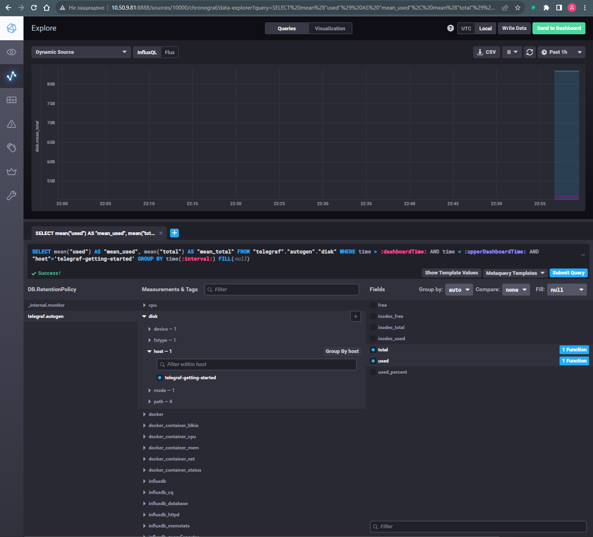
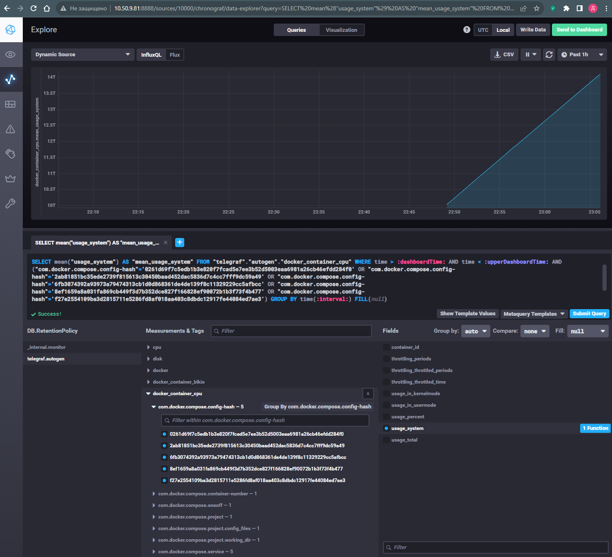

# Домашнее задание к занятию "13.Системы мониторинга"

## Обязательные задания

1. Вас пригласили настроить мониторинг на проект. На онбординге вам рассказали, что проект представляет из себя 
платформу для вычислений с выдачей текстовых отчетов, которые сохраняются на диск. Взаимодействие с платформой 
осуществляется по протоколу http. Также вам отметили, что вычисления загружают ЦПУ. Какой минимальный набор метрик вы
выведите в мониторинг и почему?

<details><summary>Ответ</summary>

Настройка мониторинга для проекта включает в себя выбор правильных показателей для обеспечения работоспособности, производительности и надежности системы. Учитывая, что в проекте задействована платформа для вычислений с ресурсоемкими задачами и взаимодействием по HTTP-протоколу, минимальный набор метрик, за которыми стоит следить:

**- Использование процессора:** Поскольку вычисления интенсивно используют ЦП, мониторинг использования ЦП имеет решающее значение. Высокая загрузка ЦП может указывать на потенциальные узкие места в производительности, конфликты ресурсов или необходимость оптимизации.

**- Использование памяти:** погает убедиться, что в системе достаточно памяти для эффективной обработки вычислений и HTTP-запросов. Высокое использование памяти может привести к снижению производительности или ошибкам нехватки памяти.

**- Время ответа HTTP и задержка:** необходим для взаимодействия с пользователем. Медленное время отклика может повлиять на удовлетворенность пользователей и может указывать на проблемы с производительностью платформы.

**- Частота ошибок HTTP:** (например, кодов состояния 4xx, 5xx) помогает выявить проблемы, с которыми могут столкнуться пользователи. Высокая частота ошибок может указывать на ошибки, неверные конфигурации или ограничения ресурсов.

**- Использование диска:** Поскольку текстовые отчеты сохраняются на диск, необходимо следить за использованием диска, чтобы гарантировать наличие достаточного места. Нехватка места на диске может привести к потере данных или системным сбоям.

**- Сетевой трафик:**  помогает понять схемы связи и потенциальные узкие места при передаче данных. Необычно высокий или низкий сетевой трафик может указывать на аномалии.

**- Средняя загрузка процессора:** обеспечивает более широкое представление о загрузке системы с течением времени. Высокая средняя нагрузка может указывать на периоды высокого спроса и потенциальной конкуренции за ресурсы.

**- Количество активных процессов/потоков:** дает представление о том, как система управляет одновременными вычислениями и запросами. Слишком большое количество процессов/потоков может повлиять на производительность и скорость отклика.

**- Метрики, специфичные для приложения:** В зависимости от специфики проекта может потребоваться отслеживать специфические для приложения показатели (для каждого конкретного проекта они могут быть свои).

</details>   

#
2. Менеджер продукта посмотрев на ваши метрики сказал, что ему непонятно что такое RAM/inodes/CPUla. Также он сказал, 
что хочет понимать, насколько мы выполняем свои обязанности перед клиентами и какое качество обслуживания. Что вы 
можете ему предложить?

<details><summary>Ответ</summary>

- CPUla - средние значения загрузки процессора за 1, 5, и 15 минут. Значение не должно превышать n, где n - количество ядер.   
- inodes - индексные дескрипторы файловой системы. Имеют ограниченное количество почти во всех файловых системах. Количество свободных не должно быть, к примеру, меньше 10% от общего количества.   
- RAM - Оперативная память. Количество свободной не должно превышать 85% от доступного объёма.
- Разработать для приложения healthcheck проверки и функциональные тесты и настроить сбор их метрик. Для примера:
  - Метрики взаимодействия с пользователем (Время, Частота ошибок https)
  - Доступность и надежность услуг (Процент времени безотказной работы, Простои)
  - Мониторинг баз данных и запросы к ним, сетевой мониторинг.
  - Прочее в рамках конкреного проекта...

</details>

#
3. Вашей DevOps команде в этом году не выделили финансирование на построение системы сбора логов. Разработчики в свою 
очередь хотят видеть все ошибки, которые выдают их приложения. Какое решение вы можете предпринять в этой ситуации, 
чтобы разработчики получали ошибки приложения?

<details><summary>Ответ</summary>

В ситуации, когда выделенная система ведения журнала не может быть построена из-за отсутствия финансирования, мы можем изучить альтернативные подходы, чтобы предоставить разработчикам информацию об ошибках приложений.   
Как вариант:

**Использовать существующие инструменты или то что можно настроить бесплатно:**
- Zabbix
- Журналы действующих приложений
- Службы объединения журналов (Elasticsearch, Logstash и Kibana (ELK))
- Платформы отслеживания ошибок (Sentry, Raygun)
- Уведомления в мессенджеры например Telegram

</details>

#
4. Вы, как опытный SRE, сделали мониторинг, куда вывели отображения выполнения SLA=99% по http кодам ответов. 
Вычисляете этот параметр по следующей формуле: summ_2xx_requests/summ_all_requests. Данный параметр не поднимается выше 
70%, но при этом в вашей системе нет кодов ответа 5xx и 4xx. Где у вас ошибка?

<details><summary>Ответ</summary>

Не учтены. 3xx - ответы, которые не являются ошибкой.   
Должно быть так: (summ_2xx_requests+summ_3xx_requests)/summ_all_requests

</details>

#
5. Опишите основные плюсы и минусы pull и push систем мониторинга.

<details><summary>Ответ</summary>

Плюсы:   
- для начала сбора метрик достаточно установить агента   
- возможность использовать протокол udp для отдачи метрик   

Минусы:   
- агент - дополнительная точка отказа. Таким образом, есть вероятность, что сервис работает в штатном режиме, а вот агент перестал работать.
- сложная отладка отправки метрик

</details>

#
6. Какие из ниже перечисленных систем относятся к push модели, а какие к pull? А может есть гибридные?

    - Prometheus 
    - TICK
    - Zabbix
    - VictoriaMetrics
    - Nagios

<details><summary>Ответ</summary>

| Сервис          | Модель | Дополнительный комментарий                                                                                                        |
|-----------------|--------|-----------------------------------------------------------------------------------------------------------------------------------|
| Prometheus      | Push   | Основное назначение собирать информацию                                                                                           |
| TICK            | Hybrid | Telegraf, InfluxDB, Chronograf, Kapacitor может быть настроен как для отправки, так и для извлечения данных.                      |
| Zabbix          | Pull   | Может опрашивать сам, так-же есть агенты                                                                                          |
| VictoriaMetrics | Pull   | Изначально разрабатывалась как pull, но вней есть API для реализации push                                                         |
| Nagios          | Pull   | Есть агенты, которые работают по pull-модели, но так же есть поддержка push-модели по протоколу SNMP                              |


</details>

#
7. Склонируйте себе [репозиторий](https://github.com/influxdata/sandbox/tree/master) и запустите TICK-стэк, 
используя технологии docker и docker-compose.

В виде решения на это упражнение приведите скриншот веб-интерфейса ПО chronograf (`http://localhost:8888`). 

P.S.: если при запуске некоторые контейнеры будут падать с ошибкой - проставьте им режим `Z`, например
`./data:/var/lib:Z`

<details><summary>Ответ</summary>


</details>

#
8. Перейдите в веб-интерфейс Chronograf (`http://localhost:8888`) и откройте вкладку `Data explorer`.

    - Нажмите на кнопку `Add a query`
    - Изучите вывод интерфейса и выберите БД `telegraf.autogen`
    - В `measurments` выберите mem->host->telegraf_container_id , а в `fields` выберите used_percent. 
    Внизу появится график утилизации оперативной памяти в контейнере telegraf.
    - Вверху вы можете увидеть запрос, аналогичный SQL-синтаксису. 
    Поэкспериментируйте с запросом, попробуйте изменить группировку и интервал наблюдений.

Для выполнения задания приведите скриншот с отображением метрик утилизации места на диске 
(disk->host->telegraf_container_id) из веб-интерфейса.


<details><summary>Ответ</summary>



Подозреваю что т.к. ДЗ выполнял на виртуальной вм у которой virtio драйвер диск не определился.

</details>

#
9. Изучите список [telegraf inputs](https://github.com/influxdata/telegraf/tree/master/plugins/inputs). 
Добавьте в конфигурацию telegraf следующий плагин - [docker](https://github.com/influxdata/telegraf/tree/master/plugins/inputs/docker):
```
[[inputs.docker]]
  endpoint = "unix:///var/run/docker.sock"
```

Дополнительно вам может потребоваться донастройка контейнера telegraf в `docker-compose.yml` дополнительного volume и 
режима privileged:
```
  telegraf:
    image: telegraf:1.4.0
    privileged: true
    volumes:
      - ./etc/telegraf.conf:/etc/telegraf/telegraf.conf:Z
      - /var/run/docker.sock:/var/run/docker.sock:Z
    links:
      - influxdb
    ports:
      - "8092:8092/udp"
      - "8094:8094"
      - "8125:8125/udp"
```

После настройке перезапустите telegraf, обновите веб интерфейс и приведите скриншотом список `measurments` в 
веб-интерфейсе базы telegraf.autogen . Там должны появиться метрики, связанные с docker.

Факультативно можете изучить какие метрики собирает telegraf после выполнения данного задания.

<details><summary>Ответ</summary>

Странно зашел внутрь контейнера судя по всему конфиг переносится но докер не появился, подозреваю что нужно использовать другую ВМ для тестов или вносить изменения в текущую.
В целом данный материал понятен т.к. с ним приходится работать.

```bash
root@denis-lin:/home/denis/sandbox# ./sandbox enter telegraf
Using latest, stable releases
Entering /bin/bash session in the telegraf container...
root@ee2d9f8f264d:/# cat /etc/telegraf/telegraf.conf
[agent]
  interval = "5s"
  round_interval = true
  metric_batch_size = 1000
  metric_buffer_limit = 10000
  collection_jitter = "0s"
  flush_interval = "5s"
  flush_jitter = "0s"
  precision = ""
  debug = false
  quiet = false
  logfile = ""
  hostname = "$HOSTNAME"
  omit_hostname = false

[[outputs.influxdb]]
  urls = ["http://influxdb:8086"]
  database = "telegraf"
  username = ""
  password = ""
  retention_policy = ""
  write_consistency = "any"
  timeout = "5s"

[[inputs.docker]]
  endpoint = "unix:///var/run/docker.sock"
  container_names = []
  timeout = "5s"
  perdevice = true
  total = false

[[inputs.cpu]]
[[inputs.system]]
[[inputs.influxdb]]
  urls = ["http://influxdb:8086/debug/vars"]
[[inputs.syslog]]
#   ## Specify an ip or hostname with port - eg., tcp://localhost:6514, tcp://10.0.0.1:6514
#   ## Protocol, address and port to host the syslog receiver.
#   ## If no host is specified, then localhost is used.
#   ## If no port is specified, 6514 is used (RFC5425#section-4.1).
  server = "tcp://localhost:6514"
root@ee2d9f8f264d:/#
```


**Дополнение** - все-же решил попробовать пересобрать но чтоб сделать это быстро собрал и запустил sandbox внутри LXC   
по этому адрес хоста на добавленном скрине другой, диск не видит а вот докер - нормально определеился...



</details>
