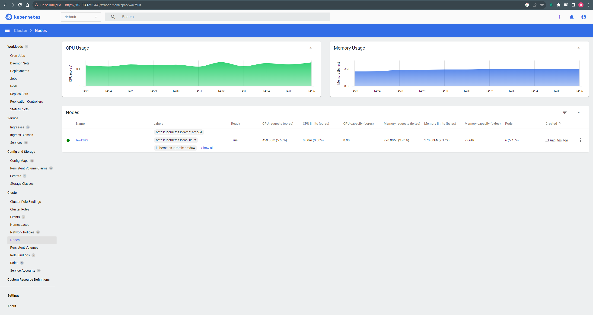

# Домашнее задание к занятию «Kubernetes. Причины появления. Команда kubectl»

### Задание 1. Установка MicroK8S

### Решение:

1. Установить MicroK8S на локальную машину или на удалённую виртуальную машину.

Установлен MicroK8S на отдельную машину

```bash
denis@hw-k8s2:~$ microk8s version
MicroK8s v1.27.5 revision 5891
denis@hw-k8s2:~$ lsb_release -a
No LSB modules are available.
Distributor ID: Ubuntu
Description:    Ubuntu 20.04.6 LTS
Release:        20.04
Codename:       focal
```


2. Установить dashboard.

```bash
microk8s enable dashboard
microk8s kubectl describe secret -n kube-system microk8s-dashboard-token
microk8s kubectl get secret microk8s-dashboard-token  -n kube-system -o jsonpath={".data.token"} | base64 -d
microk8s kubectl port-forward -n kube-system service/kubernetes-dashboard 10443:443 --address='0.0.0.0'
```

3. Сгенерировать сертификат для подключения к внешнему ip-адресу.

```bash
denis@hw-k8s2:~$ sudo microk8s refresh-certs --cert front-proxy-client.crt
[sudo] password for denis:
Taking a backup of the current certificates under /var/snap/microk8s/5891/certs-backup/
Creating new certificates
Signature ok
subject=CN = front-proxy-client
Getting CA Private Key
Restarting service kubelite.

```

------

### Задание 2. Установка и настройка локального kubectl

### Решение:

1. Установить на локальную машину kubectl.

```bash
denis@denis-lin(0):~/netology$ kubectl version --client
Client Version: v1.28.2
Kustomize Version: v5.0.4-0.20230601165947-6ce0bf390ce3

```

2. Настроить локально подключение к кластеру.

```bash
denis@denis-lin(0):~/netology$ kubectl config view
apiVersion: v1
clusters:
- cluster:
    certificate-authority-data: DATA+OMITTED
    server: https://10.10.3.12:16443
  name: microk8s-cluster
contexts:
- context:
    cluster: microk8s-cluster
    user: admin
  name: microk8s
current-context: microk8s
kind: Config
preferences: {}
users:
- name: admin
  user:
    token: REDACTED
denis@denis-lin(0):~/netology$ kubectl get nodes
NAME      STATUS   ROLES    AGE   VERSION
hw-k8s2   Ready    <none>   29m   v1.27.5

```

3. Подключиться к дашборду с помощью port-forward.




<details><summary>PS: microk8s - не запускал pod на ubuntu 22.04</summary>

```bash
denis@hw-k8s1:~$ lsb_release -a
No LSB modules are available.
Distributor ID: Ubuntu
Description:    Ubuntu 22.04.3 LTS
Release:        22.04
Codename:       jammy

denis@hw-k8s1:~$ sudo snap install microk8s --classic
microk8s (1.27/stable) v1.27.5 from Canonical✓ installed

denis@hw-k8s1:~$ microk8s status --wait-ready
microk8s is running
high-availability: no
  datastore master nodes: 127.0.0.1:19001
  datastore standby nodes: none
addons:
  enabled:
    dashboard            # (core) The Kubernetes dashboard
    dns                  # (core) CoreDNS
    ha-cluster           # (core) Configure high availability on the current node
    helm                 # (core) Helm - the package manager for Kubernetes
    helm3                # (core) Helm 3 - the package manager for Kubernetes
    metrics-server       # (core) K8s Metrics Server for API access to service metrics
  disabled:
    cert-manager         # (core) Cloud native certificate management
    community            # (core) The community addons repository
    gpu                  # (core) Automatic enablement of Nvidia CUDA
    host-access          # (core) Allow Pods connecting to Host services smoothly
    hostpath-storage     # (core) Storage class; allocates storage from host directory
    ingress              # (core) Ingress controller for external access
    kube-ovn             # (core) An advanced network fabric for Kubernetes
    mayastor             # (core) OpenEBS MayaStor
    metallb              # (core) Loadbalancer for your Kubernetes cluster
    minio                # (core) MinIO object storage
    observability        # (core) A lightweight observability stack for logs, traces and metrics
    prometheus           # (core) Prometheus operator for monitoring and logging
    rbac                 # (core) Role-Based Access Control for authorisation
    registry             # (core) Private image registry exposed on localhost:32000
    storage              # (core) Alias to hostpath-storage add-on, deprecated


denis@hw-k8s1:~$ sudo microk8s refresh-certs --cert front-proxy-client.crt
Taking a backup of the current certificates under /var/snap/microk8s/5891/certs-backup/
Creating new certificates
Signature ok
subject=CN = front-proxy-client
Getting CA Private Key
Restarting service kubelite.

denis@hw-k8s1:~$ kubectl get pods -A
NAMESPACE              NAME                                         READY   STATUS                  RESTARTS       AGE
kube-system            calico-kube-controllers-6c99c8747f-mvcbt     0/1     Unknown                 0              40m
kube-system            coredns-7745f9f87f-8psmj                     0/1     Unknown                 0              40m
kubernetes-dashboard   kubernetes-dashboard-6967859bff-sqq8w        0/1     ContainerCreating       0              31m
kubernetes-dashboard   dashboard-metrics-scraper-5cb4f4bb9c-4rxx7   0/1     ContainerCreating       0              31m
kube-system            calico-node-qfp5m                            0/1     Init:CrashLoopBackOff   14 (74s ago)   40m
denis@hw-k8s1:~$ microk8s stop
denis@hw-k8s1:~$ snap remove microk8s
```

</details>

<details><summary>PS2: microk8s - не запускал pod на ubuntu 22.04 (починено)</summary>

```bash
denis@hw-k8s1:~$ lsb_release -a
No LSB modules are available.
Distributor ID: Ubuntu
Description:    Ubuntu 22.04.3 LTS
Release:        22.04
Codename:       jammy

denis@hw-k8s1:~$ microk8s disable metrics-server
denis@hw-k8s1:~$ microk8s disable dashboard
denis@hw-k8s1:~$ microk8s stop
```
Взял файл /var/snap/microk8s/current/certs/csr.conf.template с ununtu 20, изменив IP.3

```bash
denis@hw-k8s1:~$ cat /var/snap/microk8s/current/certs/csr.conf.template
[ req ]
default_bits = 2048
prompt = no
default_md = sha256
req_extensions = req_ext
distinguished_name = dn

[ dn ]
C = GB
ST = Canonical
L = Canonical
O = Canonical
OU = Canonical
CN = 127.0.0.1

[ req_ext ]
subjectAltName = @alt_names

[ alt_names ]
DNS.1 = kubernetes
DNS.2 = kubernetes.default
DNS.3 = kubernetes.default.svc
DNS.4 = kubernetes.default.svc.cluster
DNS.5 = kubernetes.default.svc.cluster.local
IP.1 = 127.0.0.1
IP.2 = 10.152.183.1
IP.3 = 10.10.3.11
#MOREIPS

[ v3_ext ]
authorityKeyIdentifier=keyid,issuer:always
basicConstraints=CA:FALSE
keyUsage=keyEncipherment,dataEncipherment,digitalSignature
extendedKeyUsage=serverAuth,clientAuth
subjectAltName=@alt_names


denis@hw-k8s1:~$ microk8s start

```
взлетело:

```bash
denis@hw-k8s1:~$ microk8s kubectl get pods -A
NAMESPACE     NAME                                         READY   STATUS    RESTARTS        AGE
kube-system   coredns-7745f9f87f-vjb2s                     1/1     Running   2 (5m59s ago)   123m
kube-system   calico-node-57r8w                            1/1     Running   3 (5m59s ago)   123m
kube-system   calico-kube-controllers-6c99c8747f-vwn2d     1/1     Running   2 (5m59s ago)   123m
kube-system   dashboard-metrics-scraper-5cb4f4bb9c-zgxb5   1/1     Running   0               4m43s
kube-system   kubernetes-dashboard-fc86bcc89-4f7rn         1/1     Running   0               4m43s
kube-system   metrics-server-7747f8d66b-ffc2c              1/1     Running   0               4m43s


```

</details>