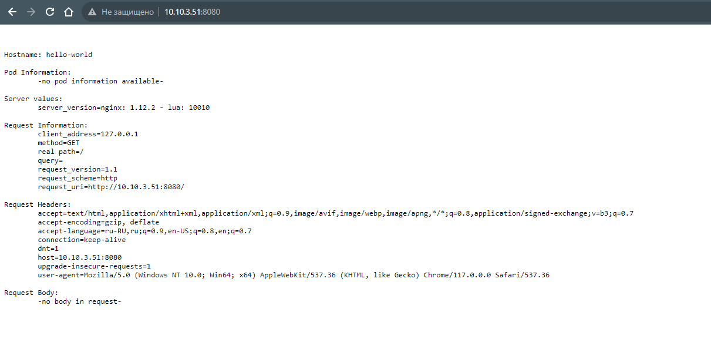
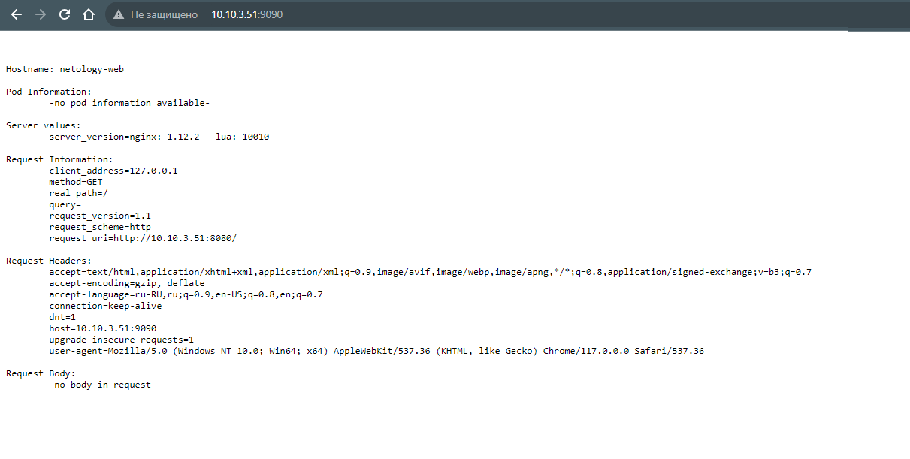

# Домашнее задание к занятию «Базовые объекты K8S»

### Задание 1. Создать Pod с именем hello-world

1. Создать манифест (yaml-конфигурацию) Pod.
2. Использовать image - gcr.io/kubernetes-e2e-test-images/echoserver:2.2.
3. Подключиться локально к Pod с помощью `kubectl port-forward` и вывести значение (curl или в браузере).

### Решение

```bash
denis@denis-lin(0):~/netology/kuber$ kubectl apply -f 12_2_pod.yaml
pod/hello-world created
denis@denis-lin(0):~/netology/kuber$ kubectl get pods
NAME          READY   STATUS    RESTARTS   AGE
hello-world   1/1     Running   0          10s
```

<details><summary>12_2_pod.yaml</summary>

```bash
denis@denis-lin(0):~/netology/kuber$ cat 12_2_pod.yaml
apiVersion: v1
kind: Pod
metadata:
  name: hello-world
  namespace: default
spec:
  containers:
  - name: hello-world
    image: gcr.io/kubernetes-e2e-test-images/echoserver:2.2
    ports:
    - containerPort: 8080

```

</details>

```bash
denis@denis-lin(0):~/netology/kuber$ kubectl port-forward pod/hello-world 8080:8080  --address='0.0.0.0'
Forwarding from 0.0.0.0:8080 -> 8080
Handling connection for 8080
Handling connection for 8080
```




### Задание 2. Создать Service и подключить его к Pod

1. Создать Pod с именем netology-web.
2. Использовать image — gcr.io/kubernetes-e2e-test-images/echoserver:2.2.
3. Создать Service с именем netology-svc и подключить к netology-web.
4. Подключиться локально к Service с помощью `kubectl port-forward` и вывести значение (curl или в браузере).

### Решение

```bash
denis@denis-lin(0):~/netology/kuber$ kubectl apply -f 12_2_service.yml
pod/netology-web created
service/netology-svc created
denis@denis-lin(0):~/netology/kuber$ kubectl get pods
NAME           READY   STATUS    RESTARTS   AGE
hello-world    1/1     Running   0          11m
netology-web   1/1     Running   0          7s
denis@denis-lin(0):~/netology/kuber$ kubectl get service
NAME           TYPE        CLUSTER-IP      EXTERNAL-IP   PORT(S)   AGE
kubernetes     ClusterIP   10.152.183.1    <none>        443/TCP   3h56m
netology-svc   ClusterIP   10.152.183.74   <none>        80/TCP    16s

```

<details><summary>12_2_service.yml</summary>

```bash
denis@denis-lin(0):~/netology/kuber$ cat 12_2_service.yml
apiVersion: v1
kind: Pod
metadata:
  name: netology-web
  labels:
    app: netology-web
spec:
  containers:
  - name: netology-web
    image: gcr.io/kubernetes-e2e-test-images/echoserver:2.2
    ports:
      - containerPort: 8080
        name: ntlg-web-port

---
apiVersion: v1
kind: Service
metadata:
  name: netology-svc
spec:
  selector:
    app: netology-web
  ports:
  - name: ntlg-svc-port
    protocol: TCP
    port: 80
    targetPort: ntlg-web-port

```

</details>

```bash
denis@denis-lin(0):~/netology/kuber$ kubectl port-forward services/netology-svc 9090:80  --address='0.0.0.0'
Forwarding from 0.0.0.0:9090 -> 8080
Handling connection for 9090
Handling connection for 9090

```


