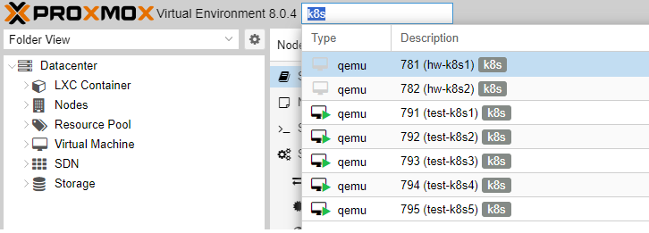
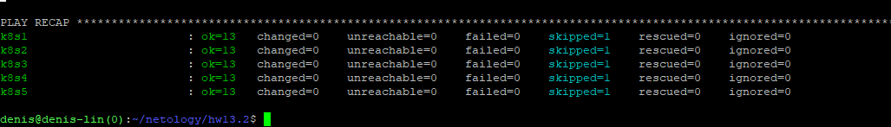

# Домашнее задание к занятию «Установка Kubernetes»

### Цель задания

Установить кластер K8s.

-----






### Задание 1. Установить кластер k8s с 1 master node

1. Подготовка работы кластера из 5 нод: 1 мастер и 4 рабочие ноды.
2. В качестве CRI — containerd.
3. Запуск etcd производить на мастере.
4. Способ установки выбрать самостоятельно.


### Решение: 
```bash
root@test-k8s1:~# kubectl get nodes -owide
NAME        STATUS     ROLES           AGE     VERSION   INTERNAL-IP   EXTERNAL-IP   OS-IMAGE             KERNEL-VERSION      CONTAINER-RUNTIME
test-k8s1   Ready      control-plane   18h     v1.28.4   10.10.3.91    <none>        Ubuntu 22.04.3 LTS   5.15.0-89-generic   containerd://1.7.2
test-k8s2   Ready      <none>          2m12s   v1.28.4   10.10.3.92    <none>        Ubuntu 22.04.3 LTS   5.15.0-89-generic   containerd://1.7.2
test-k8s3   NotReady   <none>          37s     v1.28.4   10.10.3.93    <none>        Ubuntu 22.04.3 LTS   5.15.0-89-generic   containerd://1.7.2
test-k8s4   NotReady   <none>          17s     v1.28.4   10.10.3.94    <none>        Ubuntu 22.04.3 LTS   5.15.0-89-generic   containerd://1.7.2
test-k8s5   NotReady   <none>          6s      v1.28.4   10.10.3.95    <none>        Ubuntu 22.04.3 LTS   5.15.0-89-generic   containerd://1.7.2

root@test-k8s1:~# kubectl get nodes -owide
NAME        STATUS   ROLES           AGE     VERSION   INTERNAL-IP   EXTERNAL-IP   OS-IMAGE             KERNEL-VERSION      CONTAINER-RUNTIME
test-k8s1   Ready    control-plane   18h     v1.28.4   10.10.3.91    <none>        Ubuntu 22.04.3 LTS   5.15.0-89-generic   containerd://1.7.2
test-k8s2   Ready    <none>          3m50s   v1.28.4   10.10.3.92    <none>        Ubuntu 22.04.3 LTS   5.15.0-89-generic   containerd://1.7.2
test-k8s3   Ready    <none>          2m15s   v1.28.4   10.10.3.93    <none>        Ubuntu 22.04.3 LTS   5.15.0-89-generic   containerd://1.7.2
test-k8s4   Ready    <none>          115s    v1.28.4   10.10.3.94    <none>        Ubuntu 22.04.3 LTS   5.15.0-89-generic   containerd://1.7.2
test-k8s5   Ready    <none>          104s    v1.28.4   10.10.3.95    <none>        Ubuntu 22.04.3 LTS   5.15.0-89-generic   containerd://1.7.2


```
### Задание 2*. Установить HA кластер

1. Установить кластер в режиме HA.
2. Использовать нечётное количество Master-node.
3. Для cluster ip использовать keepalived или другой способ.

### Решение:

```bash
To start administering your cluster from this node, you need to run the following as a regular user:

        mkdir -p $HOME/.kube
        sudo cp -i /etc/kubernetes/admin.conf $HOME/.kube/config
        sudo chown $(id -u):$(id -g) $HOME/.kube/config

Run 'kubectl get nodes' to see this node join the cluster.

root@test-k8s2:~# mkdir -p $HOME/.kube
root@test-k8s2:~# cp -i /etc/kubernetes/admin.conf $HOME/.kube/config
root@test-k8s2:~# chown $(id -u):$(id -g) $HOME/.kube/config
root@test-k8s2:~# kubectl get nodes -owide
NAME        STATUS     ROLES           AGE   VERSION   INTERNAL-IP   EXTERNAL-IP   OS-IMAGE             KERNEL-VERSION      CONTAINER-RUNTIME
test-k8s1   Ready      control-plane   17m   v1.28.4   10.10.3.91    <none>        Ubuntu 22.04.3 LTS   5.15.0-89-generic   containerd://1.7.2
test-k8s2   NotReady   control-plane   45s   v1.28.4   10.10.3.92    <none>        Ubuntu 22.04.3 LTS   5.15.0-89-generic   containerd://1.7.2

root@test-k8s3:~# kubectl get nodes -owide
NAME        STATUS     ROLES           AGE    VERSION   INTERNAL-IP   EXTERNAL-IP   OS-IMAGE             KERNEL-VERSION      CONTAINER-RUNTIME
test-k8s1   Ready      control-plane   18m    v1.28.4   10.10.3.91    <none>        Ubuntu 22.04.3 LTS   5.15.0-89-generic   containerd://1.7.2
test-k8s2   Ready      control-plane   111s   v1.28.4   10.10.3.92    <none>        Ubuntu 22.04.3 LTS   5.15.0-89-generic   containerd://1.7.2
test-k8s3   NotReady   control-plane   30s    v1.28.4   10.10.3.93    <none>        Ubuntu 22.04.3 LTS   5.15.0-89-generic   containerd://1.7.2

root@test-k8s1:~# kubectl get nodes -owide
NAME        STATUS   ROLES           AGE     VERSION   INTERNAL-IP   EXTERNAL-IP   OS-IMAGE             KERNEL-VERSION      CONTAINER-RUNTIME
test-k8s1   Ready    control-plane   21m     v1.28.4   10.10.3.91    <none>        Ubuntu 22.04.3 LTS   5.15.0-89-generic   containerd://1.7.2
test-k8s2   Ready    control-plane   4m13s   v1.28.4   10.10.3.92    <none>        Ubuntu 22.04.3 LTS   5.15.0-89-generic   containerd://1.7.2
test-k8s3   Ready    control-plane   2m52s   v1.28.4   10.10.3.93    <none>        Ubuntu 22.04.3 LTS   5.15.0-89-generic   containerd://1.7.2
test-k8s4   Ready    <none>          106s    v1.28.4   10.10.3.94    <none>        Ubuntu 22.04.3 LTS   5.15.0-89-generic   containerd://1.7.2
test-k8s5   Ready    <none>          96s     v1.28.4   10.10.3.95    <none>        Ubuntu 22.04.3 LTS   5.15.0-89-generic   containerd://1.7.2


root@test-k8s1:~# kubectl label node test-k8s4 node-role.kubernetes.io/worker=worker
node/test-k8s4 labeled
root@test-k8s1:~# kubectl label node test-k8s5 node-role.kubernetes.io/worker=worker
node/test-k8s5 labeled
root@test-k8s1:~# kubectl get nodes -owide
NAME        STATUS   ROLES           AGE     VERSION   INTERNAL-IP   EXTERNAL-IP   OS-IMAGE             KERNEL-VERSION      CONTAINER-RUNTIME
test-k8s1   Ready    control-plane   22m     v1.28.4   10.10.3.91    <none>        Ubuntu 22.04.3 LTS   5.15.0-89-generic   containerd://1.7.2
test-k8s2   Ready    control-plane   6m      v1.28.4   10.10.3.92    <none>        Ubuntu 22.04.3 LTS   5.15.0-89-generic   containerd://1.7.2
test-k8s3   Ready    control-plane   4m39s   v1.28.4   10.10.3.93    <none>        Ubuntu 22.04.3 LTS   5.15.0-89-generic   containerd://1.7.2
test-k8s4   Ready    worker          3m33s   v1.28.4   10.10.3.94    <none>        Ubuntu 22.04.3 LTS   5.15.0-89-generic   containerd://1.7.2
test-k8s5   Ready    worker          3m23s   v1.28.4   10.10.3.95    <none>        Ubuntu 22.04.3 LTS   5.15.0-89-generic   containerd://1.7.2

```

PS> если в инициализации использовать  --upload-certs то можно упростить себе жизнь с сертификатами

```bash
kubeadm init --v=5 --upload-certs --pod-network-cidr=10.244.0.0/16 --service-cidr=10.245.0.0/16 --control-plane-endpoint test-k8s1
***
You can now join any number of the control-plane node running the following command on each as root:

  kubeadm join test-k8s1:6443 --token nm5i80.afpu9thtbn5meoea \
        --discovery-token-ca-cert-hash sha256:824a2ebd4b3010c9a942d94a9969106c992228f98714586f05d8e8aecefd52ee \
        --control-plane --certificate-key 8bc4c223521e6241bb3fa86f0129b29ad5b0b149dedf733007ec23f72085bf7f
```

### Команды:

```bash
mkdir /etc/containerd
sh -c "containerd config default > /etc/containerd/config.toml"
sed -i 's/ SystemdCgroup = false/ SystemdCgroup = true/' /etc/containerd/config.toml
systemctl restart containerd.service
systemctl restart kubelet.service
```

```bash
kubeadm init --v=5 --pod-network-cidr=10.244.0.0/16 --service-cidr=10.245.0.0/16 --control-plane-endpoint test-k8s1
```

```bash
To start using your cluster, you need to run the following as a regular user:

  mkdir -p $HOME/.kube
  sudo cp -i /etc/kubernetes/admin.conf $HOME/.kube/config
  sudo chown $(id -u):$(id -g) $HOME/.kube/config

Alternatively, if you are the root user, you can run:

  export KUBECONFIG=/etc/kubernetes/admin.conf
```

```bash
kubectl create -f https://raw.githubusercontent.com/projectcalico/calico/v3.26.1/manifests/tigera-operator.yaml
curl https://raw.githubusercontent.com/projectcalico/calico/v3.26.1/manifests/custom-resources.yaml -O
sed -i 's/cidr: 192\.168\.0\.0\/16/cidr: 10.244.0.0\/16/g' custom-resources.yaml
kubectl create -f custom-resources.yaml
```

<details><summary>custom-resources.yaml</summary>

```bash
root@test-k8s1:~# cat custom-resources.yaml
# This section includes base Calico installation configuration.
# For more information, see: https://projectcalico.docs.tigera.io/master/reference/installation/api#operator.tigera.io/v1.Installation
apiVersion: operator.tigera.io/v1
kind: Installation
metadata:
  name: default
spec:
  # Configures Calico networking.
  calicoNetwork:
    # Note: The ipPools section cannot be modified post-install.
    ipPools:
    - blockSize: 26
      cidr: 10.244.0.0/16
      encapsulation: VXLANCrossSubnet
      natOutgoing: Enabled
      nodeSelector: all()

---

# This section configures the Calico API server.
# For more information, see: https://projectcalico.docs.tigera.io/master/reference/installation/api#operator.tigera.io/v1.APIServer
apiVersion: operator.tigera.io/v1
kind: APIServer
metadata:
  name: default
spec: {}

root@test-k8s1:~#

```

</details>


```bash
You can now join any number of control-plane nodes by copying certificate authorities
and service account keys on each node and then running the following as root:

  kubeadm join test-k8s1:6443 --token bx9jwy.l7a1bfuudj4kvbmh \
        --discovery-token-ca-cert-hash sha256:5184f2e607d96a616dd84ad7e7f2710b6077569d2e9c8fa1fff6375d3f9ab339 \
        --control-plane

Then you can join any number of worker nodes by running the following on each as root:

kubeadm join test-k8s1:6443 --token bx9jwy.l7a1bfuudj4kvbmh \
        --discovery-token-ca-cert-hash sha256:5184f2e607d96a616dd84ad7e7f2710b6077569d2e9c8fa1fff6375d3f9ab339
```

```bash
# присвоить роль worker
kubectl label node kube-worker node-role.kubernetes.io/worker=worker

# снять нагрузку с ноды
kubectl drain

#удалить ноду
kubectl delete node <node-name>

# на удаленной ноде после ее удаления запускаем и дальше читаем инструкцию которую выдаст
kubeadm reset
```

```bash
# копировать сертификаты на хосты
USER=root
CONTROL_PLANE_IPS="10.10.3.92 10.10.3.93"
for host in ${CONTROL_PLANE_IPS}; do
    scp /etc/kubernetes/pki/ca.crt "${USER}"@$host:
    scp /etc/kubernetes/pki/ca.key "${USER}"@$host:
    scp /etc/kubernetes/pki/sa.key "${USER}"@$host:
    scp /etc/kubernetes/pki/sa.pub "${USER}"@$host:
    scp /etc/kubernetes/pki/front-proxy-ca.crt "${USER}"@$host:
    scp /etc/kubernetes/pki/front-proxy-ca.key "${USER}"@$host:
    scp /etc/kubernetes/pki/etcd/ca.crt "${USER}"@$host:etcd-ca.crt
    # Skip the next line if you are using external etcd
    scp /etc/kubernetes/pki/etcd/ca.key "${USER}"@$host:etcd-ca.key
done


# на хостах запускаем
USER=root
mkdir -p /etc/kubernetes/pki/etcd
mv /${USER}/ca.crt /etc/kubernetes/pki/
mv /${USER}/ca.key /etc/kubernetes/pki/
mv /${USER}/sa.pub /etc/kubernetes/pki/
mv /${USER}/sa.key /etc/kubernetes/pki/
mv /${USER}/front-proxy-ca.crt /etc/kubernetes/pki/
mv /${USER}/front-proxy-ca.key /etc/kubernetes/pki/
mv /${USER}/etcd-ca.crt /etc/kubernetes/pki/etcd/ca.crt
# Skip the next line if you are using external etcd
mv /${USER}/etcd-ca.key /etc/kubernetes/pki/etcd/ca.key
```