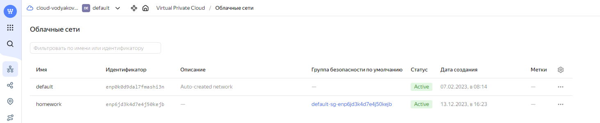
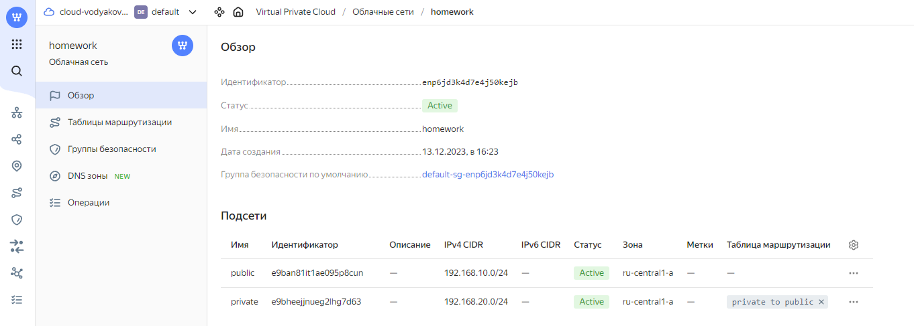
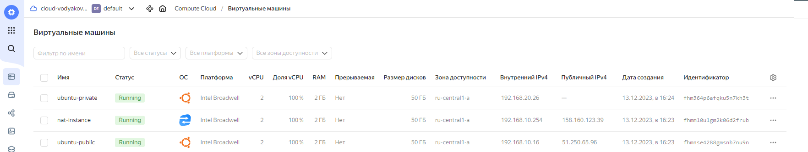

# Домашнее задание к занятию "15.1. Организация сети"

Домашнее задание будет состоять из обязательной части, которую необходимо выполнить на провайдере Яндекс.Облако и дополнительной части в AWS по желанию. Все домашние задания в 15 блоке связаны друг с другом и в конце представляют пример законченной инфраструктуры.  
Все задания требуется выполнить с помощью Terraform, результатом выполненного домашнего задания будет код в репозитории. 

Перед началом работ следует настроить доступ до облачных ресурсов из Terraform используя материалы прошлых лекций и [ДЗ](https://github.com/netology-code/virt-homeworks/tree/master/07-terraform-02-syntax ). А также заранее выбрать регион (в случае AWS) и зону.

---
## Задание 1. Яндекс.Облако (обязательное к выполнению)

1. Создать VPC.
- Создать пустую VPC. Выбрать зону.
2. Публичная подсеть.
- Создать в vpc subnet с названием public, сетью 192.168.10.0/24.
- Создать в этой подсети NAT-инстанс, присвоив ему адрес 192.168.10.254. В качестве image_id использовать fd80mrhj8fl2oe87o4e1
- Создать в этой публичной подсети виртуалку с публичным IP и подключиться к ней, убедиться что есть доступ к интернету.
3. Приватная подсеть.
- Создать в vpc subnet с названием private, сетью 192.168.20.0/24.
- Создать route table. Добавить статический маршрут, направляющий весь исходящий трафик private сети в NAT-инстанс
- Создать в этой приватной подсети виртуалку с внутренним IP, подключиться к ней через виртуалку, созданную ранее и убедиться что есть доступ к интернету

Resource terraform для ЯО
- [VPC subnet](https://registry.terraform.io/providers/yandex-cloud/yandex/latest/docs/resources/vpc_subnet)
- [Route table](https://registry.terraform.io/providers/yandex-cloud/yandex/latest/docs/resources/vpc_route_table)
- [Compute Instance](https://registry.terraform.io/providers/yandex-cloud/yandex/latest/docs/resources/compute_instance)
---

### Решение

<details><summary>terraform apply</summary>

```bash
root@denis-lin:/home/denis/netology/hw15.1# terraform apply
data.yandex_compute_image.ubuntu-2004: Reading...
data.yandex_compute_image.nat-ubuntu: Reading...
data.yandex_compute_image.ubuntu-2004: Read complete after 1s [id=fd8tckeqoshi403tks4l]
data.yandex_compute_image.nat-ubuntu: Read complete after 1s [id=fd8o8aph4t4pdisf1fio]

Terraform used the selected providers to generate the following execution plan. Resource actions are indicated with the following symbols:
  + create

Terraform will perform the following actions:

  # yandex_compute_instance.nat-instance will be created
  + resource "yandex_compute_instance" "nat-instance" {
      + created_at                = (known after apply)
      + folder_id                 = (known after apply)
      + fqdn                      = (known after apply)
      + gpu_cluster_id            = (known after apply)
      + hostname                  = "nat-instance.local"
      + id                        = (known after apply)
      + metadata                  = {
          + "serial-port-enable" = "1"
          + "ssh-keys"           = <<-EOT
                ubuntu:ssh-rsa AAAAB3NzaC1yc2EAAAADAQABAAACAQDIvWxdbLPKGpYCy5Nq2uWX29ofUovEtAYdtuK7Y09k7FiLcedpuGt8A/qt/CQVR0Xfes57Q9Ycweh/hbYvkjqI2GuW62VawCs4Yimo3y4XYW1j/28SMwfx513qjUcDyAhiqs5cpGVN+/s54WC/qzbGBOGP/pd7erRwH7rgVTtksvgR0hY+G4jU52aUTA+gwIi3V6i9jTp90dfZr1/H7ADg+sdICdanvqmtAN2lw7dyOLFTP5lHvSkESws+04i7mH8N3OkdTZfj3zTaZEHU5mqfw1AHaeO9vLHZi1so1lJDiL8zrIfNKcrjucFdySb54Eat4t4q9rQqhLpsScQkpY69rUeAQzprq/PSUUSYIMamoMTzc5awxg+fajq5Y00oUvq4aMIjjQBEU+pfUkH0aZWWDZnSZGjcRtDcVmBMYnijgHQFj9W0ZPqi1mh1oc9HORtN32cutNyXuENnO73l0LVro2bDJMXmgs9AAy4uSIi1BNCZIdZPpA51zmTwMme8wgRyePEgbzffTE5gKekMFKV4pjWMMXLv4B+45Q6BocxjW2mvcXfP6bwL0+xmYNChO45cTZ81WzTt0pJQKaS0EF41z5gGhz6gI5myNfcvvJHAY6OawWrEIa4Mau4O93OHUyDbE8U0qhnpd3ePBrSaiEYZZRFZUnPHf9UNgt4kJbptUQ== info@it-git.ru
            EOT
        }
      + name                      = "nat-instance"
      + network_acceleration_type = "standard"
      + platform_id               = "standard-v1"
      + service_account_id        = (known after apply)
      + status                    = (known after apply)
      + zone                      = (known after apply)

      + boot_disk {
          + auto_delete = true
          + device_name = (known after apply)
          + disk_id     = (known after apply)
          + mode        = (known after apply)

          + initialize_params {
              + block_size  = (known after apply)
              + description = (known after apply)
              + image_id    = "fd8o8aph4t4pdisf1fio"
              + name        = (known after apply)
              + size        = 50
              + snapshot_id = (known after apply)
              + type        = "network-hdd"
            }
        }

      + network_interface {
          + index              = (known after apply)
          + ip_address         = "192.168.10.254"
          + ipv4               = true
          + ipv6               = (known after apply)
          + ipv6_address       = (known after apply)
          + mac_address        = (known after apply)
          + nat                = true
          + nat_ip_address     = (known after apply)
          + nat_ip_version     = (known after apply)
          + security_group_ids = (known after apply)
          + subnet_id          = (known after apply)
        }

      + resources {
          + core_fraction = 100
          + cores         = 2
          + memory        = 2
        }
    }

  # yandex_compute_instance.private_instance will be created
  + resource "yandex_compute_instance" "private_instance" {
      + created_at                = (known after apply)
      + folder_id                 = (known after apply)
      + fqdn                      = (known after apply)
      + gpu_cluster_id            = (known after apply)
      + hostname                  = "ubuntu-private.local"
      + id                        = (known after apply)
      + metadata                  = {
          + "serial-port-enable" = "1"
          + "user-data"          = <<-EOT
                #cloud-config
                users:
                  - name: ubuntu
                    gecos: Ubuntu User
                    sudo: ALL=(ALL) NOPASSWD:ALL
                    shell: /bin/bash
                    groups: sudo
                    lock_passwd: false
                    #  mkpasswd --method=SHA-512 --rounds=4096 1234asdf
                    passwd: $6$rounds=4096$EFbLSn2FjdiTycDu$8uqnQbCF.AF1ds1Qmc0Naw3l1FXFpnxI9pogsTZHsJdKpY8keMR5MPWRBqBirySZkEqTOKxiB6iRAe9RWnApi1
            EOT
        }
      + name                      = "ubuntu-private"
      + network_acceleration_type = "standard"
      + platform_id               = "standard-v1"
      + service_account_id        = (known after apply)
      + status                    = (known after apply)
      + zone                      = (known after apply)

      + boot_disk {
          + auto_delete = true
          + device_name = (known after apply)
          + disk_id     = (known after apply)
          + mode        = (known after apply)

          + initialize_params {
              + block_size  = (known after apply)
              + description = (known after apply)
              + image_id    = "fd8tckeqoshi403tks4l"
              + name        = (known after apply)
              + size        = 50
              + snapshot_id = (known after apply)
              + type        = "network-hdd"
            }
        }

      + network_interface {
          + index              = (known after apply)
          + ip_address         = (known after apply)
          + ipv4               = true
          + ipv6               = false
          + ipv6_address       = (known after apply)
          + mac_address        = (known after apply)
          + nat                = false
          + nat_ip_address     = (known after apply)
          + nat_ip_version     = (known after apply)
          + security_group_ids = (known after apply)
          + subnet_id          = (known after apply)
        }

      + resources {
          + core_fraction = 100
          + cores         = 2
          + memory        = 2
        }
    }

  # yandex_compute_instance.public_instance will be created
  + resource "yandex_compute_instance" "public_instance" {
      + created_at                = (known after apply)
      + folder_id                 = (known after apply)
      + fqdn                      = (known after apply)
      + gpu_cluster_id            = (known after apply)
      + hostname                  = "ubuntu-public.local"
      + id                        = (known after apply)
      + metadata                  = {
          + "serial-port-enable" = "1"
          + "ssh-keys"           = <<-EOT
                ubuntu:ssh-rsa AAAAB3NzaC1yc2EAAAADAQABAAACAQDIvWxdbLPKGpYCy5Nq2uWX29ofUovEtAYdtuK7Y09k7FiLcedpuGt8A/qt/CQVR0Xfes57Q9Ycweh/hbYvkjqI2GuW62VawCs4Yimo3y4XYW1j/28SMwfx513qjUcDyAhiqs5cpGVN+/s54WC/qzbGBOGP/pd7erRwH7rgVTtksvgR0hY+G4jU52aUTA+gwIi3V6i9jTp90dfZr1/H7ADg+sdICdanvqmtAN2lw7dyOLFTP5lHvSkESws+04i7mH8N3OkdTZfj3zTaZEHU5mqfw1AHaeO9vLHZi1so1lJDiL8zrIfNKcrjucFdySb54Eat4t4q9rQqhLpsScQkpY69rUeAQzprq/PSUUSYIMamoMTzc5awxg+fajq5Y00oUvq4aMIjjQBEU+pfUkH0aZWWDZnSZGjcRtDcVmBMYnijgHQFj9W0ZPqi1mh1oc9HORtN32cutNyXuENnO73l0LVro2bDJMXmgs9AAy4uSIi1BNCZIdZPpA51zmTwMme8wgRyePEgbzffTE5gKekMFKV4pjWMMXLv4B+45Q6BocxjW2mvcXfP6bwL0+xmYNChO45cTZ81WzTt0pJQKaS0EF41z5gGhz6gI5myNfcvvJHAY6OawWrEIa4Mau4O93OHUyDbE8U0qhnpd3ePBrSaiEYZZRFZUnPHf9UNgt4kJbptUQ== info@it-git.ru
            EOT
        }
      + name                      = "ubuntu-public"
      + network_acceleration_type = "standard"
      + platform_id               = "standard-v1"
      + service_account_id        = (known after apply)
      + status                    = (known after apply)
      + zone                      = (known after apply)

      + boot_disk {
          + auto_delete = true
          + device_name = (known after apply)
          + disk_id     = (known after apply)
          + mode        = (known after apply)

          + initialize_params {
              + block_size  = (known after apply)
              + description = (known after apply)
              + image_id    = "fd8tckeqoshi403tks4l"
              + name        = (known after apply)
              + size        = 50
              + snapshot_id = (known after apply)
              + type        = "network-hdd"
            }
        }

      + network_interface {
          + index              = (known after apply)
          + ip_address         = (known after apply)
          + ipv4               = true
          + ipv6               = false
          + ipv6_address       = (known after apply)
          + mac_address        = (known after apply)
          + nat                = true
          + nat_ip_address     = (known after apply)
          + nat_ip_version     = (known after apply)
          + security_group_ids = (known after apply)
          + subnet_id          = (known after apply)
        }

      + resources {
          + core_fraction = 100
          + cores         = 2
          + memory        = 2
        }
    }

  # yandex_vpc_network.network will be created
  + resource "yandex_vpc_network" "network" {
      + created_at                = (known after apply)
      + default_security_group_id = (known after apply)
      + folder_id                 = (known after apply)
      + id                        = (known after apply)
      + labels                    = (known after apply)
      + name                      = "homework"
      + subnet_ids                = (known after apply)
    }

  # yandex_vpc_route_table.private_to_public will be created
  + resource "yandex_vpc_route_table" "private_to_public" {
      + created_at = (known after apply)
      + folder_id  = (known after apply)
      + id         = (known after apply)
      + labels     = (known after apply)
      + name       = "private to public"
      + network_id = (known after apply)

      + static_route {
          + destination_prefix = "0.0.0.0/0"
          + next_hop_address   = "192.168.10.254"
        }
    }

  # yandex_vpc_subnet.private will be created
  + resource "yandex_vpc_subnet" "private" {
      + created_at     = (known after apply)
      + folder_id      = (known after apply)
      + id             = (known after apply)
      + labels         = (known after apply)
      + name           = "private"
      + network_id     = (known after apply)
      + route_table_id = (known after apply)
      + v4_cidr_blocks = [
          + "192.168.20.0/24",
        ]
      + v6_cidr_blocks = (known after apply)
      + zone           = (known after apply)
    }

  # yandex_vpc_subnet.public will be created
  + resource "yandex_vpc_subnet" "public" {
      + created_at     = (known after apply)
      + folder_id      = (known after apply)
      + id             = (known after apply)
      + labels         = (known after apply)
      + name           = "public"
      + network_id     = (known after apply)
      + v4_cidr_blocks = [
          + "192.168.10.0/24",
        ]
      + v6_cidr_blocks = (known after apply)
      + zone           = (known after apply)
    }

Plan: 7 to add, 0 to change, 0 to destroy.

Do you want to perform these actions?
  Terraform will perform the actions described above.
  Only 'yes' will be accepted to approve.

  Enter a value: yes

yandex_vpc_network.network: Creating...
yandex_vpc_network.network: Creation complete after 2s [id=enp6jd3k4d7e4j50kejb]
yandex_vpc_subnet.public: Creating...
yandex_vpc_subnet.public: Creation complete after 1s [id=e9ban81it1ae095p8cun]
yandex_compute_instance.nat-instance: Creating...
yandex_compute_instance.public_instance: Creating...
yandex_compute_instance.nat-instance: Still creating... [10s elapsed]
yandex_compute_instance.public_instance: Still creating... [10s elapsed]
yandex_compute_instance.public_instance: Still creating... [20s elapsed]
yandex_compute_instance.nat-instance: Still creating... [20s elapsed]
yandex_compute_instance.public_instance: Creation complete after 30s [id=fhmnse4288gmsnb7nu9n]
yandex_compute_instance.nat-instance: Still creating... [30s elapsed]
yandex_compute_instance.nat-instance: Creation complete after 35s [id=fhmml0ulgm2k06d2frub]
yandex_vpc_route_table.private_to_public: Creating...
yandex_vpc_route_table.private_to_public: Creation complete after 0s [id=enpmbdpoi7koaem59072]
yandex_vpc_subnet.private: Creating...
yandex_vpc_subnet.private: Creation complete after 2s [id=e9bheejjnueg2lhg7d63]
yandex_compute_instance.private_instance: Creating...
yandex_compute_instance.private_instance: Still creating... [10s elapsed]
yandex_compute_instance.private_instance: Still creating... [20s elapsed]
yandex_compute_instance.private_instance: Still creating... [30s elapsed]
yandex_compute_instance.private_instance: Creation complete after 38s [id=fhm364p6afqku5n7kh3t]

Apply complete! Resources: 7 added, 0 changed, 0 destroyed.

```

</details>








```bash
root@denis-lin:/home/denis/netology/hw15.1# ssh ubuntu@51.250.65.96
The authenticity of host '51.250.65.96 (51.250.65.96)' can't be established.
ED25519 key fingerprint is SHA256:FNUt9gxQPSYeXLOwJsJaQufWaokal/BZckwWIiubG/I.
This key is not known by any other names
Are you sure you want to continue connecting (yes/no/[fingerprint])? yes
Warning: Permanently added '51.250.65.96' (ED25519) to the list of known hosts.
Welcome to Ubuntu 20.04.6 LTS (GNU/Linux 5.4.0-146-generic x86_64)

 * Documentation:  https://help.ubuntu.com
 * Management:     https://landscape.canonical.com
 * Support:        https://ubuntu.com/advantage

 * Introducing Expanded Security Maintenance for Applications.
   Receive updates to over 25,000 software packages with your
   Ubuntu Pro subscription. Free for personal use.

     https://ubuntu.com/pro

The programs included with the Ubuntu system are free software;
the exact distribution terms for each program are described in the
individual files in /usr/share/doc/*/copyright.

Ubuntu comes with ABSOLUTELY NO WARRANTY, to the extent permitted by
applicable law.

To run a command as administrator (user "root"), use "sudo <command>".
See "man sudo_root" for details.

ubuntu@ubuntu-public:~$ ping 8.8.8.8
PING 8.8.8.8 (8.8.8.8) 56(84) bytes of data.
64 bytes from 8.8.8.8: icmp_seq=1 ttl=58 time=21.3 ms
64 bytes from 8.8.8.8: icmp_seq=2 ttl=58 time=20.8 ms
^C
--- 8.8.8.8 ping statistics ---
2 packets transmitted, 2 received, 0% packet loss, time 1001ms
rtt min/avg/max/mdev = 20.782/21.022/21.262/0.240 ms
ubuntu@ubuntu-public:~$ ping mail.ru
PING mail.ru (94.100.180.201) 56(84) bytes of data.
64 bytes from mail.ru (94.100.180.201): icmp_seq=1 ttl=56 time=38.5 ms
64 bytes from mail.ru (94.100.180.201): icmp_seq=2 ttl=56 time=38.0 ms
^C
--- mail.ru ping statistics ---
2 packets transmitted, 2 received, 0% packet loss, time 1002ms
rtt min/avg/max/mdev = 37.999/38.272/38.546/0.273 ms
ubuntu@ubuntu-public:~$ curl mail.ru
<html>
<head><title>301 Moved Permanently</title></head>
<body>
<center><h1>301 Moved Permanently</h1></center>
<hr><center>nginx/1.25.3</center>
</body>
</html>


```

```bash
ubuntu@ubuntu-public:~$ ssh ubuntu@192.168.20.26
The authenticity of host '192.168.20.26 (192.168.20.26)' can't be established.
ECDSA key fingerprint is SHA256:S1RX+Y+nUPZ+3R8Dm6kFmD6NNnpx4RuI8KaWaaCpMo0.
Are you sure you want to continue connecting (yes/no/[fingerprint])? yes
Warning: Permanently added '192.168.20.26' (ECDSA) to the list of known hosts.
ubuntu@192.168.20.26's password:
Welcome to Ubuntu 20.04.6 LTS (GNU/Linux 5.4.0-146-generic x86_64)

 * Documentation:  https://help.ubuntu.com
 * Management:     https://landscape.canonical.com
 * Support:        https://ubuntu.com/advantage

 * Introducing Expanded Security Maintenance for Applications.
   Receive updates to over 25,000 software packages with your
   Ubuntu Pro subscription. Free for personal use.

     https://ubuntu.com/pro
New release '22.04.3 LTS' available.
Run 'do-release-upgrade' to upgrade to it.

Last login: Wed Dec 13 09:25:36 2023
ubuntu@ubuntu-private:~$ ping 8.8.8.8
PING 8.8.8.8 (8.8.8.8) 56(84) bytes of data.
64 bytes from 8.8.8.8: icmp_seq=1 ttl=54 time=20.5 ms
^C
--- 8.8.8.8 ping statistics ---
2 packets transmitted, 1 received, 50% packet loss, time 1002ms
rtt min/avg/max/mdev = 20.468/20.468/20.468/0.000 ms
ubuntu@ubuntu-private:~$ ping mail.ru
PING mail.ru (94.100.180.200) 56(84) bytes of data.
64 bytes from mail.ru (94.100.180.200): icmp_seq=1 ttl=50 time=12.1 ms
64 bytes from mail.ru (94.100.180.200): icmp_seq=2 ttl=50 time=11.3 ms
^C
--- mail.ru ping statistics ---
2 packets transmitted, 2 received, 0% packet loss, time 1002ms
rtt min/avg/max/mdev = 11.344/11.701/12.058/0.357 ms
ubuntu@ubuntu-private:~$ traceroute mail.ru
traceroute to mail.ru (94.100.180.201), 30 hops max, 60 byte packets
 1  _gateway (192.168.20.1)  0.513 ms  0.383 ms  0.365 ms
 2  * * *
 3  nat-instance.local (192.168.10.254)  0.889 ms  0.875 ms  0.906 ms
 4  nat-instance.local (192.168.10.254)  0.956 ms  0.870 ms  0.847 ms^C
ubuntu@ubuntu-private:~$

```

---

<details><summary>cloud-init.yml</summary>

```bash
#cloud-config
users:
  - name: ubuntu
    gecos: Ubuntu User
    sudo: ALL=(ALL) NOPASSWD:ALL
    shell: /bin/bash
    groups: sudo
    lock_passwd: false
    #  mkpasswd --method=SHA-512 --rounds=4096 1234asdf
    passwd: $6$rounds=4096$EFbLSn2FjdiTycDu$8uqnQbCF.AF1ds1Qmc0Naw3l1FXFpnxI9pogsTZHsJdKpY8keMR5MPWRBqBirySZkEqTOKxiB6iRAe9RWnApi1

```

</details>

<details><summary>instances.tf</summary>

```bash
data "yandex_compute_image" "nat-ubuntu" {
  image_id = "fd8o8aph4t4pdisf1fio"
}

data "yandex_compute_image" "ubuntu-2004" {
  image_id = "fd8tckeqoshi403tks4l"
}


resource "yandex_compute_instance" "public_instance" {
  name      = "ubuntu-public"
  hostname    = "ubuntu-public.local"

  platform_id = "standard-v1"

  resources {
    cores         = 2
    memory        = 2
    core_fraction = 100
  }

  boot_disk {
    initialize_params {
      image_id = data.yandex_compute_image.ubuntu-2004.id
      type     = "network-hdd"
      size     = "50"
    }
  }

  network_interface {
    subnet_id = yandex_vpc_subnet.public.id
    nat       = true
    ipv6      = false
  }

  metadata = {
    serial-port-enable = 1
    ssh-keys = "ubuntu:${file("./id_rsa.pub")}"
  }
}

resource "yandex_compute_instance" "private_instance" {
  name      = "ubuntu-private"
  hostname    = "ubuntu-private.local"

  platform_id = "standard-v1"

  resources {
    cores         = 2
    memory        = 2
    core_fraction = 100
  }

  boot_disk {
    initialize_params {
      image_id = data.yandex_compute_image.ubuntu-2004.id
      type     = "network-hdd"
      size     = "50"
    }
  }

  network_interface {
    subnet_id = yandex_vpc_subnet.private.id
    nat       = false
    ipv6      = false
  }

  metadata = {
    serial-port-enable = 1
    user-data = "${file("./cloud-init.yml")}"
  }
}

resource "yandex_compute_instance" "nat-instance" {
  name      = "nat-instance"
  hostname    = "nat-instance.local"

  platform_id = "standard-v1"

  resources {
    cores         = 2
    memory        = 2
    core_fraction = 100
  }

  boot_disk {
    initialize_params {
      image_id = data.yandex_compute_image.nat-ubuntu.id
      type     = "network-hdd"
      size     = "50"
    }
  }

  network_interface {
    subnet_id          = yandex_vpc_subnet.public.id
    nat                = true
    ip_address         = "192.168.10.254"
  }

  metadata = {
    serial-port-enable = 1
    ssh-keys = "ubuntu:${file("./id_rsa.pub")}"
  }
}


```

</details>

<details><summary>provider.tf</summary>

```bash
terraform {
  required_providers {
    yandex = {
      source = "yandex-cloud/yandex"
    }
  }
  required_version = ">= 0.13"
}

provider "yandex" {
  token = var.yandex_token
  cloud_id = var.yandex_cloud_id
  folder_id = var.yandex_folder_id
  zone = var.yandex_compute_default_zone
}

```

</details>

<details><summary>network.tf</summary>

```bash
resource "yandex_vpc_network" "network" {
  name = "homework"
}

resource "yandex_vpc_subnet" "public" {
  name = "public"
  v4_cidr_blocks = ["192.168.10.0/24"]
  network_id = yandex_vpc_network.network.id
}

resource "yandex_vpc_route_table" "private_to_public" {
  name = "private to public"
  network_id = yandex_vpc_network.network.id
  static_route {
    destination_prefix = "0.0.0.0/0"
    next_hop_address = yandex_compute_instance.nat-instance.network_interface.0.ip_address
  }
}

resource "yandex_vpc_subnet" "private" {
  name = "private"
  v4_cidr_blocks = ["192.168.20.0/24"]
  network_id = yandex_vpc_network.network.id
  route_table_id = yandex_vpc_route_table.private_to_public.id
}


```

</details>

<details><summary>variables.tf</summary>

```bash
variable "yandex_cloud_id" {
  default = "***znach***"
}

variable "yandex_folder_id" {
  default = "***znach***"
}

variable "yandex_compute_default_zone" {
  default = "ru-central1-a"
}

variable "yandex_token" {
  default = "***znach***"
}

```

</details>