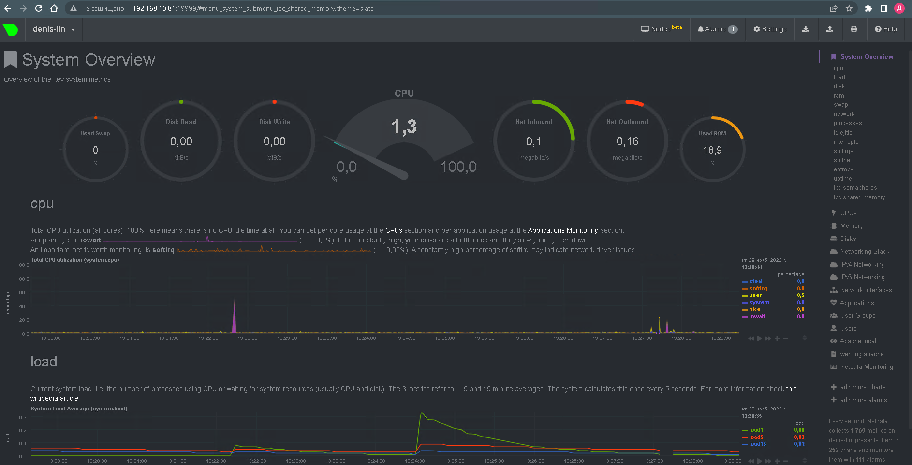
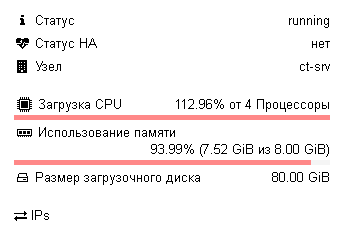

# 3.4. Операционные системы. Лекция 2

## 1. На лекции мы познакомились с node_exporter. В демонстрации его исполняемый файл запускался в background. Этого достаточно для демо, но не для настоящей production-системы, где процессы должны находиться под внешним управлением. Используя знания из лекции по systemd, создайте самостоятельно простой unit-файл для node_exporter:
	поместите его в автозагрузку,
	предусмотрите возможность добавления опций к запускаемому процессу через внешний файл (посмотрите, например, на systemctl cat cron),
	удостоверьтесь, что с помощью systemctl процесс корректно стартует, завершается, а после перезагрузки автоматически поднимается.
***
	Установка и весь процесс:
```bash
denis@denis-lin(0):~$ wget https://github.com/prometheus/node_exporter/releases/download/v1.4.0/node_exporter-1.4.0.linux-amd64.tar.gz
denis@denis-lin(0):~$ sudo mkdir /opt/node_exporter
denis@denis-lin(0):~$ chown -R denis:denis /opt/node_exporter

denis@denis-lin(0):~$ tar -xvf node_exporter-1.4.0.linux-amd64.tar.gz -C /opt/node_exporter/
node_exporter-1.4.0.linux-amd64/
node_exporter-1.4.0.linux-amd64/LICENSE
node_exporter-1.4.0.linux-amd64/NOTICE
node_exporter-1.4.0.linux-amd64/node_exporter
denis@denis-lin(0):~$ sudo nano /etc/systemd/system/node_exporter.service
```
```bash
denis@denis-lin(0):~$ cat /etc/systemd/system/node_exporter.service
[Unit]
Description=Node Exporter

[Service]
ExecStart=/opt/node_exporter/node_exporter-1.4.0.linux-amd64/node_exporter $my_options
EnvironmentFile=/etc/default/node_exporter

[Install]
WantedBy=multi-user.target

denis@denis-lin(0):~$ sudo touch /etc/default/node_exporter
```
```bash
denis@denis-lin(0):~$ systemctl enable node_exporter
==== AUTHENTICATING FOR org.freedesktop.systemd1.manage-unit-files ===
Для управления файлами конфигурации системных служб и юнитов, необходимо пройти аутентификацию.
Authenticating as: denis,,, (denis)
Password:
==== AUTHENTICATION COMPLETE ===
Created symlink /etc/systemd/system/multi-user.target.wants/node_exporter.service → /etc/systemd/system/node_exporter.service.
==== AUTHENTICATING FOR org.freedesktop.systemd1.reload-daemon ===
Чтобы заставить systemd перечитать конфигурацию, необходимо пройти аутентификацию.
Authenticating as: denis,,, (denis)
Password:
==== AUTHENTICATION COMPLETE ===
denis@denis-lin(0):~$ systemctl start node_exporter
==== AUTHENTICATING FOR org.freedesktop.systemd1.manage-units ===
Чтобы запустить «node_exporter.service», необходимо пройти аутентификацию.
Authenticating as: denis,,, (denis)
Password:
==== AUTHENTICATION COMPLETE ===
```
```bash
denis@denis-lin(0):~$ systemctl status node_exporter
● node_exporter.service - Node Exporter
     Loaded: loaded (/etc/systemd/system/node_exporter.service; enabled; vendor preset: enabled)
     Active: active (running) since Tue 2022-11-29 12:50:09 +07; 36s ago
   Main PID: 13411 (node_exporter)
      Tasks: 6 (limit: 9442)
     Memory: 2.5M
     CGroup: /system.slice/node_exporter.service
             └─13411 /opt/node_exporter/node_exporter-1.4.0.linux-amd64/node_exporter

ноя 29 12:50:09 denis-lin node_exporter[13411]: ts=2022-11-29T05:50:09.486Z caller=node_exporter.go:115 level=info collector=thermal_zone
ноя 29 12:50:09 denis-lin node_exporter[13411]: ts=2022-11-29T05:50:09.486Z caller=node_exporter.go:115 level=info collector=time
ноя 29 12:50:09 denis-lin node_exporter[13411]: ts=2022-11-29T05:50:09.486Z caller=node_exporter.go:115 level=info collector=timex
ноя 29 12:50:09 denis-lin node_exporter[13411]: ts=2022-11-29T05:50:09.486Z caller=node_exporter.go:115 level=info collector=udp_queues
ноя 29 12:50:09 denis-lin node_exporter[13411]: ts=2022-11-29T05:50:09.486Z caller=node_exporter.go:115 level=info collector=uname
ноя 29 12:50:09 denis-lin node_exporter[13411]: ts=2022-11-29T05:50:09.486Z caller=node_exporter.go:115 level=info collector=vmstat
ноя 29 12:50:09 denis-lin node_exporter[13411]: ts=2022-11-29T05:50:09.486Z caller=node_exporter.go:115 level=info collector=xfs
ноя 29 12:50:09 denis-lin node_exporter[13411]: ts=2022-11-29T05:50:09.486Z caller=node_exporter.go:115 level=info collector=zfs
ноя 29 12:50:09 denis-lin node_exporter[13411]: ts=2022-11-29T05:50:09.486Z caller=node_exporter.go:199 level=info msg="Listening on" address=:9100
ноя 29 12:50:09 denis-lin node_exporter[13411]: ts=2022-11-29T05:50:09.487Z caller=tls_config.go:195 level=info msg="TLS is disabled." http2=false
```
```bash
denis@denis-lin(0):~$ systemctl restart node_exporte
==== AUTHENTICATING FOR org.freedesktop.systemd1.manage-units ===
Чтобы перезапустить «node_exporte.service», необходимо пройти аутентификацию.
Authenticating as: denis,,, (denis)
Password:
==== AUTHENTICATION COMPLETE ===
Failed to restart node_exporte.service: Unit node_exporte.service not found.
```
```bash
denis@denis-lin(0):~$ systemctl status node_exporter
● node_exporter.service - Node Exporter
     Loaded: loaded (/etc/systemd/system/node_exporter.service; enabled; vendor preset: enabled)
     Active: active (running) since Tue 2022-11-29 12:50:09 +07; 1min 17s ago
   Main PID: 13411 (node_exporter)
      Tasks: 6 (limit: 9442)
     Memory: 2.5M
     CGroup: /system.slice/node_exporter.service
             └─13411 /opt/node_exporter/node_exporter-1.4.0.linux-amd64/node_exporter

ноя 29 12:50:09 denis-lin node_exporter[13411]: ts=2022-11-29T05:50:09.486Z caller=node_exporter.go:115 level=info collector=thermal_zone
ноя 29 12:50:09 denis-lin node_exporter[13411]: ts=2022-11-29T05:50:09.486Z caller=node_exporter.go:115 level=info collector=time
ноя 29 12:50:09 denis-lin node_exporter[13411]: ts=2022-11-29T05:50:09.486Z caller=node_exporter.go:115 level=info collector=timex
ноя 29 12:50:09 denis-lin node_exporter[13411]: ts=2022-11-29T05:50:09.486Z caller=node_exporter.go:115 level=info collector=udp_queues
ноя 29 12:50:09 denis-lin node_exporter[13411]: ts=2022-11-29T05:50:09.486Z caller=node_exporter.go:115 level=info collector=uname
ноя 29 12:50:09 denis-lin node_exporter[13411]: ts=2022-11-29T05:50:09.486Z caller=node_exporter.go:115 level=info collector=vmstat
ноя 29 12:50:09 denis-lin node_exporter[13411]: ts=2022-11-29T05:50:09.486Z caller=node_exporter.go:115 level=info collector=xfs
ноя 29 12:50:09 denis-lin node_exporter[13411]: ts=2022-11-29T05:50:09.486Z caller=node_exporter.go:115 level=info collector=zfs
ноя 29 12:50:09 denis-lin node_exporter[13411]: ts=2022-11-29T05:50:09.486Z caller=node_exporter.go:199 level=info msg="Listening on" address=:9100
ноя 29 12:50:09 denis-lin node_exporter[13411]: ts=2022-11-29T05:50:09.487Z caller=tls_config.go:195 level=info msg="TLS is disabled." http2=false
```
	/etc/default/node_exporter - в последствии можем добавить необходимые параметры

## 2. Ознакомьтесь с опциями node_exporter и выводом /metrics по-умолчанию. Приведите несколько опций, которые вы бы выбрали для базового мониторинга хоста по CPU, памяти, диску и сети.

```bash
denis@denis-lin(0):~$ curl localhost:9100/metrics | grep cpu
...
# TYPE node_cpu_seconds_total counter
node_cpu_seconds_total{cpu="0",mode="idle"} 93778.86
node_cpu_seconds_total{cpu="0",mode="iowait"} 38.69
node_cpu_seconds_total{cpu="0",mode="irq"} 0
node_cpu_seconds_total{cpu="0",mode="nice"} 8.81
node_cpu_seconds_total{cpu="0",mode="softirq"} 11.9
node_cpu_seconds_total{cpu="0",mode="steal"} 1.99
node_cpu_seconds_total{cpu="0",mode="system"} 92.99
node_cpu_seconds_total{cpu="0",mode="user"} 266.94
node_cpu_seconds_total{cpu="1",mode="idle"} 93723.09
node_cpu_seconds_total{cpu="1",mode="iowait"} 42.53
node_cpu_seconds_total{cpu="1",mode="irq"} 0
...
```
```bash
denis@denis-lin(0):~$ curl localhost:9100/metrics | grep memory
...
# TYPE node_memory_MemFree_bytes gauge
node_memory_MemFree_bytes 4.680851456e+09
# TYPE node_memory_SwapTotal_bytes gauge
node_memory_SwapTotal_bytes 2.147479552e+09
# TYPE node_memory_MemAvailable_bytes gauge
node_memory_MemAvailable_bytes 6.531035136e+09
...
```
```bash
denis@denis-lin(0):~$ curl localhost:9100/metrics | grep network
...
# TYPE node_network_receive_bytes_total counter
node_network_receive_bytes_total{device="ens18"} 1.5990428e+08
# TYPE node_network_receive_drop_total counter
node_network_receive_drop_total{device="ens18"} 77936
# TYPE node_network_receive_errs_total counter
node_network_receive_errs_total{device="ens18"} 0
# TYPE node_network_receive_packets_total counter
node_network_receive_packets_total{device="ens18"} 911174
# TYPE node_network_transmit_bytes_total counter
node_network_transmit_bytes_total{device="ens18"} 3.83278129e+08
...
```
```bash
denis@denis-lin(0):~$ curl localhost:9100/metrics | grep disk
...
# TYPE node_disk_io_time_seconds_total counter
node_disk_io_time_seconds_total{device="sda"} 166.508
# TYPE node_disk_write_time_seconds_total counter
node_disk_write_time_seconds_total{device="sda"} 269.457
# TYPE node_disk_written_bytes_total counter
node_disk_written_bytes_total{device="sda"} 1.258402816e+09
# TYPE node_disk_read_time_seconds_total counter
node_disk_read_time_seconds_total{device="sda"} 228.639
# TYPE node_disk_read_bytes_total counter
node_disk_read_bytes_total{device="sda"} 1.348864e+09
...
```

## 3. Установите в свою виртуальную машину Netdata. Воспользуйтесь готовыми пакетами для установки (sudo apt install -y netdata).
	После успешной установки:
	в конфигурационном файле /etc/netdata/netdata.conf в секции [web] замените значение с localhost на bind to = 0.0.0.0,
	добавьте в Vagrantfile проброс порта Netdata на свой локальный компьютер и сделайте vagrant reload:
	config.vm.network "forwarded_port", guest: 19999, host: 19999
	После успешной перезагрузки в браузере на своем ПК (не в виртуальной машине) вы должны суметь зайти на localhost:19999. Ознакомьтесь с метриками, которые по умолчанию собираются Netdata и с комментариями, которые даны к этим метрикам.
***


## 4. Можно ли по выводу dmesg понять, осознает ли ОС, что загружена не на настоящем оборудовании, а на системе виртуализации?
	Да, можно
```bash
denis@denis-lin(0):~$ dmesg | grep virt
[    0.076174] Booting paravirtualized kernel on KVM
[    2.949217] virtio_net virtio3 ens18: renamed from eth0
[    4.916009] systemd[1]: Detected virtualization kvm.
```

## 5. Как настроен sysctl fs.nr_open на системе по-умолчанию? Определите, что означает этот параметр. Какой другой существующий лимит не позволит достичь такого числа (ulimit --help)?
```bash
denis@denis-lin(0):~$ sysctl -n fs.nr_open
1048576
denis@denis-lin(0):~$ ulimit -n
1024
denis@denis-lin(0):~$ cat /proc/sys/fs/file-max
9223372036854775807
denis@denis-lin(0):~$ ulimit -Sn
1024
denis@denis-lin(0):~$ ulimit -Hn
1048576
```
	fs.nr_open Максимальное количество открытых файлов (файловых дескрипторов), лимит открытых файлов на пользователя не позволит достичь данного числа одним пользователем.
	cat /proc/sys/fs/file-ma максимальный предел ОС (ядра системы).
	ulimit -Sn и ulimit -Hn отображают soft и hard значение вышеназванного ограничения устанавливаемого на сессионном уровне.

## 6. Запустите любой долгоживущий процесс (не ls, который отработает мгновенно, а, например, sleep 1h) в отдельном неймспейсе процессов; покажите, что ваш процесс работает под PID 1 через nsenter. Для простоты работайте в данном задании под root (sudo -i). Под обычным пользователем требуются дополнительные опции (--map-root-user) и т.д.
```bash
root@denis-lin:/home/denis/netology/devops-netology# unshare -f --pid --mount-proc /usr/bin/sleep 1h
root@denis-lin:/home/denis/netology/devops-netology# ps aux | grep sleep
root       14804  0.0  0.0   4280   520 ?        S    13:50   0:00 sleep 3600
root       15156  0.0  0.0  16720   516 pts/2    S+   14:31   0:00 unshare -f --pid --mount-proc /usr/bin/sleep 1h
root       15157  0.0  0.0  16716   576 pts/2    S+   14:31   0:00 /usr/bin/sleep 1h
root       15173  0.0  0.0  17696   720 pts/0    S+   14:31   0:00 grep --color=auto sleep
root@denis-lin:/home/denis/netology/devops-netology# nsenter --target 15157 --pid --mount
root@denis-lin:/# ps aux
USER         PID %CPU %MEM    VSZ   RSS TTY      STAT START   TIME COMMAND
root           1  0.0  0.0  16716   576 pts/2    S+   14:31   0:00 /usr/bin/sleep 1h
root           2  0.4  0.0  19500  5076 pts/0    S    14:32   0:00 -bash
root          11  0.0  0.0  20160  3532 pts/0    R+   14:32   0:00 ps aux
```

## 7. Найдите информацию о том, что такое :(){ :|:& };:. 
	Запустите эту команду в своей виртуальной машине Vagrant с Ubuntu 20.04 (это важно, поведение в других ОС не проверялось). 
	Некоторое время все будет "плохо", после чего (минуты) – ОС должна стабилизироваться. Вызов dmesg расскажет, какой механизм помог автоматической стабилизации.
	Как настроен этот механизм по-умолчанию, и как изменить число процессов, которое можно создать в сессии?
***
```bash
denis@denis-lin(0):~$ ulimit -u
31475
denis@denis-lin(0):~$ :(){ :|:& };:
[1] 15240
```
	:D - хорошая команда, ниже скрин с хостовой машины:

	
	:(){ :|:& };: - Функция, которая запускает сама себя два раза, каждая запущенная в свою очередь запускают еще два экземпляра функции и т.д. 
	Чтобы ограничить число процессов необходимо: ulimit -u n, где n кол-во процессов.
	[ 3123.191679 ] cgroup: fork rejected by pids controller in /user.slice/user-1000.slice/session-2.scope - механизм стабилизации.
	Указав для теста unlimit -u 512 виртуалка в несознанку не ушла, загружено окзалось только одно ядро.
