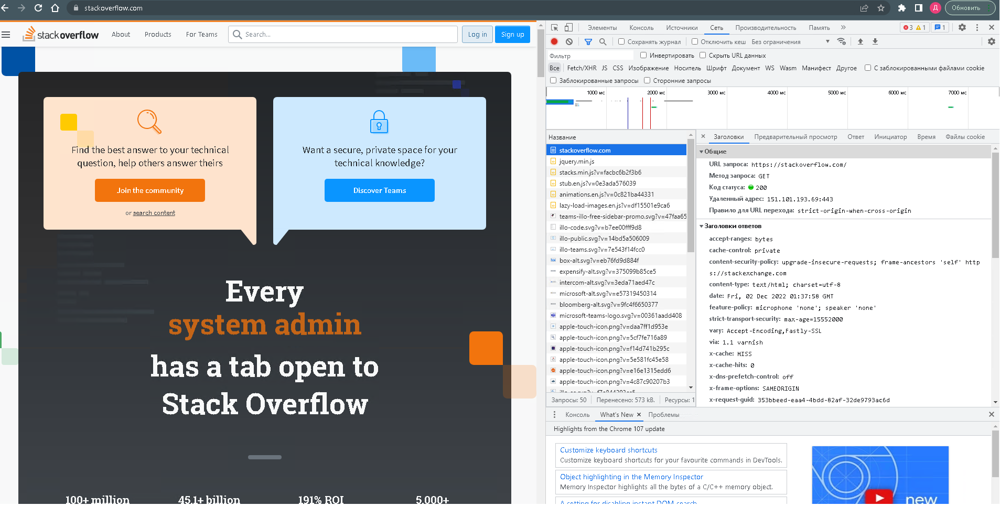
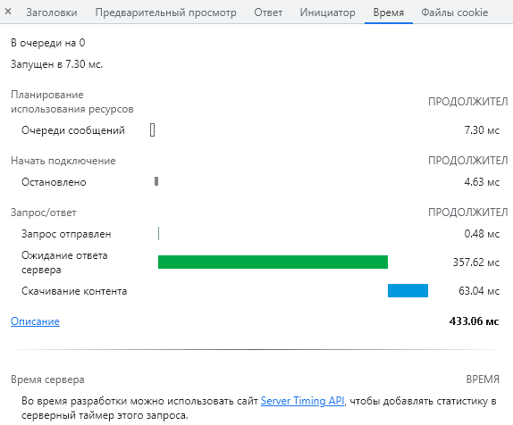

# 3.6. Компьютерные сети. Лекция 1

## 1. Работа c HTTP через телнет.
###	Подключитесь утилитой телнет к сайту stackoverflow.com telnet stackoverflow.com 80
###	Отправьте HTTP запрос

```shell
denis@denis-lin(0):~$ telnet stackoverflow.com 80
Trying 151.101.193.69...
Connected to stackoverflow.com.
Escape character is '^]'.
GET /questions HTTP/1.0
HOST: stackoverflow.com

HTTP/1.1 403 Forbidden
Connection: close
Content-Length: 1920
Server: Varnish
Retry-After: 0
Content-Type: text/html
Accept-Ranges: bytes
Date: Fri, 02 Dec 2022 01:30:18 GMT
Via: 1.1 varnish
X-Served-By: cache-fra-eddf8230041-FRA
X-Cache: MISS
X-Cache-Hits: 0
X-Timer: S1669944619.538265,VS0,VE1
X-DNS-Prefetch-Control: off
```
	403 Forbidden — стандартный код ответа HTTP, означающий, что доступ к запрошенному ресурсу запрещен. Сервер понял запрос, но не выполнит его.

## 2. Повторите задание 1 в браузере, используя консоль разработчика F12.
* откройте вкладку Network
* отправьте запрос http://stackoverflow.com
* найдите первый ответ HTTP сервера, откройте вкладку Headers
* укажите в ответе полученный HTTP код.
* проверьте время загрузки страницы, какой запрос обрабатывался дольше всего?
* приложите скриншот консоли браузера в ответ.



	Первый ответ 200 - указывает, что запрос выполнен успешно.
	Общее время загрузки:
	* Запросы: 50
	* Перенесено: 573 kB.
	* Ресурсы: 1.6 MB
	* Завершено: 6.73 сек.
	* DOMContentLoaded: 1.35 сек.
	* Загрузить: 1.68 сек.
	Дольше всего обрабатывался запрос GET https://stackoverflow.com/ 433.06мс 


## 3. Какой IP адрес у вас в интернете?
```shell
denis@denis-lin(0):~$ wget -O - -q icanhazip.com
158.46.80.100
denis@denis-lin(0):~$ wget -qO- eth0.me
158.46.80.100
```

## 4. Какому провайдеру принадлежит ваш IP адрес? Какой автономной системе AS? Воспользуйтесь утилитой whois
	AS39927 | E-Light-Telecom
```shell
denis@denis-lin(0):~$ whois 158.46.80.100

#
# ARIN WHOIS data and services are subject to the Terms of Use
# available at: https://www.arin.net/resources/registry/whois/tou/
#
# If you see inaccuracies in the results, please report at
# https://www.arin.net/resources/registry/whois/inaccuracy_reporting/
#
# Copyright 1997-2022, American Registry for Internet Numbers, Ltd.
#


NetRange:       158.46.0.0 - 158.46.255.255
CIDR:           158.46.0.0/16
NetName:        RIPE-ERX-158-46-0-0
NetHandle:      NET-158-46-0-0-1
Parent:         NET158 (NET-158-0-0-0-0)
NetType:        Early Registrations, Transferred to RIPE NCC
OriginAS:
Organization:   RIPE Network Coordination Centre (RIPE)
RegDate:        2010-11-03
Updated:        2010-11-17
Comment:        These addresses have been further assigned to users in
Comment:        the RIPE NCC region. Contact information can be found in
Comment:        the RIPE database at http://www.ripe.net/whois
Ref:            https://rdap.arin.net/registry/ip/158.46.0.0

ResourceLink:  https://apps.db.ripe.net/search/query.html
ResourceLink:  whois.ripe.net


OrgName:        RIPE Network Coordination Centre
OrgId:          RIPE
Address:        P.O. Box 10096
City:           Amsterdam
StateProv:
PostalCode:     1001EB
Country:        NL
RegDate:
Updated:        2013-07-29
Ref:            https://rdap.arin.net/registry/entity/RIPE

ReferralServer:  whois://whois.ripe.net
ResourceLink:  https://apps.db.ripe.net/search/query.html

OrgAbuseHandle: ABUSE3850-ARIN
OrgAbuseName:   Abuse Contact
OrgAbusePhone:  +31205354444
OrgAbuseEmail:  abuse@ripe.net
OrgAbuseRef:    https://rdap.arin.net/registry/entity/ABUSE3850-ARIN

OrgTechHandle: RNO29-ARIN
OrgTechName:   RIPE NCC Operations
OrgTechPhone:  +31 20 535 4444
OrgTechEmail:  hostmaster@ripe.net
OrgTechRef:    https://rdap.arin.net/registry/entity/RNO29-ARIN


#
# ARIN WHOIS data and services are subject to the Terms of Use
# available at: https://www.arin.net/resources/registry/whois/tou/
#
# If you see inaccuracies in the results, please report at
# https://www.arin.net/resources/registry/whois/inaccuracy_reporting/
#
# Copyright 1997-2022, American Registry for Internet Numbers, Ltd.
#


Найдено перенаправление на whois.ripe.net.

% This is the RIPE Database query service.
% The objects are in RPSL format.
%
% The RIPE Database is subject to Terms and Conditions.
% See http://www.ripe.net/db/support/db-terms-conditions.pdf

% Note: this output has been filtered.
%       To receive output for a database update, use the "-B" flag.

% Information related to '158.46.0.0 - 158.46.127.255'

% Abuse contact for '158.46.0.0 - 158.46.127.255' is 'abuse@eltc.ru'

inetnum:        158.46.0.0 - 158.46.127.255
netname:        GOODLINE-INFO
descr:          E-Light-Telecom
descr:          Novokuznetsk city
country:        RU
org:            ORG-EA385-RIPE
admin-c:        KK7315-RIPE
tech-c:         KS10342-RIPE
status:         ASSIGNED PA
mnt-by:         ELT-MNT
mnt-lower:      ELT-MNT
mnt-routes:     ELT-MNT
mnt-domains:    ELT-MNT
created:        2012-10-12T08:46:46Z
last-modified:  2018-11-15T07:15:04Z
source:         RIPE # Filtered

organisation:   ORG-EA385-RIPE
org-name:       E-Light-Telecom Ltd.
country:        RU
org-type:       LIR
address:        Kuznetsky 18
address:        650000
address:        Kemerovo
address:        RUSSIAN FEDERATION
phone:          +73842452999
fax-no:         +73842452999
abuse-c:        AR16650-RIPE
admin-c:        KK7315-RIPE
tech-c:         KS10342-RIPE
tech-c:         OE528-RIPE
mnt-ref:        ELT-MNT
mnt-ref:        RIPE-NCC-HM-MNT
mnt-by:         RIPE-NCC-HM-MNT
mnt-by:         ELT-MNT
created:        2008-09-15T12:23:31Z
last-modified:  2020-12-16T13:23:27Z
source:         RIPE # Filtered

person:         Konstantin Karavaev
address:        Russian Federation
address:        Kemerovo
address:        650099 Kuznetsky 18
org:            ORG-EA385-RIPE
phone:          +73842452999
phone:          +73842452893
nic-hdl:        KK7315-RIPE
mnt-by:         ELT-MNT
created:        2018-11-14T03:45:11Z
last-modified:  2018-11-14T03:53:45Z
source:         RIPE # Filtered

person:         Konstantin Shchukin
address:        Russian Federation
address:        Kemerovo
address:        650099 Kuznetsky 18
org:            ORG-EA385-RIPE
phone:          +73842452999
phone:          +73842452893
nic-hdl:        KS10342-RIPE
mnt-by:         ELT-MNT
created:        2018-11-14T03:48:38Z
last-modified:  2018-11-14T03:51:40Z
source:         RIPE # Filtered

% Information related to '158.46.0.0/17AS39927'

route:          158.46.0.0/17
descr:          Goodline.info
descr:          Novokuznetsk, Russia
descr:          RU
origin:         AS39927
mnt-by:         ELT-MNT
created:        2016-05-04T09:34:30Z
last-modified:  2016-05-04T09:34:30Z
source:         RIPE

% This query was served by the RIPE Database Query Service version 1.104 (ANGUS)
```

## 5. Через какие сети проходит пакет, отправленный с вашего компьютера на адрес 8.8.8.8? Через какие AS? Воспользуйтесь утилитой traceroute
```shell
denis@denis-lin(0):~$ traceroute -An 8.8.8.8
traceroute to 8.8.8.8 (8.8.8.8), 30 hops max, 60 byte packets
 1  192.168.10.1 [*]  0.607 ms  0.558 ms  0.529 ms
 2  10.200.22.1 [*]  43.431 ms  43.400 ms  43.375 ms
 3  10.77.77.10 [*]  82.975 ms  82.894 ms  84.451 ms
 4  46.246.96.1 [AS42708]  85.946 ms  86.057 ms  86.035 ms
 5  80.67.3.188 [AS42708]  85.101 ms  85.065 ms  85.256 ms
 6  80.67.4.156 [AS42708]  86.122 ms 80.67.4.154 [AS42708]  83.107 ms  83.075 ms
 7  80.67.4.134 [AS42708]  83.246 ms 80.67.4.132 [AS42708]  84.578 ms 80.67.4.134 [AS42708]  84.524 ms
 8  72.14.216.118 [AS15169]  85.291 ms  85.403 ms  85.250 ms
 9  * * *
10  8.8.8.8 [AS15169]  84.948 ms  84.926 ms  85.328 ms
```
	Трафик идет через: AS42708, AS15169
## 6. Повторите задание 5 в утилите mtr. На каком участке наибольшая задержка - delay?
```shell
denis@denis-lin(0):~$ sudo mtr -rnc 10 8.8.8.8
Start: 2022-12-02T09:16:44+0700
HOST: denis-lin                   Loss%   Snt   Last   Avg  Best  Wrst StDev
  1.|-- 192.168.10.1               0.0%    10    0.3   0.3   0.3   0.5   0.1
  2.|-- 10.200.22.1                0.0%    10   44.0  43.5  43.3  44.0   0.3
  3.|-- 10.77.77.10                0.0%    10   82.0  82.1  81.6  83.9   0.6
  4.|-- 46.246.96.1                0.0%    10   84.5  85.7  82.9  94.3   3.9
  5.|-- 80.67.3.188                0.0%    10   82.8  83.4  82.6  87.0   1.3
  6.|-- 80.67.4.156                0.0%    10   82.9  83.3  82.7  84.1   0.4
  7.|-- 80.67.4.134                0.0%    10   90.7  84.1  82.9  90.7   2.4
  8.|-- 72.14.216.118              0.0%    10   83.8  85.5  83.4  95.8   3.8
  9.|-- 142.250.213.135            0.0%    10   83.1  84.6  83.1  94.2   3.4
 10.|-- 209.85.241.225             0.0%    10   83.6  85.2  83.6  91.2   2.2
 11.|-- 8.8.8.8                    0.0%    10   83.2  83.6  82.9  85.2   0.8
```
	Наибольшая задержка:
		* средняя: 85.7 (4)
		* максимальная: 95.8 (8) 
## 7. Какие DNS сервера отвечают за доменное имя dns.google? Какие A записи? Воспользуйтесь утилитой dig
```shell
denis@denis-lin(0):~$ dig +trace dns.google | grep dns
; <<>> DiG 9.16.1-Ubuntu <<>> +trace dns.google
dns.google.             10800   IN      NS      ns2.zdns.google.
dns.google.             10800   IN      NS      ns1.zdns.google.
dns.google.             10800   IN      NS      ns4.zdns.google.
dns.google.             10800   IN      NS      ns3.zdns.google.
dns.google.             3600    IN      DS      56044 8 2 1B0A7E90AA6B1AC65AA5B573EFC44ABF6CB2559444251B997103D2E4 0C351B08
dns.google.             3600    IN      RRSIG   DS 8 2 3600 20221221203617 20221129203617 7584 google. e1ddZV4hQHYoL6Gy0a0hBrRN1CoTVcsvKk2Dsw6aGXJlkyqO2mtFyFqo dxDEw8ZBko63/ijC3iJ1DlO640ilYsq0q5XBIB1usvFlG2+mnIR1VNyc nJSXaOXi9vUm4ZhpJs3haXx4IgqDsCjmTcUuUyhbLKKT8fqHFxsOX5d9 5CE=
dns.google.             900     IN      A       8.8.8.8
dns.google.             900     IN      A       8.8.4.4
dns.google.             900     IN      RRSIG   A 8 2 900 20221220161358 20221128161358 33555 dns.google. B8LvFuQxkz3KyrUzrLdL8+lExu1MXyElTB7Q6v+tcHT0u/9TuEEjspFK Fj/zb844GiL8pPODOxUt8WaeJLInTOQQz9C4FupP5k+pUPY4rlWQkMDH arM3rGjm7pEaiBDhUtpILRpP9AW5QgrKQiiG1dSsTKH4tSgh/PnRGdXr ZOY=
;; Received 241 bytes from 216.239.34.114#53(ns2.zdns.google) in 104 ms
```
	A записи: 8.8.8.8 и 8.8.4.4
	NS сервера: ns1.zdns.google.; ns2.zdns.google.; ns3.zdns.google.; ns4.zdns.google.

## 8. Проверьте PTR записи для IP адресов из задания 7. Какое доменное имя привязано к IP? Воспользуйтесь утилитой dig

```shell
denis@denis-lin(0):~$ dig -x 8.8.4.4 +noall +answer
4.4.8.8.in-addr.arpa.   7162    IN      PTR     dns.google.
denis@denis-lin(0):~$ dig -x 8.8.8.8 +noall +answer
8.8.8.8.in-addr.arpa.   7150    IN      PTR     dns.google.
```
	Оба имеют PTR dns.google.
