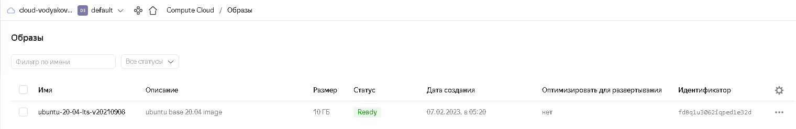
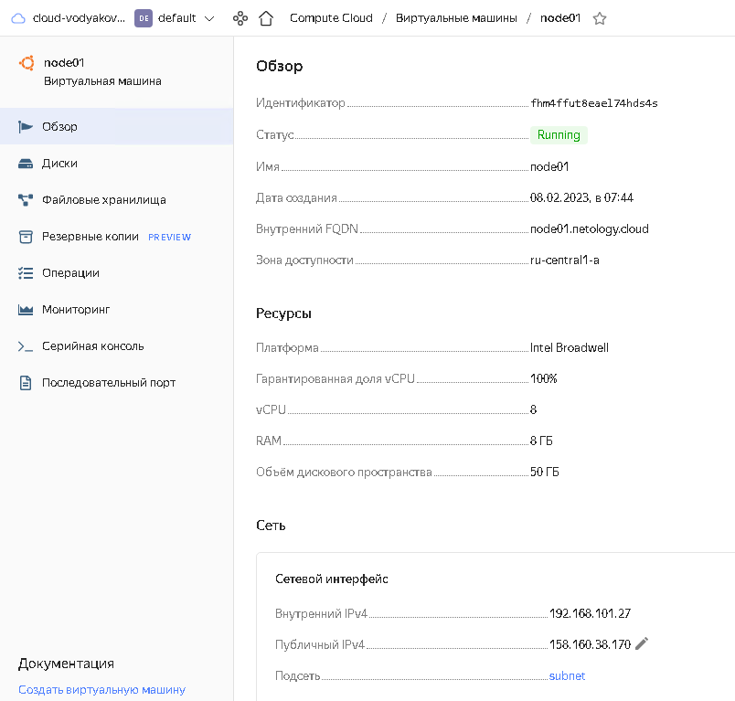
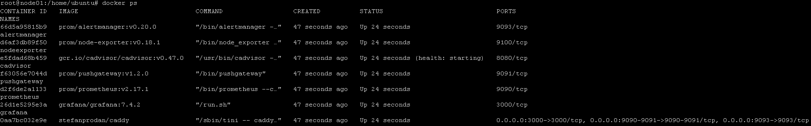
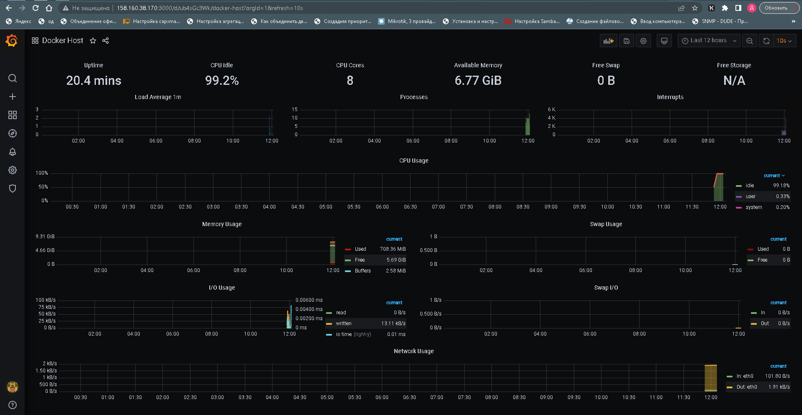

# Домашнее задание к занятию "5.4. Оркестрация группой Docker контейнеров на примере Docker Compose".
## Задача 1
Создать собственный образ любой операционной системы (например, ubuntu-20.04) с помощью Packer (инструкция)

### Решение:
```shell
denis@denis-lin(0):~/netology/packer$ packer build yc_1_image.json
yandex: output will be in this color.

==> yandex: Creating temporary RSA SSH key for instance...
==> yandex: Using as source image: fd8snjpoq85qqv0mk9gi (name: "ubuntu-20-04-lts-v20230130", family: "ubuntu-2004-lts")
==> yandex: Use provided subnet id e9b51ek9b27497tr3k9v
==> yandex: Creating disk...
==> yandex: Creating instance...
==> yandex: Waiting for instance with id fhmoc5hvo4bc40ki3c0g to become active...
    yandex: Detected instance IP: 62.84.116.76
==> yandex: Using SSH communicator to connect: 62.84.116.76
==> yandex: Waiting for SSH to become available...
==> yandex: Connected to SSH!
==> yandex: Stopping instance...
==> yandex: Deleting instance...
    yandex: Instance has been deleted!
==> yandex: Creating image: ubuntu-20-04-lts-v20210908
==> yandex: Waiting for image to complete...
==> yandex: Success image create...
==> yandex: Destroying boot disk...
    yandex: Disk has been deleted!
Build 'yandex' finished after 2 minutes 8 seconds.

==> Wait completed after 2 minutes 8 seconds

==> Builds finished. The artifacts of successful builds are:
--> yandex: A disk image was created: ubuntu-20-04-lts-v20210908 (id: fd8q1u3062iqped1e32d) with family name ubuntu-2004-lts
denis@denis-lin(0):~/netology/packer$ yc compute image list
+----------------------+----------------------------+-----------------+----------------------+--------+
|          ID          |            NAME            |     FAMILY      |     PRODUCT IDS      | STATUS |
+----------------------+----------------------------+-----------------+----------------------+--------+
| fd8q1u3062iqped1e32d | ubuntu-20-04-lts-v20210908 | ubuntu-2004-lts | f2eb05obffng2supgqli | READY  |
+----------------------+----------------------------+-----------------+----------------------+--------+
```



## Задача 2
Создать вашу первую виртуальную машину в YandexCloud с помощью terraform. Используйте terraform код в директории (src/terraform)

Для получения зачета, вам необходимо предоставить вывод команды terraform apply и страницы свойств созданной ВМ из личного кабинета YandexCloud.

### Решение: 
```
yandex_vpc_network.default: Creating...
yandex_vpc_network.default: Creation complete after 2s [id=enpnvld0vbuf9mt09h35]
yandex_vpc_subnet.default: Creating...
yandex_vpc_subnet.default: Creation complete after 0s [id=e9b1mbgs8j7c5efeoe6l]
yandex_compute_instance.node01: Creating...
yandex_compute_instance.node01: Still creating... [10s elapsed]
yandex_compute_instance.node01: Still creating... [20s elapsed]
yandex_compute_instance.node01: Still creating... [30s elapsed]
yandex_compute_instance.node01: Still creating... [40s elapsed]
yandex_compute_instance.node01: Still creating... [50s elapsed]
yandex_compute_instance.node01: Creation complete after 57s [id=fhm4ffut8eael74hds4s]

Apply complete! Resources: 3 added, 0 changed, 0 destroyed.

Outputs:

external_ip_address_node01_yandex_cloud = "158.160.38.170"
internal_ip_address_node01_yandex_cloud = "192.168.101.27"
```



## Задача 3
С помощью ansible и docker-compose разверните на виртуальной машине из предыдущего задания систему мониторинга на основе Prometheus/Grafana . Используйте ansible код в директории (src/ansible)

Для получения зачета вам необходимо предоставить вывод команды "docker ps" , все контейнеры, описанные в (docker-compose), должны быть в статусе "Up

### Решение:


## Задача 4
1. Откройте веб-браузер, зайдите на страницу http://<внешний_ip_адрес_вашей_ВМ>:3000.
2. Используйте для авторизации логин и пароль из ([.env-file](https://github.com/netology-group/virt-homeworks/blob/virt-11/05-virt-04-docker-compose/src/ansible/stack/.env)).
3. Изучите доступный интерфейс, найдите в интерфейсе автоматически созданные docker-compose панели с графиками([dashboards](https://grafana.com/docs/grafana/latest/dashboards/use-dashboards/)).
4. Подождите 5-10 минут, чтобы система мониторинга успела накопить данные.

### Решение:

