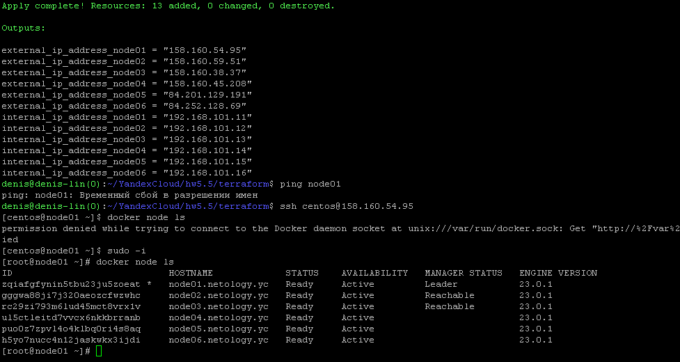
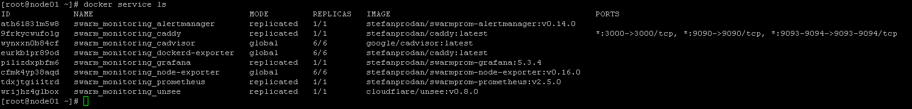
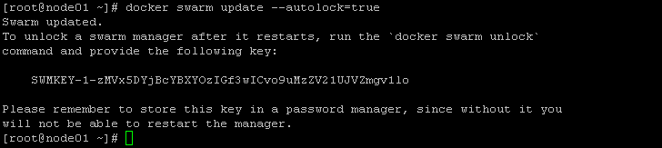

# Домашнее задание к занятию 5. «Оркестрация кластером Docker контейнеров на примере Docker Swarm»

## Задача 1

Дайте письменые ответы на вопросы:

- В чём отличие режимов работы сервисов в Docker Swarm-кластере: replication и global?
- Какой алгоритм выбора лидера используется в Docker Swarm-кластере?
- Что такое Overlay Network?

### Решение

Для реплицируемой службы указывается количество идентичных задач, которые необходимо запустить.
Глобальная служба запускает одну задачу на каждом узле. Каждый раз, когда добавляется узел в swarm, оркестратор создает задачу, а планировщик назначает задачу новому узлу. Примером глобальных служб являются агенты мониторинга, антивирусные сканеры или другие типы контейнеров, которые требуется запускать на каждом узле.


Для выбора лидера используется алгоритм поддержания распределённого консенсуса - Raft.
Если обычный узел долго не получает сообщений от лидера, то он переходит в состояние «кандидат» и посылает другим узлам запрос на голосование. Другие узлы голосуют за того кандидата, от которого они получили первый запрос. Если кандидат получает сообщение от лидера, то он снимает свою кандидатуру и возвращается в обычное состояние. Если кандидат получает большинство голосов, то он становится лидером. Если же он не получил большинства (это случай, когда на кластере возникли сразу несколько кандидатов и голоса разделились), то кандидат ждёт случайное время и инициирует новую процедуру голосования.
Процедура голосования повторяется, пока не будет выбран лидер.


Overlay Network в контексте docker является распределенной сетью между несколькими узлами docker. Эта сеть находится поверх основной сети, позволяя контейнерам, подключенным к ней (включая контейнеры службы swarm), безопасно обмениваться данными при включенном шифровании.

## Задача 2

Создайте ваш первый Docker Swarm-кластер в Яндекс Облаке.

Чтобы получить зачёт, предоставьте скриншот из терминала (консоли) с выводом команды:
```
docker node ls
```

### Решение



## Задача 3

Создайте ваш первый, готовый к боевой эксплуатации кластер мониторинга, состоящий из стека микросервисов.

Чтобы получить зачёт, предоставьте скриншот из терминала (консоли), с выводом команды:
```
docker service ls
```

### Решение



## Задача 4 (*)

Выполните на лидере Docker Swarm-кластера команду, указанную ниже, и дайте письменное описание её функционала — что она делает и зачем нужна:
```
# см.документацию: https://docs.docker.com/engine/swarm/swarm_manager_locking/
docker swarm update --autolock=true
```

### Решение


```txt
Enable or disable autolock on an existing swarm🔗
To enable autolock on an existing swarm, set the autolock flag to true.
```
Команда docker swarm update --autolock=true позволяет включить возможность зашифровать ключ шифрующий логи Raft и TLS ключ используемый для шифрования коммуникаций между нодами другим ключом, для дополнительной безопасности. 
При перезагрузке ноды для ее успешной работы нужно будет ввести ключ расшифровки.
Хранить ключ расшифровки необходимо в безопасном месте (менеджере паролей).
Ключ расшифровки можно менять
