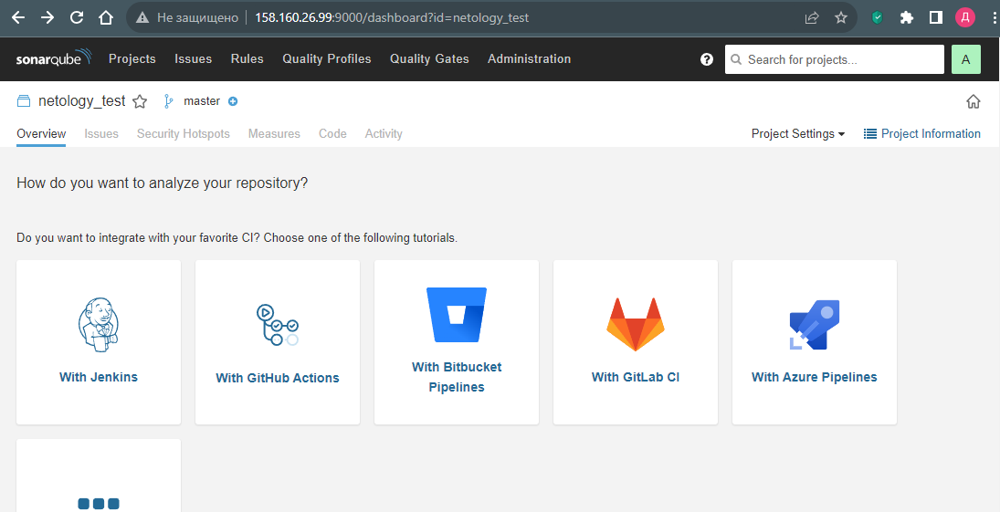
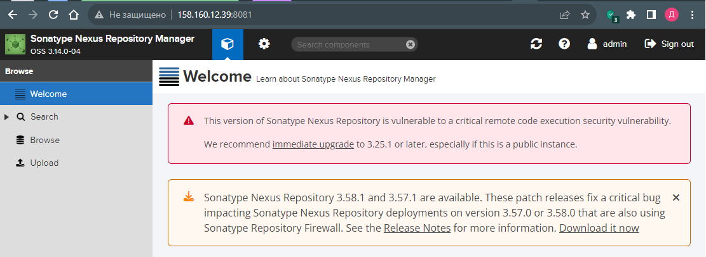
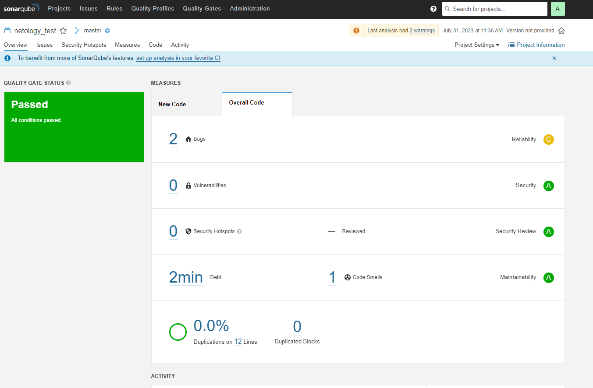
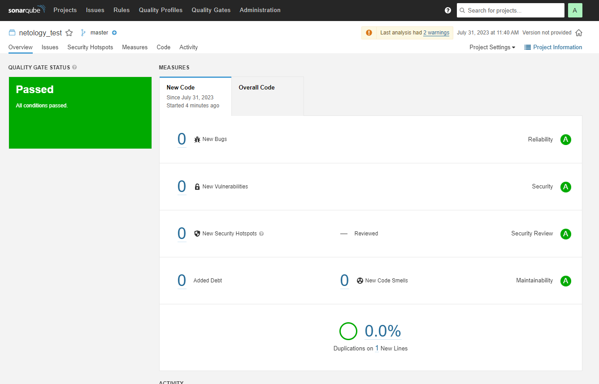
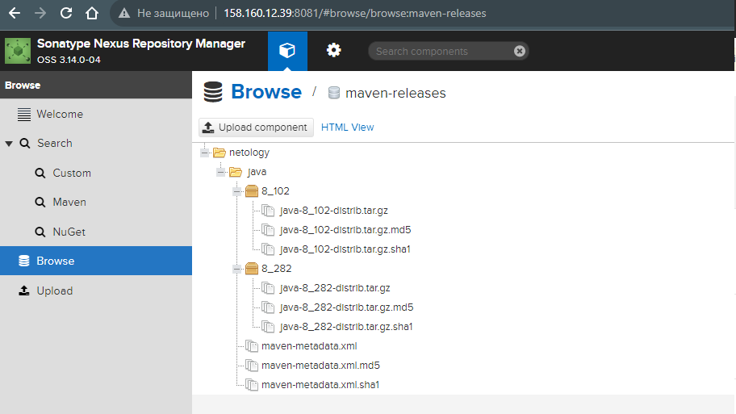

# Домашнее задание к занятию 9 «Процессы CI/CD»

## Подготовка к выполнению

1. Создайте два VM в Yandex Cloud с параметрами: 2CPU 4RAM Centos7 (остальное по минимальным требованиям).
2. Пропишите в [inventory](./infrastructure/inventory/cicd/hosts.yml) [playbook](./infrastructure/site.yml) созданные хосты.
3. Добавьте в [files](./infrastructure/files/) файл со своим публичным ключом (id_rsa.pub). Если ключ называется иначе — найдите таску в плейбуке, которая использует id_rsa.pub имя, и исправьте на своё.
4. Запустите playbook, ожидайте успешного завершения.
5. Проверьте готовность SonarQube через [браузер](http://localhost:9000).
6. Зайдите под admin\admin, поменяйте пароль на свой.
7.  Проверьте готовность Nexus через [бразуер](http://localhost:8081).
8. Подключитесь под admin\admin123, поменяйте пароль, сохраните анонимный доступ.

```
PLAY RECAP *************************************************************************************************************************
nexus-01                   : ok=17   changed=15   unreachable=0    failed=0    skipped=2    rescued=0    ignored=0   
sonar-01                   : ok=35   changed=27   unreachable=0    failed=0    skipped=0    rescued=0    ignored=0  
```



## Знакомоство с SonarQube

### Основная часть

1. Создайте новый проект, название произвольное.
2. Скачайте пакет sonar-scanner, который вам предлагает скачать SonarQube.
3. Сделайте так, чтобы binary был доступен через вызов в shell (или поменяйте переменную PATH, или любой другой, удобный вам способ).
4. Проверьте `sonar-scanner --version`.
5. Запустите анализатор против кода из директории [example](./example) с дополнительным ключом `-Dsonar.coverage.exclusions=fail.py`.
6. Посмотрите результат в интерфейсе.
7. Исправьте ошибки, которые он выявил, включая warnings.
8. Запустите анализатор повторно — проверьте, что QG пройдены успешно.
9. Сделайте скриншот успешного прохождения анализа, приложите к решению ДЗ.

```
denis@denis-lin(0):~/netology/hw9.3/infrastructure$ curl https://binaries.sonarsource.com/Distribution/sonar-scanner-cli/sonar-scanner-cli-4.8.0.2856-linux.zip -o sonar-scanner-cli-4.8.0.2856-linux.zip
  % Total    % Received % Xferd  Average Speed   Time    Time     Time  Current
                                 Dload  Upload   Total   Spent    Left  Speed
100 41.5M  100 41.5M    0     0  8997k      0  0:00:04  0:00:04 --:--:-- 9393k
denis@denis-lin(0):~/netology/hw9.3/infrastructure$ unzip sonar-scanner-cli-4.8.0.2856-linux.zip -d ~/.local/share/
Archive:  sonar-scanner-cli-4.8.0.2856-linux.zip
   creating: /home/denis/.local/share/sonar-scanner-4.8.0.2856-linux/
   creating: /home/denis/.local/share/sonar-scanner-4.8.0.2856-linux/jre/
   creating: /home/denis/.local/share/sonar-scanner-4.8.0.2856-linux/jre/conf/
***
denis@denis-lin(0):~/netology/hw9.3/infrastructure$ sonar-scanner --version
INFO: Scanner configuration file: /home/denis/.local/share/sonar-scanner-4.8.0.2856-linux/conf/sonar-scanner.properties
INFO: Project root configuration file: NONE
INFO: SonarScanner 4.8.0.2856
INFO: Java 11.0.17 Eclipse Adoptium (64-bit)
INFO: Linux 5.19.0-46-generic amd64
```

Добавляем симлинк для $PATH
```
denis@denis-lin(0):~/netology/hw9.3/infrastructure$ sudo ln -s  ~/.local/share/sonar-scanner-4.8.0.2856-linux/bin/sonar-scanner /bin/
denis@denis-lin(0):~/netology/hw9.3/infrastructure$ sudo ln -s  ~/.local/share/sonar-scanner-4.8.0.2856-linux/bin/sonar-scanner-debug /bin/
```
<details><summary>Вывод sonar-scanner</summary>

```
denis@denis-lin(0):~/netology/hw9.3/infrastructure$ sonar-scanner \
  -Dsonar.projectKey=netology_test \
  -Dsonar.sources=. \
  -Dsonar.coverage.exclusions=fail.py \
  -Dsonar.host.url=http://158.160.26.99:9000 \
  -Dsonar.login=67642c753e9917aac5e99e8078cb0e6e83453724
INFO: Scanner configuration file: /home/denis/.local/share/sonar-scanner-4.8.0.2856-linux/conf/sonar-scanner.properties
INFO: Project root configuration file: NONE
INFO: SonarScanner 4.8.0.2856
INFO: Java 11.0.17 Eclipse Adoptium (64-bit)
INFO: Linux 5.19.0-46-generic amd64
INFO: User cache: /home/denis/.sonar/cache
INFO: Analyzing on SonarQube server 9.1.0
INFO: Default locale: "en_US", source code encoding: "UTF-8" (analysis is platform dependent)
INFO: Load global settings
INFO: Load global settings (done) | time=258ms
INFO: Server id: 9CFC3560-AYmqIYD2mqfnnnaiKkl2
INFO: User cache: /home/denis/.sonar/cache
INFO: Load/download plugins
INFO: Load plugins index
INFO: Load plugins index (done) | time=139ms
INFO: Load/download plugins (done) | time=29277ms
INFO: Process project properties
INFO: Process project properties (done) | time=14ms
INFO: Execute project builders
INFO: Execute project builders (done) | time=11ms
INFO: Project key: netology_test
INFO: Base dir: /home/denis/netology/hw9.3/infrastructure
INFO: Working dir: /home/denis/netology/hw9.3/infrastructure/.scannerwork
INFO: Load project settings for component key: 'netology_test'
INFO: Load project settings for component key: 'netology_test' (done) | time=94ms
INFO: Load quality profiles
INFO: Load quality profiles (done) | time=143ms
INFO: Load active rules
INFO: Load active rules (done) | time=2727ms
WARN: SCM provider autodetection failed. Please use "sonar.scm.provider" to define SCM of your project, or disable the SCM Sensor in the project settings.
INFO: Indexing files...
INFO: Project configuration:
INFO:   Excluded sources for coverage: fail.py
INFO: 17 files indexed
INFO: Quality profile for py: Sonar way
INFO: ------------- Run sensors on module netology_test
INFO: Load metrics repository
INFO: Load metrics repository (done) | time=96ms
INFO: Sensor Python Sensor [python]
WARN: Your code is analyzed as compatible with python 2 and 3 by default. This will prevent the detection of issues specific to python 2 or python 3. You can get a more precise analysis by setting a python version in your configuration via the parameter "sonar.python.version"
INFO: Starting global symbols computation
INFO: 1 source file to be analyzed
INFO: Load project repositories
INFO: Load project repositories (done) | time=84ms
INFO: 1/1 source file has been analyzed
INFO: Starting rules execution
INFO: 1 source file to be analyzed
INFO: 1/1 source file has been analyzed
INFO: Sensor Python Sensor [python] (done) | time=998ms
INFO: Sensor Cobertura Sensor for Python coverage [python]
INFO: Sensor Cobertura Sensor for Python coverage [python] (done) | time=12ms
INFO: Sensor PythonXUnitSensor [python]
INFO: Sensor PythonXUnitSensor [python] (done) | time=2ms
INFO: Sensor CSS Rules [cssfamily]
INFO: No CSS, PHP, HTML or VueJS files are found in the project. CSS analysis is skipped.
INFO: Sensor CSS Rules [cssfamily] (done) | time=1ms
INFO: Sensor JaCoCo XML Report Importer [jacoco]
INFO: 'sonar.coverage.jacoco.xmlReportPaths' is not defined. Using default locations: target/site/jacoco/jacoco.xml,target/site/jacoco-it/jacoco.xml,build/reports/jacoco/test/jacocoTestReport.xml
INFO: No report imported, no coverage information will be imported by JaCoCo XML Report Importer
INFO: Sensor JaCoCo XML Report Importer [jacoco] (done) | time=4ms
INFO: Sensor C# Project Type Information [csharp]
INFO: Sensor C# Project Type Information [csharp] (done) | time=1ms
INFO: Sensor C# Analysis Log [csharp]
INFO: Sensor C# Analysis Log [csharp] (done) | time=19ms
INFO: Sensor C# Properties [csharp]
INFO: Sensor C# Properties [csharp] (done) | time=0ms
INFO: Sensor JavaXmlSensor [java]
INFO: Sensor JavaXmlSensor [java] (done) | time=2ms
INFO: Sensor HTML [web]
INFO: Sensor HTML [web] (done) | time=5ms
INFO: Sensor VB.NET Project Type Information [vbnet]
INFO: Sensor VB.NET Project Type Information [vbnet] (done) | time=1ms
INFO: Sensor VB.NET Analysis Log [vbnet]
INFO: Sensor VB.NET Analysis Log [vbnet] (done) | time=19ms
INFO: Sensor VB.NET Properties [vbnet]
INFO: Sensor VB.NET Properties [vbnet] (done) | time=0ms
INFO: ------------- Run sensors on project
INFO: Sensor Zero Coverage Sensor
INFO: Sensor Zero Coverage Sensor (done) | time=3ms
INFO: SCM Publisher No SCM system was detected. You can use the 'sonar.scm.provider' property to explicitly specify it.
INFO: CPD Executor Calculating CPD for 1 file
INFO: CPD Executor CPD calculation finished (done) | time=14ms
INFO: Analysis report generated in 89ms, dir size=103.0 kB
INFO: Analysis report compressed in 18ms, zip size=14.0 kB
INFO: Analysis report uploaded in 155ms
INFO: ANALYSIS SUCCESSFUL, you can browse http://158.160.26.99:9000/dashboard?id=netology_test
INFO: Note that you will be able to access the updated dashboard once the server has processed the submitted analysis report
INFO: More about the report processing at http://158.160.26.99:9000/api/ce/task?id=AYmqO7PqmqfnnnaiKpq9
INFO: Analysis total time: 7.194 s
INFO: ------------------------------------------------------------------------
INFO: EXECUTION SUCCESS
INFO: ------------------------------------------------------------------------
INFO: Total time: 1:10.523s
INFO: Final Memory: 7M/27M
INFO: ------------------------------------------------------------------------
```

</details>






## Знакомство с Nexus

### Основная часть

1. В репозиторий `maven-public` загрузите артефакт с GAV-параметрами:

 *    groupId: netology;
 *    artifactId: java;
 *    version: 8_282;
 *    classifier: distrib;
 *    type: tar.gz.
   
2. В него же загрузите такой же артефакт, но с version: 8_102.
3. Проверьте, что все файлы загрузились успешно.
4. В ответе пришлите файл `maven-metadata.xml` для этого артефекта.



[maven-metadata.xml](hw9.3/maven-metadata.xml)

<details><summary>Вывод</summary>

```
<?xml version="1.0" encoding="UTF-8"?>
<metadata modelVersion="1.1.0">
  <groupId>netology</groupId>
  <artifactId>java</artifactId>
  <versioning>
    <latest>8_282</latest>
    <release>8_282</release>
    <versions>
      <version>8_102</version>
      <version>8_282</version>
    </versions>
    <lastUpdated>20230731044936</lastUpdated>
  </versioning>
</metadata>
```

 </details>

### Знакомство с Maven

### Подготовка к выполнению

1. Скачайте дистрибутив с [maven](https://maven.apache.org/download.cgi).
2. Разархивируйте, сделайте так, чтобы binary был доступен через вызов в shell (или поменяйте переменную PATH, или любой другой, удобный вам способ).
3. Удалите из `apache-maven-<version>/conf/settings.xml` упоминание о правиле, отвергающем HTTP- соединение — раздел mirrors —> id: my-repository-http-unblocker.
4. Проверьте `mvn --version`.
5. Заберите директорию [mvn](./mvn) с pom.

```
denis@denis-lin(0):~/netology/hw9.3/mvn$ mvn --version
Apache Maven 3.9.3 (21122926829f1ead511c958d89bd2f672198ae9f)
Maven home: /home/denis/netology/hw9.3/infrastructure/apache-maven-3.9.3
Java version: 11.0.19, vendor: Ubuntu, runtime: /usr/lib/jvm/java-11-openjdk-amd64
Default locale: en_US, platform encoding: UTF-8
OS name: "linux", version: "5.19.0-46-generic", arch: "amd64", family: "unix"
```

### Основная часть

1. Поменяйте в `pom.xml` блок с зависимостями под ваш артефакт из первого пункта задания для Nexus (java с версией 8_282).
2. Запустите команду `mvn package` в директории с `pom.xml`, ожидайте успешного окончания.
3. Проверьте директорию `~/.m2/repository/`, найдите ваш артефакт.
4. В ответе пришлите исправленный файл `pom.xml`.

```
[INFO] Building jar: /home/denis/netology/hw9.3/mvn/target/simple-app-1.0-SNAPSHOT.jar
[INFO] ------------------------------------------------------------------------
[INFO] BUILD SUCCESS
[INFO] ------------------------------------------------------------------------
[INFO] Total time:  18.929 s
[INFO] Finished at: 2023-07-31T15:00:53+07:00
[INFO] ------------------------------------------------------------------------

```

[pom.xml](hw9.3/pom.xml)

<details><summary>Вывод pom.xml</summary>

```
<project xmlns="http://maven.apache.org/POM/4.0.0" xmlns:xsi="http://www.w3.org/2001/XMLSchema-instance"
  xsi:schemaLocation="http://maven.apache.org/POM/4.0.0 http://maven.apache.org/xsd/maven-4.0.0.xsd">
  <modelVersion>4.0.0</modelVersion>
 
  <groupId>com.netology.app</groupId>
  <artifactId>simple-app</artifactId>
  <version>1.0-SNAPSHOT</version>
   <repositories>
    <repository>
      <id>my-repo</id>
      <name>maven-public</name>
      <url>http://158.160.12.39:8081/repository/maven-public/</url>
    </repository>
  </repositories>
  <dependencies>
     <dependency>
      <groupId>netology</groupId>
      <artifactId>java</artifactId>
      <version>8_282</version>
      <classifier>distrib</classifier>
      <type>tar.gz</type>
    </dependency> 
  </dependencies>
```

 </details>

 <details><summary>Вывод .m2</summary>

 ```
denis@denis-lin(0):~/netology/hw9.3/mvn$ sudo ls -la /root/.m2/repository/netology/java/8_282/
total 24
drwxr-xr-x 2 root root 4096 Jul 31 15:00 .
drwxr-xr-x 3 root root 4096 Jul 31 14:27 ..
-rw-r--r-- 1 root root  255 Jul 31 15:00 java-8_282-distrib.tar.gz
-rw-r--r-- 1 root root   40 Jul 31 15:00 java-8_282-distrib.tar.gz.sha1
-rw-r--r-- 1 root root  697 Jul 31 15:00 java-8_282.pom.lastUpdated
-rw-r--r-- 1 root root  176 Jul 31 15:00 _remote.repositories
 ```

 </details>

