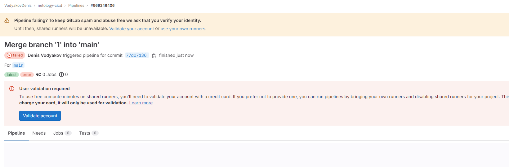
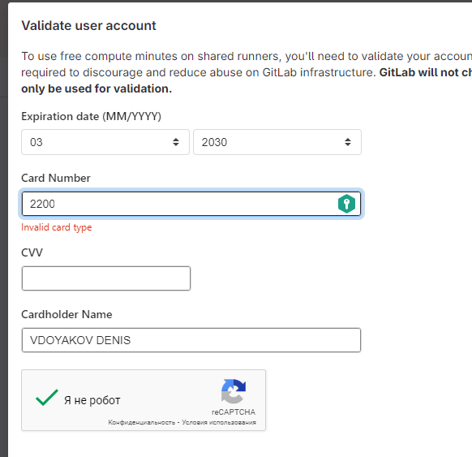
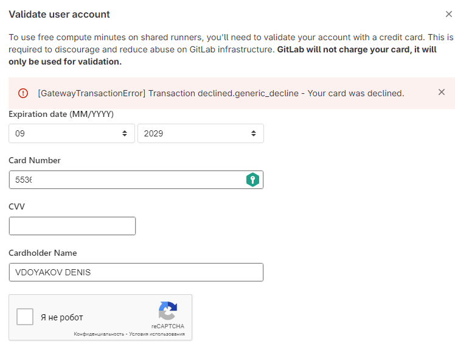

# Проблема с гитлаб.

- Интерфейс гиталаба обновлен, судя по всему в качестве web-ide сейчас там VSCode
- Основная проблема на скринах

Как решение скорее всего нужно разворачивать свой локальный GitLab