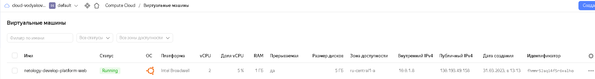
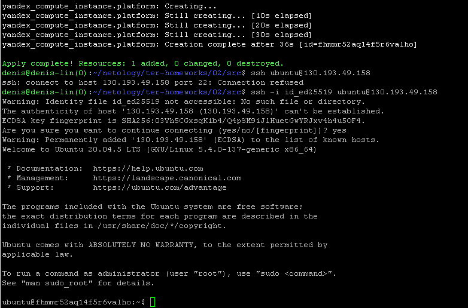
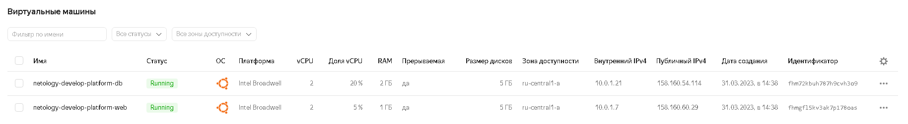

# Домашнее задание к занятию "Основы Terraform. Yandex Cloud"

### Задание 1

1. Изучите проект. В файле variables.tf объявлены переменные для yandex provider.
2. Переименуйте файл personal.auto.tfvars_example в personal.auto.tfvars. Заполните переменные (идентификаторы облака, токен доступа). Благодаря .gitignore этот файл не попадет в публичный репозиторий. **Вы можете выбрать иной способ безопасно передать секретные данные в terraform.**
3. Сгенерируйте или используйте свой текущий ssh ключ. Запишите его открытую часть в переменную **vms_ssh_root_key**.
4. Инициализируйте проект, выполните код. Исправьте возникшую ошибку. Ответьте в чем заключается ее суть?
5. Ответьте, как в процессе обучения могут пригодиться параметры```preemptible = true``` и ```core_fraction=5``` в параметрах ВМ? Ответ в документации Yandex cloud.

В качестве решения приложите:
- скриншот ЛК Yandex Cloud с созданной ВМ,
- скриншот успешного подключения к консоли ВМ через ssh,
- ответы на вопросы.

### Решение
```
yandex_compute_instance.platform: Creating...
╷
│ Error: Error while requesting API to create instance: server-request-id = 9fae416b-b0d9-4fd0-9252-61ca55065d82 server-trace-id = 6d7016818627e438:9e75b919eb7941c0:6d7016818627e438:1 client-request-id = 436c3454-5d59-4ac3-9a21-843ded77e661 client-trace-id = 5ea1ae71-b7de-4330-adad-99b59d4cea03 rpc error: code = InvalidArgument desc = the specified number of cores is not available on platform "standard-v1"; allowed core number: 2, 4
│
│   with yandex_compute_instance.platform,
│   on main.tf line 15, in resource "yandex_compute_instance" "platform":
│   15: resource "yandex_compute_instance" "platform" {
│
╵
```
	Недопустимое количество ядер для платформы standard-v1, должно быть 2 или 4





	preemptible = true - ВМ будет прерываемой   
	core_fraction=5 - уровень производительности ЦПУ   
	* данные параметры помогут экономить средства т.к. прерываемые и использующие не 100% ресурсов цпу ВМ стоят дешевле.   

### Задание 2

1. Изучите файлы проекта.
2. Замените все "хардкод" **значения** для ресурсов **yandex_compute_image** и **yandex_compute_instance** на **отдельные** переменные. К названиям переменных ВМ добавьте в начало префикс **vm_web_** .  Пример: **vm_web_name**.
2. Объявите нужные переменные в файле variables.tf, обязательно указывайте тип переменной. Заполните их **default** прежними значениями из main.tf. 
3. Проверьте terraform plan (изменений быть не должно). 

### Решение
```
denis@denis-lin(0):~/netology/ter-homeworks/02/src$ cat main.tf
resource "yandex_vpc_network" "develop" {
  name = var.vpc_name
}
resource "yandex_vpc_subnet" "develop" {
  name           = var.vpc_name
  zone           = var.default_zone
  network_id     = yandex_vpc_network.develop.id
  v4_cidr_blocks = var.default_cidr
}


data "yandex_compute_image" "ubuntu" {
  family = "${var.vm_web_image_family}"
}
resource "yandex_compute_instance" "platform" {
  name        = "${var.vm_web_name}"
  platform_id = "${var.vm_web_platform_id}"
  resources {
    cores         = "${var.vm_web_cores}"
    memory        = "${var.vm_web_memory}"
    core_fraction = "${var.vm_web_core_fraction}"
  }
  boot_disk {
    initialize_params {
      image_id = data.yandex_compute_image.ubuntu.image_id
    }
  }
  scheduling_policy {
    preemptible = true
  }
  network_interface {
    subnet_id = yandex_vpc_subnet.develop.id
    nat       = true
  }

  metadata = {
    serial-port-enable = 1
    ssh-keys           = "ubuntu:${var.vms_ssh_root_key}"
  }

}
```
```
denis@denis-lin(0):~/netology/ter-homeworks/02/src$ cat variables.tf
###cloud vars
variable "token" {
  type        = string
  description = "OAuth-token; https://cloud.yandex.ru/docs/iam/concepts/authorization/oauth-token"
}

..пропустил дефолт и ssh ключик..


### add
variable "vm_web_image_family" {
  type        = string
  description = "OS release name"
  default     = "ubuntu-2004-lts"
}

variable "vm_web_name" {
  type        = string
  description = "Name VM"
  default     =  "netology-develop-platform-web"
}

variable "vm_web_platform_id" {
  type        = string
  description = "VM platform_id"
  default     =   "standard-v1"
}

variable "vm_web_cores" {
  type        = number
  description = "VM cores"
  default     = "2"
}

variable "vm_web_memory" {
  type        = number
  description = "VM memory"
  default     = "1"
}

variable "vm_web_core_fraction" {
  type        = number
  description = "VM core fraction"
  default     = "5"
}
```
terraform plan - проверил вроде все ок, пробовал пересоздать машину тоже создалась как и была, в процессе были ошибки и тестово вм когда проверял создалась не верно, потом разобрался привел 
конфиг к виду как выше и все нормально запустилось.


### Задание 3

1. Создайте в корне проекта файл 'vms_platform.tf' . Перенесите в него все переменные ВМ.
2. Скопируйте блок ресурса и создайте с его помощью вторую ВМ: **"netology-develop-platform-db"** ,  cores  = 2, memory = 2, core_fraction = 20. Объявите ее переменные с префиксом **vm_db_** в том же файле.
3. Примените изменения.



### Задание 4

1. Объявите в файле outputs.tf отдельные output, для каждой из ВМ с ее внешним IP адресом.
2. Примените изменения.

В качестве решения приложите вывод значений ip-адресов команды ```terraform output```

### Решение

```
denis@denis-lin(0):~/netology/ter-homeworks/02/src$ terraform output
external_ip_netology-develop-platform-db = "158.160.54.114"
external_ip_netology-develop-platform-web = "158.160.60.29"
```

### Задание 5

1. В файле locals.tf опишите в **одном** local-блоке имя каждой ВМ, используйте интерполяцию ${..} с несколькими переменными по примеру из лекции.
2. Замените переменные с именами ВМ из файла variables.tf на созданные вами local переменные.
3. Примените изменения.

### Решение

```
denis@denis-lin(0):~/netology/ter-homeworks/02/src$ cat locals.tf
locals {
  db-name="netology-${var.vpc_name}-platform-db"
  web-name="netology-${var.vpc_name}-platform-web"
}
```
	Вывод части кода у меня это main.tf и main2.tf
```
resource "yandex_compute_instance" "platform" {
  name = local.web-name
  ...
}
resource "yandex_compute_instance" "platform2" {
  name = local.db-name
  ...
}
```
```
denis@denis-lin(0):~/netology/ter-homeworks/02/src$ terraform apply
yandex_vpc_network.develop: Creating...
yandex_vpc_network.develop: Creation complete after 2s [id=enpmhfdto3gcovq7g9v3]
yandex_vpc_subnet.develop: Creating...
yandex_vpc_subnet.develop: Creation complete after 1s [id=e9bgqbqj3ff5otf1536o]
yandex_compute_instance.platform: Creating...
yandex_compute_instance.platform2: Creating...
yandex_compute_instance.platform2: Still creating... [10s elapsed]
yandex_compute_instance.platform: Still creating... [10s elapsed]
yandex_compute_instance.platform2: Still creating... [20s elapsed]
yandex_compute_instance.platform: Still creating... [20s elapsed]
yandex_compute_instance.platform: Still creating... [30s elapsed]
yandex_compute_instance.platform2: Still creating... [30s elapsed]
yandex_compute_instance.platform: Still creating... [40s elapsed]
yandex_compute_instance.platform2: Still creating... [40s elapsed]
yandex_compute_instance.platform: Creation complete after 42s [id=fhml2t93ceavh0se59n0]
yandex_compute_instance.platform2: Creation complete after 43s [id=fhmvopsha0p6gmljspe9]

Apply complete! Resources: 4 added, 0 changed, 0 destroyed.

Outputs:

external_ip_netology-develop-platform-db = "158.160.42.194"
external_ip_netology-develop-platform-web = "158.160.39.52"

```

### Задание 6

1. Вместо использования 3-х переменных  ".._cores",".._memory",".._core_fraction" в блоке  resources {...}, объедените их в переменные типа **map** с именами "vm_web_resources" и "vm_db_resources".
2. Так же поступите с блоком **metadata {serial-port-enable, ssh-keys}**, эта переменная должна быть общая для всех ваших ВМ.
3. Найдите и удалите все более не используемые переменные проекта.
4. Проверьте terraform plan (изменений быть не должно).

### Решение

1. код:
```
denis@denis-lin(0):~/netology/ter-homeworks/02/src$ cat vms_platform.tf
...
variable "vm_web_resources" {
  type = map
  default = {
    cores = 2
    memory = 1
    core_fraction = 5
  }
}
variable "vm_db_resources" {
  type = map
  default = {
    cores = 2
    memory = 2
    core_fraction = 20
  }
}
...
```

2. код:
```
denis@denis-lin(0):~/netology/ter-homeworks/02/src$ cat variables.tf
...
variable "vm_metadata" {
  type = map
  default = {
    serial-port-enable = "1"
    ssh-keys     = "ubuntu:ssh-ed25519 4pab93zMBN7a>"
  }
}

...
```
4. код:
```
denis@denis-lin(0):~/netology/ter-homeworks/02/src$ terraform apply
data.yandex_compute_image.ubuntu: Reading...
data.yandex_compute_image.ubuntu2: Reading...
yandex_vpc_network.develop: Refreshing state... [id=enpmhfdto3gcovq7g9v3]
data.yandex_compute_image.ubuntu: Read complete after 1s [id=fd8snjpoq85qqv0mk9gi]
data.yandex_compute_image.ubuntu2: Read complete after 1s [id=fd8snjpoq85qqv0mk9gi]
yandex_vpc_subnet.develop: Refreshing state... [id=e9bgqbqj3ff5otf1536o]
yandex_compute_instance.platform: Refreshing state... [id=fhml2t93ceavh0se59n0]
yandex_compute_instance.platform2: Refreshing state... [id=fhmvopsha0p6gmljspe9]

No changes. Your infrastructure matches the configuration.

Terraform has compared your real infrastructure against your configuration and found no differences, so no changes are needed.

Apply complete! Resources: 0 added, 0 changed, 0 destroyed.

Outputs:

external_ip_netology-develop-platform-db = "158.160.42.194"
external_ip_netology-develop-platform-web = "158.160.39.52"
```
